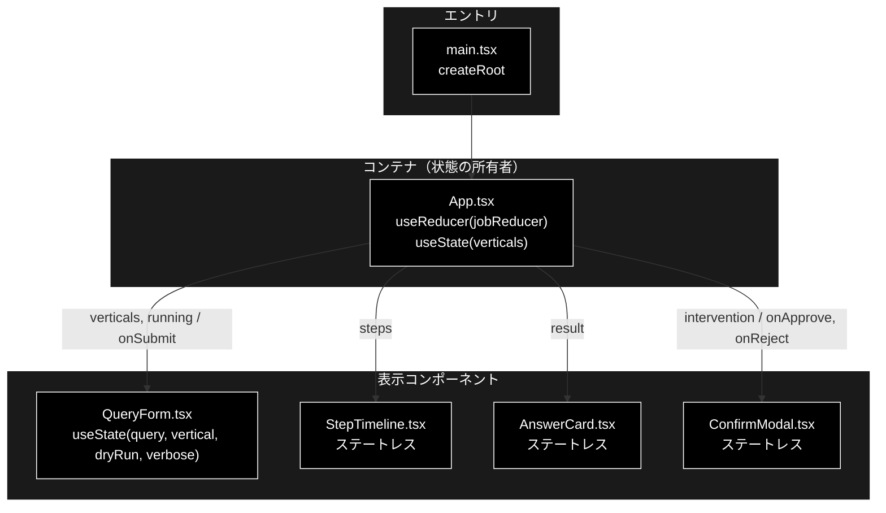
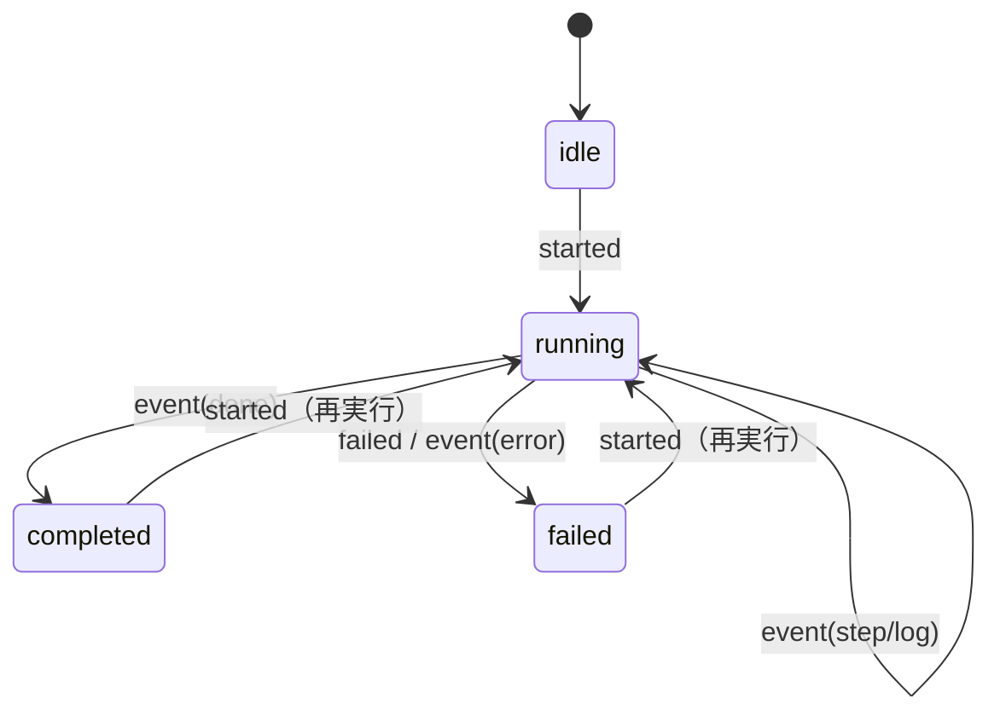
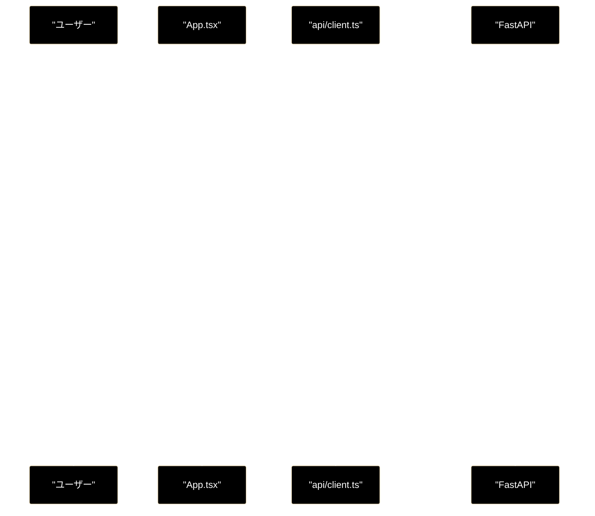
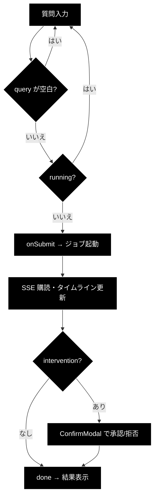

# React UIコンポーネント ドキュメント フォーマット仕様書

**Version 1.0** | 最終更新: 2026-07-27

---

## この仕様書の適用範囲

`frontend/src/**`（Vite + React + TypeScript）のコンポーネント・状態・API クライアントを
ドキュメント化するときに使う。

| 対象 | 使う仕様書 |
|---|---|
| **React コンポーネント / reducer / API クライアント**（`frontend/src/**`） | **本書** |
| Python モジュール（クラス・関数） | `a_class_method_md_format.md`（IPO 形式） |
| Streamlit 画面（`ui/pages/*.py` の `show_*_page()`） | `a_pages_md_format.md`<br>※ **grace_v2 には Streamlit は存在しない**。他リポジトリ用 |
| 単体テスト | `.claude/skills/grace-agent-tests/a_test_md_format.md`（SAE 形式） |

Streamlit 版（`a_pages_md_format.md`）との最大の違いは **状態の持ち方**である。
Streamlit は `st.session_state` という単一のグローバル辞書に状態が集まるが、React では
状態が **props / ローカル state（`useState`）/ reducer state** の 3 層に分かれる。
本書はこの 3 層を分けて記述させることを主眼に置く。

---

## 目次

1. [ドキュメント全体構成](#1-ドキュメント全体構成)
2. [ヘッダー・メタ情報](#2-ヘッダーメタ情報)
3. [コンポーネントツリー図](#3-コンポーネントツリー図)
4. [Props インターフェース](#4-props-インターフェース)
5. [状態管理（3層）](#5-状態管理3層)
6. [データフロー・副作用](#6-データフロー副作用)
7. [API 通信・SSE イベント](#7-api-通信sse-イベント)
8. [ユーザー操作フロー](#8-ユーザー操作フロー)
9. [型定義とバックエンド対応](#9-型定義とバックエンド対応)
10. [スタイル・アクセシビリティ](#10-スタイルアクセシビリティ)
11. [テスト](#11-テスト)
12. [変更履歴](#12-変更履歴)
13. [Mermaid 記法規約](#13-mermaid-記法規約)

---

## 1. ドキュメント全体構成

### 1.1 必須セクション構成

```
# {ComponentName}.tsx - {説明} ドキュメント
**Version X.X** | 最終更新: YYYY-MM-DD

## 目次
## 概要
## 1. コンポーネントツリー図
## 2. Props インターフェース
## 3. 状態管理
## 4. データフロー・副作用
## 5. API 通信・SSE イベント     ← API に触れるコンポーネントのみ
## 6. ユーザー操作フロー
## 7. 型定義とバックエンド対応
## 8. スタイル・アクセシビリティ
## 9. テスト
## 10. 変更履歴
```

### 1.2 セクションの要否

| セクション | 必須 | 省略できる条件 |
|---|:---:|---|
| 概要 | ✅ | — |
| コンポーネントツリー図 | ✅ | — |
| Props インターフェース | ✅ | props を持たない場合は「なし」と明記する（節ごと消さない） |
| 状態管理 | ✅ | 状態を持たない純表示コンポーネントは「ステートレス」と明記 |
| データフロー・副作用 | ✅ | — |
| API 通信・SSE イベント | △ | `fetch` / `EventSource` を一切呼ばない場合は省略可 |
| ユーザー操作フロー | ✅ | — |
| 型定義とバックエンド対応 | △ | バックエンド由来の型を扱わない場合は省略可 |
| スタイル・アクセシビリティ | ✅ | — |
| テスト | ✅ | テストが無い場合は「未整備」と明記（省略しない） |
| 変更履歴 | ✅ | — |

> **原則**: 「該当なし」でも節は残し、理由を 1 行書く。節ごと消すと
> 「書き忘れ」と「本当に無い」が区別できなくなる。

---

## 2. ヘッダー・メタ情報

### 2.1 タイトル形式

```markdown
# StepTimeline.tsx - SSE ステップ進捗タイムライン ドキュメント

**Version 1.0** | 最終更新: 2026-07-27
```

- 拡張子（`.tsx` / `.ts`）を必ず付ける。
- 複数コンポーネントをまとめる場合はディレクトリ名にする（例: `# components/ - UI コンポーネント群 ドキュメント`）。

### 2.2 概要セクション

```markdown
## 概要

| 項目 | 内容 |
|---|---|
| ファイル | `frontend/src/components/StepTimeline.tsx` |
| 種別 | 表示コンポーネント（ステートレス） |
| 親 | `App.tsx` |
| 子 | なし |
| 主な依存 | `../state/jobReducer`（`StepState` / `STEP_LABELS`） |
| 対応バックエンド | `backend/app/core/support_agent.py`（`STEP_IDS`） |

### 主な責務

- reducer が畳み込んだ 8 ステップの状態を、実行順に縦タイムラインで表示する。
- 各ステップの `status`（pending / running / done / skipped）を色と記号で区別する。
- `verbose` 時に届いたログ行をステップ配下に折りたたみ表示する。

### 主要機能一覧

| 機能 | 実装 | 説明 |
|---|---|---|
| ステップ一覧描画 | `STEP_IDS.map(...)` | 固定順で 8 ステップを並べる |
| 状態バッジ | `statusIcon(status)` | ⏳ / ▶ / ✅ / ⏭ を割り当てる |
```

### 2.3 「種別」の書き分け

| 種別 | 定義 |
|---|---|
| 表示コンポーネント（ステートレス） | props のみで描画。`useState`/`useReducer`/`useEffect` を持たない |
| 状態保持コンポーネント | `useState` によるローカル state を持つ（例: 入力フォーム） |
| コンテナコンポーネント | reducer・副作用・API 呼び出しを束ねる（例: `App.tsx`） |
| 純ロジック（非コンポーネント） | reducer / パーサ / API クライアント。JSX を返さない |

---

## 3. コンポーネントツリー図

親子関係と、**どの階層で状態が生まれ・どの向きに流れるか**を 1 枚で示す。

````markdown
## 1. コンポーネントツリー図


````

**記述規則:**

1. ノードラベルに**そのコンポーネントが持つ state を併記**する（`useState(...)` / `useReducer(...)` / `ステートレス`）。これで「状態がどこにあるか」がツリーだけで分かる。
2. 矢印ラベルは `"渡す props / コールバック"` の形式（`|"verticals, running / onSubmit"|`）。データを左、コールバックを右に置きスラッシュで区切る。
3. サブグラフは「エントリ」「コンテナ」「表示」の 3 層を基本とする。

---

## 4. Props インターフェース

**TypeScript の `interface Props` を、実コードからそのまま転記**したうえで表に展開する。

````markdown
## 2. Props インターフェース

```typescript
interface Props {
  verticals: VerticalInfo[];
  running: boolean;
  onSubmit: (params: QueryParams) => void;
}
```

| Prop | 型 | 必須 | 既定値 | 説明 |
|---|---|:---:|---|---|
| `verticals` | `VerticalInfo[]` | ✅ | — | `/api/verticals` の取得結果。セレクタの選択肢 |
| `running` | `boolean` | ✅ | — | 実行中フラグ。`true` の間は送信ボタンを `disabled` |
| `onSubmit` | `(params: QueryParams) => void` | ✅ | — | 送信時に親へ `QueryParams` を返すコールバック |

### コールバックの契約

| コールバック | 呼ばれる条件 | 親側の責務 |
|---|---|---|
| `onSubmit` | フォーム submit かつ `query` が空白でなく `running === false` | ジョブ起動 → SSE 購読開始 |
````

**記述規則:**

- `?:`（省略可能）な prop は「必須」列を空欄にし、既定値を必ず書く。
- コールバック props は**別表で「呼ばれる条件」と「親側の責務」を書く**。React では
  ここが実質的な API 契約になるため、型だけでは不足する。
- props を持たないコンポーネントは `Props なし（`export function Foo()`）` と 1 行書く。

---

## 5. 状態管理（3層）

React の状態は 3 層に分かれる。**層を混ぜて 1 表にしない。**

````markdown
## 3. 状態管理

### 3.1 ローカル state（`useState`）

| 変数 | 型 | 初期値 | 更新契機 | 説明 |
|---|---|---|---|---|
| `query` | `string` | `''` | `onChange` | 入力中の質問文 |
| `vertical` | `string` | `''` | セレクタ変更 | 空文字は「自動判定」を意味する |
| `dryRun` | `boolean` | `true` | チェックボックス | 既定 ON（副作用のある action を実行しない） |
| `verbose` | `boolean` | `false` | チェックボックス | 詳細ログの購読可否 |

### 3.2 reducer state（`useReducer`）

`jobReducer.ts` が SSE イベント列を畳み込む。**純関数・副作用ゼロ。**

| フィールド | 型 | 初期値 | 説明 |
|---|---|---|---|
| `jobId` | `string \| null` | `null` | 起動中ジョブの ID |
| `phase` | `'idle' \| 'running' \| 'completed' \| 'failed'` | `'idle'` | ジョブ全体の進行状態 |
| `steps` | `Record<StepId, StepState>` | 全 `pending` | 8 ステップの個別状態 |
| `intervention` | `InterventionInfo \| null` | `null` | HITL CONFIRM の承認待ち |
| `result` | `SupportResult \| null` | `null` | 最終結果 |

#### アクション一覧

| アクション | ペイロード | 効果 |
|---|---|---|
| `started` | `jobId` | 状態を初期化し `phase='running'` |
| `event` | `SupportEvent` | イベント種別に応じて steps / intervention / result を更新 |
| `confirm_sent` | — | `intervention` をクリア |
| `failed` | `message` | `phase='failed'`、`error` を設定 |
| `reset` | — | 初期状態へ戻す |

#### 状態遷移図



### 3.3 親から渡る状態（props 由来）

| 値 | 供給元 | 本コンポーネントでの扱い |
|---|---|---|
| `verticals` | `App.tsx` の `useState` + `fetchVerticals()` | 読み取りのみ。変更しない |

> **不変条件**: 表示コンポーネントは props を変更しない（`readonly` 前提）。
> 変更が必要な場合はコールバックで親に依頼する。
````

**記述規則:**

1. **3 層それぞれに節を立てる。** 該当が無い層は「なし」と 1 行書く。
2. reducer がある場合は **アクション一覧表**と**状態遷移図**を必須とする。
   遷移図は `stateDiagram-v2` を使う（`stateDiagram-v2` は `classDef` 非対応のため
   §13 の flowchart 用スタイル指定は付けない）。
3. 「初期値」は**実コードの初期化式から転記**する。推測で書かない。

---

## 6. データフロー・副作用

`useEffect` の依存配列とクリーンアップを**必ず**表にする。SSE 購読の解除漏れは
このプロジェクトで最も起きやすいバグであり、ドキュメント側で固定しておく。

````markdown
## 4. データフロー・副作用

### 4.1 副作用一覧（`useEffect`）

| # | 目的 | 依存配列 | クリーンアップ | 備考 |
|---|---|---|---|---|
| 1 | 業界プロファイル一覧の初回取得 | `[]` | なし | マウント時 1 回 |
| 2 | SSE 購読 | `[jobId]` | `unsubscribe()` を返す | **必須**。返さないと再実行時に多重購読になる |

### 4.2 データフロー図


````

**記述規則:**

- 依存配列は `[]` / `[jobId]` のように**実コードのとおり**書く。「なし」と書かない。
- クリーンアップ列には**返している関数名**を書く。返していない場合は「なし」とし、
  それが正しいのか（マウント時 1 回で解除不要か）を備考に 1 行書く。

---

## 7. API 通信・SSE イベント

このプロジェクトの UI は SSE 駆動であり、**イベント種別の網羅表が最重要**である。

````markdown
## 5. API 通信・SSE イベント

### 5.1 呼び出す API

| 関数 | メソッド | パス | 用途 |
|---|---|---|---|
| `startQuery` | POST | `/api/support/query` | ジョブ起動。`job_id` / `stream_url` を得る |
| `subscribeStream` | GET(SSE) | `/api/support/stream/{job_id}` | ステップ進捗の購読 |
| `confirmIntervention` | POST | `/api/support/confirm/{job_id}` | HITL CONFIRM への承認/拒否 |
| `fetchVerticals` | GET | `/api/verticals` | 業界プロファイル一覧 |

### 5.2 SSE イベント種別（`SupportEvent.type`）

| type | 意味 | 主なフィールド | reducer の扱い |
|---|---|---|---|
| `step` | ステップの開始・終了 | `step`, `status`, `title` | 該当 `StepState.status` を更新 |
| `log` | 進捗ログ 1 行 | `step`, `message` | 該当ステップの `logs` に追加 |
| `intervention` | HITL CONFIRM 要求 | `data: InterventionInfo` | `intervention` を設定（モーダル表示） |
| `result` | 最終結果 | `data: SupportResult` | `result` を設定 |
| `error` | エラー | `message` | `phase='failed'` |
| `done` | 配信終了 | — | `phase='completed'`、`EventSource` を close |

> ⚠️ **`done` を受けたら必ず `source.close()` する。** 閉じないと EventSource が
> 自動再接続し、同じジョブのイベントを再送させてしまう。

### 5.3 シーケンス図


````

---

## 8. ユーザー操作フロー

````markdown
## 6. ユーザー操作フロー

### 6.1 イベントハンドラ一覧

| 要素 | イベント | ハンドラ | 効果 | 無効化条件 |
|---|---|---|---|---|
| 送信ボタン | `submit` | `submit(e)` | `onSubmit(params)` を呼ぶ | `running` または `query` が空白のみ |
| 業界セレクタ | `change` | `setVertical` | ローカル state 更新 | なし |
| 承認ボタン | `click` | `onApprove` | `confirmIntervention(.., true)` | なし |

### 6.2 操作フロー図


````

**記述規則:** 「無効化条件」列は必須。`disabled` の条件を実コードから転記する
（このプロジェクトでは二重送信防止が `running` フラグに依存しているため）。

---

## 9. 型定義とバックエンド対応

TypeScript の型は `backend/app/schemas.py` と**手動で同期**している。ズレると
コンパイルは通るのに実行時に `undefined` になるため、対応表を必ず置く。

````markdown
## 7. 型定義とバックエンド対応

| TS 型（`src/types.ts`） | 対応する Python | 定義元 |
|---|---|---|
| `SupportEvent` | SSE ペイロード | `backend/app/core/jobs.py` |
| `SupportResult` | `SupportResult` | `backend/app/core/support_agent.py` |
| `VerticalInfo` | `VerticalInfo` | `backend/app/schemas.py` |
| `InterventionInfo` | intervention イベントの `data` | `backend/app/core/intervention_bridge.py` |
| `QueryParams` | `QueryRequest` | `backend/app/schemas.py` |
| `StepId` | `STEP_IDS` | `backend/app/core/support_agent.py` |

> ⚠️ **バックエンドのスキーマを変えたら、この表の TS 型も必ず追随させる。**
> `frontend` は blocking な CI ゲート（`tsc --noEmit`）なので、型がズレると
> **PR がマージできなくなる**。
````

---

## 10. スタイル・アクセシビリティ

````markdown
## 8. スタイル・アクセシビリティ

| 項目 | 内容 |
|---|---|
| スタイル方式 | プレーン CSS（`src/styles.css`）。CSS-in-JS・Tailwind は不使用 |
| 主要クラス | `.query-form`, `.query-row`, `.step-timeline`, `.answer-card` |
| ダークモード | 未対応（対応する場合は `prefers-color-scheme` を使う） |

### アクセシビリティ・チェック

| 観点 | 状態 |
|---|---|
| フォーム要素に `label` が対応しているか | ✅ / ❌（実コードを確認して記載） |
| モーダルにフォーカストラップがあるか | ✅ / ❌ |
| 状態表示が色のみに依存していないか（記号併用） | ✅ / ❌ |
| キーボードのみで送信・承認できるか | ✅ / ❌ |
````

**記述規則:** アクセシビリティ表は**実装できていない項目も ❌ で残す**。
「できていないことが分かっている」状態を保つのが目的で、消すと再発見できない。

---

## 11. テスト

````markdown
## 9. テスト

| テストファイル | 対象 | 実行 |
|---|---|---|
| `src/state/jobReducer.test.ts` | reducer の畳み込み | `npm test` |
| `src/markdown/parseMarkdown.test.ts` | Markdown パーサ | `npm test` |

### テスト方針

- **純ロジック（reducer / パーサ）を優先してテストする。** JSX のレンダリング
  テストは導入しておらず（`@testing-library/react` 未導入）、コンポーネントは
  `tsc --noEmit` の型検査でガードしている。
- CI では `npm run lint`（tsc）→ `npm test`（vitest）→ `npm run build` の順に
  実行され、**いずれも blocking**。
````

---

## 12. 変更履歴

````markdown
## 10. 変更履歴

| 版 | 日付 | 変更内容 |
|---|---|---|
| 1.0 | 2026-07-27 | 初版作成 |
````

版を上げたら**必ず**この表に追記する。ヘッダーの `**Version X.X**` と一致させる。

---

## 13. Mermaid 記法規約

本リポジトリ共通の**黒背景・白文字**を厳守する（`a_class_method_md_format.md` と同一）。

### 13.1 flowchart / graph

ブロック末尾に必ず以下を置く。

```
classDef default fill:#000,stroke:#fff,color:#fff
classDef subgraphStyle fill:#1a1a1a,stroke:#fff,color:#fff
class <全ノードID をカンマ区切り> default
style <各サブグラフ名> fill:#1a1a1a,stroke:#fff,color:#fff
```

### 13.2 sequenceDiagram

先頭に init ヘッダーを置き、`classDef` / `class` は**使わない**（非対応）。

```
%%{ init: { "theme": "base", "themeVariables": {
  "background": "#000000", "mainBkg": "#000000",
  "textColor": "#ffffff", "lineColor": "#ffffff",
  "actorBkg": "#000000", "actorTextColor": "#ffffff",
  "actorLineColor": "#ffffff", "noteBkgColor": "#000000",
  "noteTextColor": "#ffffff", "noteBorderColor": "#ffffff" } } }%%
```

> ⚠️ **Note 背景の変数名は `noteBkgColor`（`noteBkg` ではない）。**
> `noteBkg` は Mermaid に認識されず既定の黄色（`#fff5ad`）になる。

### 13.3 stateDiagram-v2

`classDef` / `class` に非対応のため**スタイル指定は付けない**。
状態遷移図（§5.2）でのみ使う。

### 13.4 共通

- ノードラベルの特殊文字はダブルクォートで囲む。バッククォート禁止。`<br>` は可。
- **TSX の総称型（`Record<StepId, StepState>` 等）をラベルに入れるときは要注意。**
  `<` `>` が HTML タグと解釈されうるため、ダブルクォートで囲んだうえで
  可能なら `Record[StepId, StepState]` のように角括弧へ置換する。

### 13.5 検証（grep）

各ファイルで以下が一致すること。

```bash
# flowchart/graph の数 == classDef default の数
grep -c 'flowchart\|graph ' <file>
grep -c 'classDef default fill:#000' <file>

# sequenceDiagram の数 == init ヘッダーの数
grep -c 'sequenceDiagram' <file>
grep -c '%%{ init' <file>
```

---

## 付録: 実装との整合チェックリスト

書き終えたら以下を実コードと突合する。**推測で埋めない。**

- [ ] `interface Props` を実ファイルからコピーしたか（型を要約していないか）
- [ ] `useState` の初期値を実コードの初期化式から転記したか
- [ ] `useEffect` の依存配列を実コードのとおり書いたか
- [ ] クリーンアップ関数の有無を確認したか（SSE は特に）
- [ ] SSE イベント種別を `src/types.ts` の `SupportEvent['type']` と突合したか
- [ ] `STEP_IDS` / `STEP_LABELS` の件数がバックエンドの `STEP_IDS` と一致するか
- [ ] TS 型とバックエンドスキーマの対応表に漏れがないか
- [ ] テストファイルの実在を確認したか（無いなら「未整備」と書く）
- [ ] Mermaid の黒背景規約を grep で検証したか
- [ ] 版・最終更新日・変更履歴を更新したか
