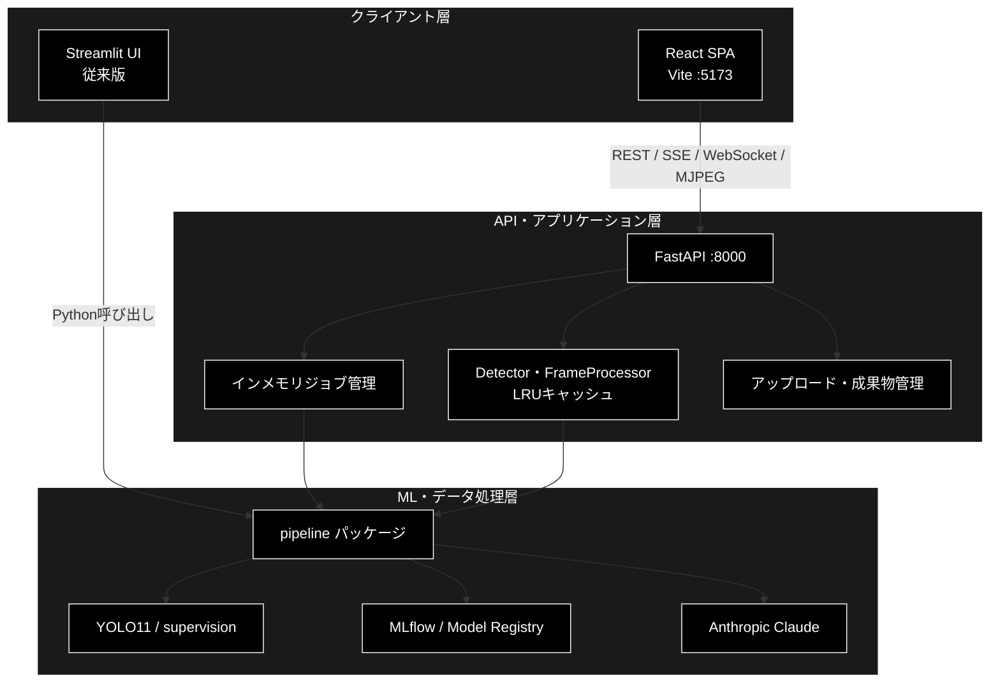
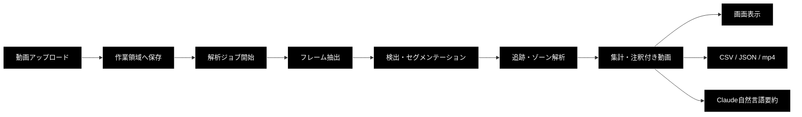

# Video ML Analytics Studio (`ml_motion_v1`)

**Version 2.0** | 最終更新: 2026-08-03

動画ファイルまたはカメラ映像を入力し、YOLO11による物体検出・セグメンテーション、ByteTrackによる追跡、ゾーン解析、学習・実験管理、モデル変換、Claude Visionによる解析支援までを一つの画面から扱うローカル開発向け動画ML解析プラットフォームです。

---

## 目次

1. [概要](#概要)
2. [クイックスタート](#1-クイックスタート)
3. [アーキテクチャ構成](#2-アーキテクチャ構成)
4. [ディレクトリ構成](#3-ディレクトリ構成)
5. [主要画面と機能](#4-主要画面と機能)
6. [バックエンドAPI](#5-バックエンドapi)
7. [MLパイプライン](#6-mlパイプライン)
8. [設定](#7-設定)
9. [基本ワークフロー](#8-基本ワークフロー)
10. [テストと品質確認](#9-テストと品質確認)
11. [制約・セキュリティ・既知の問題](#10-制約セキュリティ既知の問題)
12. [関連ドキュメント](#11-関連ドキュメント)
13. [実装Phaseと移行状況](#12-実装phaseと移行状況)
14. [変更履歴](#13-変更履歴)

---

## 概要

### プロジェクトの目的

Video ML Analytics Studioは、動画MLの検証から本番モデルの準備までを、同じ`pipeline/`実装を使って一貫して試せる環境を提供します。

- mp4・mov・avi動画の検出、セグメンテーション、追跡、ゾーン解析
- Continuity Cameraまたはブラウザカメラによるリアルタイム解析
- MLflowを使ったFine-tuning、Run比較、Model Registry管理
- ディレクトリ一括推論、ONNX・CoreML・TorchScript等へのモデル変換
- Claudeによる自然言語要約、アノテーションレビュー、自然言語検索
- Apple Silicon上のPyTorch MPSを意識したローカル開発

### 主な責務

- React SPAから動画解析・リアルタイム解析・実験管理機能を提供する
- FastAPIでREST、SSE、WebSocket、MJPEGのインターフェースを提供する
- 推論・学習・集計処理をUIから独立したPythonパイプラインとして実装する
- Streamlit版UIを従来インターフェースとして併存させる
- MLflowとClaude APIを利用する拡張機能を提供する

### 各責務に対応するディレクトリ

| # | 責務 | 対応ディレクトリ | 説明 |
|---:|---|---|---|
| 1 | Web UI | `frontend/` | React 18＋TypeScript SPA。5画面、APIクライアント、状態管理を実装 |
| 2 | Web API | `backend/` | FastAPIルーター、ジョブ管理、モデルキャッシュ、成果物管理を実装 |
| 3 | ML処理コア | `pipeline/` | 検出・追跡・学習・実験管理・本番化・Claude連携を実装 |
| 4 | 従来UI | `app/` | `pipeline/`を直接利用するStreamlitマルチページUI |
| 5 | 仕様・操作説明 | `docs/`、`pipeline/docs/` | システム仕様、操作マニュアル、クラス・関数IPO仕様 |

### 主要機能一覧

| 機能 | 説明 |
|---|---|
| 動画解析 | 検出、セグメンテーション、ByteTrack追跡、ゾーン滞留・侵入集計 |
| リアルタイム解析 | Mac側カメラのMJPEG配信、ブラウザカメラのWebSocket推論 |
| 実験管理 | YOLO Fine-tuning、MLflow Run比較、`data.yaml`生成 |
| 本番・最適化 | バッチ推論、モデル変換・量子化、Registry URI解決 |
| アノテーションQA | Claude Visionによる画像と提案ラベルのレビュー |
| 解析結果出力 | 注釈付き動画、CSV、JSON、自然言語要約 |

---

## 1. クイックスタート

### 1.1 前提環境

| 項目 | 前提 |
|---|---|
| Python | 3.12（`>=3.12,<3.13`） |
| Node.js | フロントエンドのVite／Reactを実行できる環境（CIはNode.js 22） |
| 推奨端末 | MacBook Air M2等のApple Silicon Mac |
| パッケージ管理 | `uv`推奨（`pip`でもインストール可能） |
| Docker | MLflow Trackingサーバを利用する場合に必要 |

### 1.2 初回セットアップ

リポジトリルートで実行します。

```bash
uv venv --python 3.12
source .venv/bin/activate
uv pip install -e '.[dev]'

cp .env.example .env

cd frontend
npm install
cd ..
```

`.env`の`ANTHROPIC_API_KEY`は、アノテーションQAまたは解析結果の自然言語要約を利用するときに設定します。

### 1.3 バックエンドとフロントエンドの一括起動

```bash
./run_dev.sh
```

| サービス | URL |
|---|---|
| React UI | <http://localhost:5173> |
| FastAPI | <http://localhost:8000> |
| OpenAPI UI | <http://localhost:8000/docs> |

`run_dev.sh`は`frontend/node_modules`の存在を確認し、バックエンドとフロントエンドを同時に起動します。停止するときは`Ctrl-C`を押します。

### 1.4 個別起動

バックエンドはリポジトリルートで起動します。

```bash
uvicorn backend.app.main:app --reload --port 8000
```

別ターミナルでフロントエンドを起動します。

```bash
cd frontend
npm run dev
# http://localhost:5173
```

### 1.5 起動確認

```bash
curl http://localhost:8000/api/health
```

正常時は、`status`が`ok`のJSONを返します。React画面で「バックエンドに接続できません」と表示される場合は、FastAPIがポート8000で起動しているか確認してください。

### 1.6 Streamlit版の起動

React移行元のStreamlit版も併存しています。

```bash
streamlit run app/Home.py
```

> React版とStreamlit版は、どちらも同じ`pipeline/`を使用します。新規利用ではReact版を推奨します。

---

## 2. アーキテクチャ構成

### 2.1 システム全体構成



`backend/`はHTTPインターフェースと実行制御を担当する薄い層です。検出、集計、学習などの中核処理は`pipeline/`に置き、React版とStreamlit版の双方から再利用します。

### 2.2 解析データフロー



### 2.3 リアルタイム処理フロー

リアルタイム解析には2経路があります。

| 経路 | 入力 | 通信 | 用途 |
|---|---|---|---|
| Continuity Camera | バックエンドを実行しているMacのカメラ | MJPEG | iPhoneをMacのカメラとして使う場合 |
| ブラウザカメラ | ブラウザの`getUserMedia` | WebSocket | ブラウザ側のカメラを使う場合 |

ブラウザ経路は、応答を受け取ってから次のJPEGフレームを送るin-flight 1枚の方式で、未処理フレームを蓄積しません。

### 2.4 非同期ジョブと進捗通知

動画解析、学習、バッチ推論はバックグラウンドジョブとして実行します。開始APIは`job_id`を返し、React側はSSEで`progress`、`done`、`error`イベントを受信します。結果は`job_id`を使って別APIから取得します。

ジョブと成果物はローカル開発用の一時状態であり、外部データベースには永続化しません。

---

## 3. ディレクトリ構成

```text
ml_motion_v1/
├── backend/              # FastAPI Web API
│   ├── app/api/          # 機能別APIルーター
│   ├── app/core/         # ジョブ、キャッシュ、ストレージ、パス検証
│   └── tests/            # バックエンドAPI・コアテスト
├── frontend/             # Vite + React 18 + TypeScript SPA
│   └── src/
│       ├── api/          # fetch・SSE・WebSocketクライアント
│       ├── components/   # 共通UIコンポーネント
│       ├── pages/        # 5つの機能画面
│       └── state/        # 設定・ジョブ状態管理
├── pipeline/             # 推論・学習・集計のコアパッケージ
│   └── docs/             # モジュール別IPOドキュメント
├── app/                  # Streamlit版UI
│   └── views/            # 5つの機能画面
├── docs/                 # システム仕様・操作マニュアル・移行資料
├── tests/                # pipelineの単体テスト
├── scripts/              # MPS確認・サンプル取得等の補助スクリプト
├── docker-compose/       # MLflow Trackingサーバ
├── data/                 # 入力動画・データセット（原則git管理外）
├── models/               # モデル重み・変換成果物（原則git管理外）
├── experiments/          # MLflow DB・artifact（原則git管理外）
├── pyproject.toml        # Python依存・pytest・ruff設定
└── run_dev.sh            # FastAPI＋React一括起動
```

### 3.1 `backend/` — FastAPI Web API

- `app/main.py`: FastAPI生成、CORS、`.env`読込、ルーター登録
- `app/schemas.py`: リクエスト・レスポンス用Pydanticモデル
- `app/api/`: 解析、リアルタイム、実験管理、本番化、アノテーションQA、メタ情報
- `app/core/jobs.py`: スレッド実行とSSEイベントを扱うインメモリジョブ管理
- `app/core/detector_cache.py`: DetectorとFrameProcessorのLRUキャッシュ
- `app/core/storage.py`: アップロードと解析成果物の管理
- `app/core/paths.py`: ユーザー指定パスの許可ルート検証

### 3.2 `frontend/` — React SPA

`frontend/src/App.tsx`がアプリケーションシェル、`nav.ts`が5画面のルーティング定義です。APIの型は`types.ts`に集約し、動画解析等の進捗は`state/jobReducer.ts`で管理します。

### 3.3 `pipeline/` — ML処理コア

UIやHTTPに依存しない推論・学習処理を提供します。`torch`、`cv2`、`ultralytics`、`supervision`、`mlflow`、`anthropic`等の重い依存は必要な関数・メソッド内で遅延importします。

### 3.4 `app/` — Streamlit版UI

`app/Home.py`が`st.navigation`を構築し、`app/views/`の5画面を読み込みます。React版への移行後も比較・互換用途として残しています。

### 3.5 その他の主要ディレクトリ

- `docs/manual/`: 画面別の操作マニュアル
- `pipeline/docs/`: `a_class_method_md_format.md`に準拠したモジュール別IPO仕様
- `docker-compose/`: SQLiteとローカルartifactを使うMLflowサーバ
- `.github/workflows/ci.yml`: PythonとフロントエンドのCI

---

## 4. 主要画面と機能

| 画面 | Reactルート | 主な機能 | 操作マニュアル |
|---|---|---|---|
| 解析 | `/analyze` | 動画アップロード、検出・セグ・追跡・ゾーン、結果出力、NL要約 | [`01_analyze.md`](docs/manual/01_analyze.md) |
| リアルタイム | `/realtime` | Continuity Camera、ブラウザカメラ、FPS・検出数表示 | [`02_realtime.md`](docs/manual/02_realtime.md) |
| 実験管理 | `/experiments` | MLflow Run比較、Fine-tuning、`data.yaml`生成 | [`03_experiments.md`](docs/manual/03_experiments.md) |
| 本番・最適化 | `/production` | バッチ推論、モデル変換・量子化、Registry URI | [`04_production.md`](docs/manual/04_production.md) |
| アノテーションQA | `/annotation-qa` | Claude Visionによる画像・提案ラベルレビュー | [`05_annotation_qa.md`](docs/manual/05_annotation_qa.md) |

---

## 5. バックエンドAPI

### 5.1 メタ情報・ヘルスチェック

| メソッド | パス | 説明 |
|---|---|---|
| `GET` | `/api/health` | バックエンド疎通とAPIバージョン |
| `GET` | `/api/meta/device` | PyTorch、MPS、CUDA、選択デバイス情報 |
| `GET` | `/api/meta/options` | モデル、COCOクラス、解像度、変換形式等の選択肢 |

### 5.2 動画解析API

| メソッド | パス | 説明 |
|---|---|---|
| `POST` | `/api/analyze/upload` | 動画をストリーミング保存 |
| `POST` | `/api/analyze/run` | 解析ジョブを開始 |
| `GET` | `/api/analyze/stream/{job_id}` | SSEによる進捗配信 |
| `GET` | `/api/analyze/result/{job_id}` | 解析結果の概要 |
| `GET` | `/api/analyze/detections/{job_id}` | 検出レコードのページング取得 |
| `GET` | `/api/analyze/download/{job_id}/{kind}` | CSV、JSON、注釈付き動画の取得 |
| `POST` | `/api/analyze/summary/{job_id}` | Claudeによる自然言語要約 |
| `GET` | `/media/{run_id}/{filename}` | 解析成果物の配信 |

### 5.3 リアルタイムAPI

| メソッド | パス | 説明 |
|---|---|---|
| `GET` | `/api/realtime/settings` | 解像度・モデル等を解決した設定 |
| `GET` | `/api/realtime/mjpeg` | Mac側カメラのMJPEG配信 |
| `GET` | `/api/realtime/stats` | FPSと検出件数 |
| `POST` | `/api/realtime/stop` | カメラストリーム停止 |
| `WS` | `/api/realtime/ws` | ブラウザカメラのフレーム推論 |

### 5.4 実験管理API

| メソッド | パス | 説明 |
|---|---|---|
| `GET` | `/api/experiments/config` | MLflow URIと既定実験名 |
| `GET` | `/api/experiments/runs` | Run一覧と最良Run |
| `POST` | `/api/experiments/train` | 学習ジョブ開始 |
| `GET` | `/api/experiments/stream/{job_id}` | 学習進捗SSE |
| `GET` | `/api/experiments/result/{job_id}` | 学習結果取得 |
| `POST` | `/api/experiments/dataset-yaml` | YOLO用`data.yaml`生成 |

### 5.5 本番・最適化API

| メソッド | パス | 説明 |
|---|---|---|
| `POST` | `/api/production/discover` | 入力ディレクトリ内の動画を列挙 |
| `POST` | `/api/production/batch` | バッチ推論ジョブ開始 |
| `GET` | `/api/production/stream/{job_id}` | バッチ進捗SSE |
| `GET` | `/api/production/result/{job_id}` | バッチ結果取得 |
| `POST` | `/api/production/export` | モデル変換・量子化 |
| `GET` | `/api/production/registry-uri` | Model Registry URI取得 |

### 5.6 アノテーションQA API

| メソッド | パス | 説明 |
|---|---|---|
| `POST` | `/api/annotation/review` | 画像と提案ラベルをClaude Visionでレビュー |

詳細なリクエスト・レスポンスは、FastAPI起動後に<http://localhost:8000/docs>で確認できます。

---

## 6. MLパイプライン

| 分類 | モジュール | 主な機能 |
|---|---|---|
| デバイス | `device.py` | `mps > cuda > cpu`の順で実行デバイスを解決 |
| 検出 | `detector.py`、`detections.py` | YOLO11推論、検出レコード、集計、CSV・JSON |
| 動画 | `video.py` | 動画読込、フレーム処理、注釈付き動画生成 |
| 追跡・ゾーン | `tracking.py`、`zones.py` | ByteTrack、滞留時間、侵入回数、最大同時数 |
| リアルタイム | `realtime.py`、`camera.py` | 1フレーム処理、FPS、カメラ入力、軽量モデル推奨 |
| 学習 | `dataset.py`、`training.py` | データセット定義、分割、YOLO Fine-tuning |
| 実験管理 | `experiments.py`、`registry.py` | MLflow Run、最良Run、Model Registry |
| 本番化 | `batch.py`、`export_model.py`、`benchmark.py` | 一括推論、変換・量子化、レイテンシ計測 |
| Claude連携 | `claude_vision.py`、`active_learning.py` | 要約、Visionレビュー、NL検索、低信頼フレーム抽出 |

各クラス・関数のシグネチャ、IPO、戻り値例、使用例は[`pipeline/docs/README.md`](pipeline/docs/README.md)を参照してください。

---

## 7. 設定

### 7.1 環境変数

| 変数 | 既定値 | 説明 |
|---|---|---|
| `ANTHROPIC_API_KEY` | 未設定 | Claude APIキー |
| `ANTHROPIC_MODEL` | `claude-opus-4-8` | Claudeモデル名 |
| `MLFLOW_PORT` | `5000` | Docker Composeが公開するMLflowポート |
| `MLFLOW_TRACKING_URI` | `http://localhost:5000` | Python側が接続するMLflow URI |
| `BACKEND_PORT` | `8000` | `run_dev.sh`が使うFastAPIポート |
| `ML_MOTION_WORKDIR` | OS一時領域の`ml_motion_react` | アップロード・解析成果物の作業領域 |
| `ML_MOTION_ALLOWED_ROOTS` | リポジトリルートのみ | 本番・最適化APIで追加許可するルート。複数指定は`os.pathsep`区切り |

### 7.2 MLflow

```bash
docker-compose -f docker-compose/docker-compose.yml up -d
```

MLflow UIは既定で<http://localhost:5000>です。別アプリとポートが衝突する場合は、`.env`の`MLFLOW_PORT`と`MLFLOW_TRACKING_URI`を同じポートへ変更してください。

### 7.3 許可ディレクトリ

本番・最適化APIへ渡すパスは、既定ではリポジトリルート配下だけが許可されます。リポジトリ外を使用する場合は、明示的に許可します。

```bash
export ML_MOTION_ALLOWED_ROOTS="/path/to/videos:/path/to/models"
```

パスは`Path.resolve()`後に検証されるため、`../`やシンボリックリンクによる許可ルート外への移動も拒否されます。

### 7.4 モデルとデバイス

- 検出: `yolo11n.pt`、`yolo11s.pt`、`yolo11m.pt`
- セグメンテーション: `yolo11n-seg.pt`、`yolo11s-seg.pt`、`yolo11m-seg.pt`
- リアルタイム: 重いモデルが指定された場合は軽量モデルを推奨・選択可能
- デバイス: MPS、CUDA、CPUの順に利用可能なデバイスを選択

YOLO重みは、初回のモデル生成時にUltralyticsが取得します。

---

## 8. 基本ワークフロー

### 8.1 動画解析

1. `./run_dev.sh`でReact版を起動する。
2. 「解析」画面でmp4、mov、avi動画をアップロードする。
3. モデル、信頼度、セグメンテーション、追跡、ゾーン等を設定する。
4. 解析を開始し、SSEで表示される進捗を確認する。
5. 注釈付き動画、統計、検出テーブル、CSV、JSONを確認する。
6. 必要に応じてClaudeによる自然言語要約を実行する。

### 8.2 リアルタイム解析

1. 「リアルタイム」画面を開く。
2. Continuity Cameraまたはブラウザカメラを選択する。
3. 解像度、フレーム間引き、モデル等を設定する。
4. ストリームを開始し、FPSと検出数を確認する。
5. 終了時に停止操作を行い、カメラを解放する。

### 8.3 学習からModel Registry登録まで

```bash
docker-compose -f docker-compose/docker-compose.yml up -d
```

1. 「実験管理」画面でMLflowへの接続を確認する。
2. データセットパス、クラス、base model、epoch等を設定する。
3. `data.yaml`を確認し、学習ジョブを開始する。
4. 複数RunのmAP等を比較する。
5. 必要なモデルをModel Registryへ登録・昇格する。

> M2 Macでは小規模な動作確認を想定しています。本格的な学習はクラウドGPUを推奨します。

### 8.4 本番用バッチ推論

1. 「本番/最適化」画面で入力・出力ディレクトリを指定する。
2. 対象動画を検出し、バッチ推論を開始する。
3. マニフェストで成功・失敗・検出数を確認する。
4. 必要に応じてモデルをCoreML、ONNX、TorchScript等へ変換する。
5. `pipeline.benchmark`で変換前後のレイテンシとFPSを比較する。

---

## 9. テストと品質確認

### 9.1 Pythonテスト

```bash
pytest tests/ backend/tests/ -q
```

`tests/`は主に`pipeline/`のロジック、`backend/tests/`はAPI、ジョブ、ストレージ、パス制限、キャッシュ等を検証します。

### 9.2 フロントエンドテスト

```bash
cd frontend
npm test
```

ナビゲーション、APIクライアント、ジョブ状態、解析・実験・リアルタイム設定、Markdown解析をVitestで検証します。

### 9.3 Lintとビルド

```bash
ruff check .
python -m compileall -q pipeline app backend scripts tests main.py

cd frontend
npm run lint
npm run build
```

GitHub Actionsでも、Pythonのlint・compile・pytestと、フロントエンドの型チェック・テスト・ビルドを実行します。

---

## 10. 制約・セキュリティ・既知の問題

### 10.1 ローカル開発用途

- FastAPIは認証を実装していません。
- CORSはVite開発サーバの`localhost:5173`と`127.0.0.1:5173`を許可します。
- ジョブ、キャッシュ、アップロード参照は単一プロセス内の一時状態です。
- インターネットや共有ネットワークへ公開する本番構成としては使用しないでください。

### 10.2 M2 MacとMPS

Apple SiliconではMPSを優先しますが、すべての演算やモデルが同じ性能・互換性を持つわけではありません。MPSが利用できない環境ではCUDAまたはCPUへフォールバックします。

```bash
python scripts/check_mps.py
```

### 10.3 ファイルアクセス制限

- 動画アップロード上限: 2 GiB
- アノテーションQA画像上限: 5 MiB
- 動画形式: `.mp4`、`.mov`、`.avi`
- 画像形式: `.jpg`、`.jpeg`、`.png`、`.webp`
- ユーザー指定パス: 許可ルート内に限定
- 作業領域: 古いアップロードとRunを世代数で自動整理

### 10.4 既知の問題

- 注釈付き動画は、利用可能なコーデックによってブラウザ再生できない場合があります。その場合はファイルをダウンロードして確認してください。
- MLflowが未起動の場合、実験管理APIは接続エラーと起動方法を返します。
- YOLO重みの初回取得にはネットワーク接続が必要です。

修正済みの問題と詳細は[`docs/known_issues.md`](docs/known_issues.md)を参照してください。

---

## 11. 関連ドキュメント

| ドキュメント | 内容 |
|---|---|
| [`docs/manual/README.md`](docs/manual/README.md) | React版・Streamlit版の起動と画面別操作マニュアル |
| [`pipeline/docs/README.md`](pipeline/docs/README.md) | pipelineモジュール別IPOドキュメント索引 |
| [`docs/ml_motion_spec.md`](docs/ml_motion_spec.md) | pipeline横断のクラス・関数IPO仕様 |
| [`docs/ml_motion_detection_spec.md`](docs/ml_motion_detection_spec.md) | システム要件、アーキテクチャ、Phase計画 |
| [`docs/react_migration_todo.md`](docs/react_migration_todo.md) | StreamlitからReactへの移行設計と進捗 |
| [`docs/known_issues.md`](docs/known_issues.md) | 既知の問題と対応状況 |

---

## 12. 実装Phaseと移行状況

### 12.1 ML機能Phase 0〜6

既存READMEのPhase情報は、開発経緯として次のように継承します。

| Phase | ゴール | 主な実装 |
|---|---|---|
| P0 | 基盤構築 | Python 3.12、MPS確認、Streamlit、MLflow、リポジトリ骨格 |
| P1 | 検出MVP | mp4→YOLO11→注釈付き動画・CSV・JSON |
| P2 | セグ・追跡・ゾーン | YOLO11-seg、ByteTrack、滞留・侵入解析 |
| P3 | リアルタイム | Continuity Camera、ブラウザカメラ、FPS最適化 |
| P4 | 学習・実験管理 | Fine-tuning、MLflow、Model Registry、データセット設計 |
| P5 | 本番化・最適化 | バッチ推論、モデル変換・量子化、ベンチマーク |
| P6 | Claude高度化 | NL要約、Visionレビュー、NL検索、Active Learning |

各Phaseの詳細な完了条件とTODOは[`docs/ml_motion_detection_spec.md`](docs/ml_motion_detection_spec.md)を参照してください。

### 12.2 StreamlitからReactへの移行状況

| Phase | 対象 | 状況 |
|---|---|---|
| R0 | FastAPI基盤・Reactシェル | 完了 |
| R1 | 解析画面 | 完了 |
| R2 | アノテーションQA | 完了 |
| R3 | 実験管理 | 完了 |
| R4 | 本番・最適化 | 完了 |
| R5 | リアルタイム | 完了 |
| R6 | テスト・文書・Streamlit版の去就整理 | 継続中 |

React版の全5画面は実装済みです。Streamlit版は削除せず併存しており、今後の退役または移動は別途判断します。

---

## 13. 変更履歴

| Version | 日付 | 変更内容 |
|---|---|---|
| 2.0 | 2026-08-03 | 現行FastAPI＋React構成を基準に全面再編。クイックスタート、責務表、Mermaid構成図、API、設定、テスト、制約を追加し、既存Phase情報を統合 |
| 1.0 | 2026-06-30 | Phase 0〜6の実装内容とStreamlit版の起動方法を中心とする初版 |
