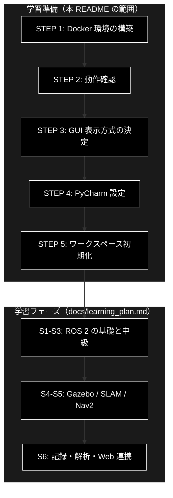
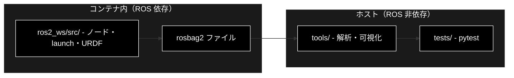

# sim_ros2_v1 — ROS 2 学習環境 セットアップガイド

**実機を使わず、Mac 上のシミュレーションだけで ROS 2 を習得するための学習環境。**
本 README は、その**学習を開始できる状態を作るまで**を扱う。

| 項目 | 内容 |
|---|---|
| ROS 2 ディストリビューション | **Jazzy Jalisco**（LTS / 2029年5月まで） |
| シミュレータ | turtlesim（前半）→ **Gazebo Harmonic**（後半） |
| 実装言語 | **Python（rclpy）** |
| 実行環境 | Docker Compose（macOS Apple Silicon 対応） |
| 開発 IDE | PyCharm Professional（Docker インタプリタ） |

> ### 本ドキュメントの実装状況
> STEP 1〜5 は実装済み。**イメージのビルドとコンテナ起動は macOS (Apple Silicon) で
> 実機確認済み**。`scripts/verify_env.sh` による全項目の検証は未実施。
> `ros2_ws/src/` はまだ空で、学習フェーズで中身を作っていく。
> 実装状況は「[2.3 準備フェーズのチェックリスト](#23-準備フェーズのチェックリスト)」で管理する。

---

## 目次

1. [概要](#1-概要)
2. [学習準備で作るもの](#2-学習準備で作るもの)
3. [STEP 1: Docker 環境の構築](#3-step-1-docker-環境の構築)
4. [STEP 2: 動作確認](#4-step-2-動作確認)
5. [STEP 3: GUI をどう見るか](#5-step-3-gui-をどう見るか)
6. [STEP 4: 開発環境の整備（PyCharm Professional）](#6-step-4-開発環境の整備pycharm-professional)
7. [STEP 5: ワークスペースの初期化](#7-step-5-ワークスペースの初期化)
8. [リポジトリ構成](#8-リポジトリ構成)
9. [関連ドキュメント・参考リンク](#9-関連ドキュメント参考リンク)
10. [変更履歴](#10-変更履歴)

---

## 1. 概要

### 1.1 プロジェクトの目的

ROS 2 を**実機なしで**習得する。ロボット本体・センサ・実験スペースを一切用意せず、
Mac 1 台と Docker だけで、次の範囲を手を動かして学べる状態を作る。

- ROS 2 の通信 4 方式（トピック / サービス / アクション / パラメータ）
- ノード構成と launch による起動管理
- URDF によるロボット記述と TF（座標変換）
- Gazebo 上での仮想ロボット・仮想センサの扱い
- SLAM による地図生成と Nav2 による自律走行
- rosbag2 による記録・再現・解析

### 1.2 この README の役割

本 README は**学習準備のドキュメント**である。扱う範囲は次の一線まで。

```
[ 本README の範囲 ]                              [ 学習フェーズ ]
環境構築 → 動作確認 → GUI → IDE → WS初期化   ｜   S1 … S6（別ドキュメント）
```

**「STEP 1〜5 を終えた状態」＝「学習を開始できる状態」**と定義する。
準備完了後に何をどの順で学ぶかは、[`docs/learning_plan.md`](docs/learning_plan.md) に分離した。

この分離には理由がある。ROS 2 学習の脱落要因はほぼ環境構築であり、
特に macOS では ROS 2 のネイティブ実行が現実的でないため、
**準備工程を独立した手順書として完成させてから学習に入る**方が確実に進む。

### 1.3 前提知識と対象環境

**前提知識**

| 分野 | 必要な水準 |
|---|---|
| Python | クラス・デコレータ・仮想環境が読み書きできる |
| Docker | `docker compose up` / `exec` の意味が分かる |
| ターミナル | 複数タブでの作業に抵抗がない |
| ロボティクス | **不要**（本プロジェクトで学ぶ） |
| C++ | **不要**（本プロジェクトは Python のみ） |

**対象環境**

| 項目 | 想定 | 備考 |
|---|---|---|
| マシン | MacBook Air M2 / メモリ 24GB | Apple Silicon 前提 |
| OS | macOS 14 以降 | Intel Mac / Linux / WSL2 でも動作する想定 |
| Docker | Docker Desktop 4.30 以降 | `docker compose` v2 |
| 空きディスク | 20GB 以上 | イメージ約 8GB ＋ ビルド成果物 |
| IDE | PyCharm Professional | Docker インタプリタ機能を使うため Community 版は不可 |
| ホスト Python | 3.12 以上 | `tools/`（ROS 非依存）実行用のみ |

> **ホストに ROS 2 をインストールする必要はない。** すべてコンテナ内で完結させる。

### 1.4 公式チュートリアルとの関係

本プロジェクトは公式チュートリアルを**置き換えるものではなく、実行環境と道筋を与えるもの**である。

| 領域 | 本リポジトリ | 公式 |
|---|---|---|
| 環境構築（Mac / Docker / GUI / IDE） | ◎ 本 README が担当 | △ Ubuntu 直インストール前提 |
| ROS 2 の基礎〜中級（S1〜S3） | 進め方の道筋を提示 | ◎ 本文は公式を参照 |
| Gazebo との統合（S4） | ◎ 独自 | △ Advanced に 1 章のみ、かつ記法が旧世代 |
| SLAM / Nav2（S5） | ◎ 独自 | ✕ 範囲外（Nav2 は別ドキュメント） |
| 記録・解析・Web 連携（S6） | ◎ 独自 | △ 断片的 |

対応関係の詳細は [`docs/learning_plan.md`](docs/learning_plan.md)、
公式チュートリアルの全目次は [`docs/ros2_tutorial_index.md`](docs/ros2_tutorial_index.md) にまとめている。

> **注意:** 公式チュートリアルには Python 版と C++ 版が併記されている章が多い。
> 本プロジェクトは **Python 版のみを追う**。

---

## 2. 学習準備で作るもの

### 2.1 完成状態の定義

次の 6 条件をすべて満たしたとき、学習準備は完了とする。

| # | 条件 | 確認方法 |
|---|---|---|
| C1 | コンテナが起動し、ROS 2 Jazzy が使える | `ros2 doctor` が致命的エラーを出さない |
| C2 | turtlesim が画面に表示され、キー操作で動く | STEP 2.2 |
| C3 | ノード間でメッセージが流れる | `talker` / `listener` の疎通（STEP 2.3） |
| C4 | RViz2 と rqt が開く | STEP 2.4 / 2.5 |
| C5 | Gazebo が起動し、ROS 側からトピックが見える | STEP 2.6 |
| C6 | PyCharm から `rclpy` の補完が効き、デバッグできる | STEP 4 |

### 2.2 準備の全体像



### 2.3 準備フェーズのチェックリスト

| STEP | 作業 | 成果物 | 状況 |
|---|---|---|---|
| 1 | Docker 環境の構築 | `docker-compose/Dockerfile`, `docker-compose/docker-compose.yml`, `docker-compose/entrypoint.sh`, `.env.example` | ✅ ビルド・起動を確認済 |
| 2 | 動作確認 | `scripts/verify_env.sh`, `scripts/{up,sh,build,down}.sh` | ✅ 作成済（`verify_env.sh` の実行結果は未確認） |
| 3 | GUI 表示方式の決定 | noVNC を既定（`entrypoint.sh` に組込み済）、Foxglove は手動起動 | ✅ |
| 4 | PyCharm 設定 | 本 README 6章（手順のみ。設定はローカル作業） | ✅ |
| 5 | ワークスペース初期化 | `ros2_ws/src/`, `.gitignore` 更新 | ✅ |

> **確認済みの範囲:** `docker compose build` と `up -d`、`exec ros2 bash` での
> コンテナ接続までは macOS (Apple Silicon) で動作を確認している。
> `scripts/verify_env.sh` による C1〜C5 の全項目検証はまだ実施していないため、
> 個々のツール（turtlesim / RViz2 / Gazebo）の起動可否は未確認である。
> 問題が出た場合は [`docs/troubleshooting.md`](docs/troubleshooting.md) を参照すること。

---

## 3. STEP 1: Docker 環境の構築

### 3.1 なぜ Docker なのか

**macOS には ROS 2 の実用的なネイティブ配布が存在しない。**
公式のバイナリ提供は Ubuntu / Windows が中心で、macOS は「ソースからのビルド（experimental）」扱いである。
Apple Silicon ではさらに依存関係の解決が難しく、環境構築だけで数日を消費しかねない。

Docker を使うことで次が同時に得られる。

| 利点 | 内容 |
|---|---|
| 再現性 | Ubuntu 24.04 + ROS 2 Jazzy の公式環境がそのまま動く |
| 隔離 | ホストの Python / Homebrew と一切干渉しない |
| 破棄可能 | 壊したら `docker compose down -v` でやり直せる |
| 移植性 | 同じ環境を Linux / WSL2 でも再現できる |

**代償**として、GUI 表示に一手間かかる（→ STEP 3）、GPU アクセラレーションが効かない（→ 5.3）。

### 3.2 前提ソフトの確認

```bash
docker --version          # 24.x 以降
docker compose version    # v2.x
python3 --version         # 3.12 以上（ホスト側 tools/ 用）
```

Docker Desktop の設定で、**メモリを 8GB 以上、ディスクを 32GB 以上**割り当てておく。
24GB 機なら 12GB 割り当てが目安（Gazebo + Nav2 を同時に動かすと 6GB 前後を使う）。

### 3.3 イメージの構成

`docker-compose/Dockerfile` は公式の ROS 2 ベースイメージから組み立てる。

| 層 | 内容 |
|---|---|
| ベース | `ros:jazzy-ros-base`（arm64 対応の公式イメージ） |
| デスクトップ一式 | `ros-jazzy-desktop`（RViz2 / rqt / turtlesim / demo_nodes_py を含む） |
| シミュレータ | `ros-jazzy-ros-gz`（Gazebo Harmonic 連携。`gz sim` 本体を含む） |
| 自律走行 | `ros-jazzy-navigation2`, `ros-jazzy-nav2-bringup`, `ros-jazzy-slam-toolbox` |
| 可視化ブリッジ | `ros-jazzy-foxglove-bridge`（Foxglove 用）, `ros-jazzy-rosbridge-suite`（Web UI 用） |
| GUI 転送 | `xvfb` + `fluxbox` + `x11vnc` + `novnc` + `websockify` |
| 開発補助 | `python3-colcon-common-extensions`, `python3-rosdep`, `ros-jazzy-ros2doctor`, `debugpy` |

> **なぜ `ros:jazzy-ros-base` から積み上げるのか。**
> `-desktop-full` 系のタグは arm64 での提供が不安定な時期があり、
> また不要な重量物を抱える。必要なパッケージを明示的に `apt install` する方が、
> 何が入っているか把握でき、後の切り分けが楽になる。

### 3.4 docker compose の設計

`docker-compose/docker-compose.yml` の設計方針は次のとおり。

**方針 1: ROS 2 のノードは 1 コンテナ内に集約する**

コンテナを分けると DDS のマルチキャスト探索が macOS の Docker ネットワークで失敗しやすい。
学習用途ではノードを分散させる必然性がないため、**全ノードを 1 コンテナ内で動かす**。
これにより DDS 起因のトラブルをほぼ回避できる。

**方針 2: ワークスペースはボリュームマウントする**

`ros2_ws/` をホストからマウントし、**ホスト（PyCharm）で編集 → コンテナ内でビルド**する。
ただし `build/` `install/` `log/` はホストと共有すると遅く・壊れやすいため、
名前付きボリュームに逃がす。

**方針 3: ポートは明示公開する**

| ポート | 用途 |
|---|---|
| 6080 | noVNC（ブラウザで RViz2 / Gazebo GUI を表示） |
| 5900 | VNC（VNC クライアントを使う場合） |
| 8765 | `foxglove_bridge`（Foxglove Studio 接続用） |
| 9090 | `rosbridge_websocket`（学習後半の Web UI 用） |
| 8000 | FastAPI（学習後半・S6 で使用） |
| 5678 | `debugpy`（PyCharm リモートデバッグ用） |

`network_mode: host` は macOS の Docker Desktop では機能しないため使わない。

**環境変数**

既定値は `docker-compose.yml` に埋め込んであり、変更したい場合は
`cp .env.example .env` して編集する。

| 変数 | 既定値 | 説明 |
|---|---|---|
| `ROS_DOMAIN_ID` | `42` | DDS ドメイン。他マシンと混線する場合に変更 |
| `ROS_AUTOMATIC_DISCOVERY_RANGE` | `LOCALHOST` | 探索範囲。同一ホスト内に限定する |
| `RMW_IMPLEMENTATION` | `rmw_fastrtps_cpp` | Jazzy の既定 DDS |
| `GZ_SIM_RESOURCE_PATH` | `/workspace/ros2_ws/src/sim_gazebo/models` | Gazebo のモデル探索パス |
| `START_GUI` | `1` | `0` にすると noVNC 一式を起動しない |
| `DISPLAY` | `:1` | コンテナ内 Xvfb のディスプレイ番号 |
| `LIBGL_ALWAYS_SOFTWARE` | `1` | GPU が使えないためソフトウェアレンダリングを強制 |

> **⚠️ `ROS_LOCALHOST_ONLY` は Jazzy では非推奨。**
> 後継の `ROS_AUTOMATIC_DISCOVERY_RANGE`（`OFF` / `LOCALHOST` / `SUBNET` /
> `SYSTEM_DEFAULT`）を使う。Humble 向けの記事には `ROS_LOCALHOST_ONLY=1` と
> 書かれているが、本環境では `ROS_AUTOMATIC_DISCOVERY_RANGE=LOCALHOST` に読み替える
> （[`docs/humble_jazzy_diff.md`](docs/humble_jazzy_diff.md)）。

### 3.5 ビルドと起動

```bash
git clone https://github.com/nakashima2toshio/sim_ros2_v1.git
cd sim_ros2_v1

# イメージのビルド（初回のみ・20〜40分）
docker compose -f docker-compose/docker-compose.yml build

# 起動（バックグラウンド）
docker compose -f docker-compose/docker-compose.yml up -d

# 状態確認
docker compose -f docker-compose/docker-compose.yml ps
```

停止・破棄は次のとおり。

```bash
docker compose -f docker-compose/docker-compose.yml stop    # 停止（データは残る）
docker compose -f docker-compose/docker-compose.yml down    # コンテナ削除
docker compose -f docker-compose/docker-compose.yml down -v # ボリュームごと破棄（やり直し）
```

### 3.6 コンテナへの入り方と、複数ターミナルの扱い

ROS 2 の学習では**ターミナルを 3〜4 枚同時に開く**場面が頻繁にある
（例: シミュレータ / 自作ノード / `ros2 topic echo` / RViz2）。

```bash
# 1枚目
docker compose -f docker-compose/docker-compose.yml exec ros2 bash

# 2枚目以降も同じコマンドで入れる（同一コンテナ内の別シェル）
docker compose -f docker-compose/docker-compose.yml exec ros2 bash
```

毎回 `source` を打つ手間を省くため、`docker-compose/entrypoint.sh` と `~/.bashrc` で
次を自動実行するよう構成してある（実装済み）。

```bash
source /opt/ros/jazzy/setup.bash
[ -f /workspace/ros2_ws/install/setup.bash ] && source /workspace/ros2_ws/install/setup.bash
```

> **`source` 忘れは ROS 2 最頻出のトラブル**である（「ノードが見つからない」の第一容疑）。
> 自動化しておくことを強く勧める。

作業を短縮するため、`scripts/` に薄いラッパを置く。

> **⚠️ `scripts/*.sh` はホスト（Mac）側で実行する。**
> 中身が `docker compose` コマンドであり、コンテナ内には docker CLI が無いため、
> コンテナの中では動かない（誤実行した場合は案内を出して停止する）。
> コンテナ内での作業は `ros2` / `colcon` コマンドを直接使う。

```bash
./scripts/up.sh       # コンテナ起動
./scripts/sh.sh       # コンテナ内 bash に入る
./scripts/build.sh    # colcon build
./scripts/down.sh     # 停止
```

---

## 4. STEP 2: 動作確認

**この章を全部通ることが、学習開始の合格条件**である（2.1 の C1〜C5）。
`./scripts/verify_env.sh` で一括実行できるが、初回は手で 1 つずつ確認することを勧める。
どこで落ちるかを知ること自体が、後のトラブル対応の下地になる。

### 4.1 ros2doctor による自己診断

```bash
ros2 doctor
```

環境変数・RMW・ネットワーク・パッケージの整合性を自己診断する。
`All checks passed` または警告のみであれば合格。エラーが出る場合は
[`docs/troubleshooting.md`](docs/troubleshooting.md) を参照。

```bash
ros2 doctor --report     # 詳細レポート（問い合わせ時に添付すると有用）
```

### 4.2 turtlesim（C2）

ROS 2 の "Hello World"。**GUI が出るかの確認も兼ねる**ため、最初に実施する。

```bash
# 1枚目
ros2 run turtlesim turtlesim_node

# 2枚目
ros2 run turtlesim turtle_teleop_key
```

STEP 3 で設定した方法（noVNC ならブラウザで `http://localhost:6080`）で画面を開き、
矢印キーで亀が動けば合格。

### 4.3 ノード間通信（C3）

```bash
# 1枚目
ros2 run demo_nodes_py talker

# 2枚目
ros2 run demo_nodes_py listener
```

`listener` 側に `I heard: [Hello World: 1]` が連続表示されれば、DDS の疎通は正常。

```bash
# 3枚目で観測してみる
ros2 node list
ros2 topic list
ros2 topic echo /chatter
ros2 topic hz /chatter
```

> ここで `talker` は動くのに `listener` が何も受け取らない場合、
> ほぼ確実に DDS / ネットワーク設定の問題である。3.4 の方針 1・`ROS_AUTOMATIC_DISCOVERY_RANGE` を確認する。

### 4.4 rqt / rqt_graph（C4）

```bash
ros2 run rqt_graph rqt_graph
```

`talker` と `listener` が `/chatter` で結ばれた図が表示されれば合格。
**ノード構成を目で見る手段**として、学習全体で最も使うツールの 1 つ。

```bash
rqt                                  # 統合GUI
ros2 run rqt_console rqt_console     # ログ閲覧
```

### 4.5 RViz2（C4）

```bash
rviz2
```

グリッドが表示されれば合格。この時点で表示するデータはまだ無い。
RViz2 は S3（TF / URDF）以降で本格的に使う。

### 4.6 Gazebo（C5）

```bash
# Gazebo 単体の起動
gz sim -v 4 shapes.sdf
```

3D 画面に図形が表示され、左下の再生ボタンでシミュレーションが進めば合格。

続いて **ROS 2 との橋渡し**を確認する。

```bash
# 1枚目: Gazebo（ヘッドレスでも可）
gz sim -v 4 -r visualize_lidar.sdf

# 2枚目: ブリッジ経由で ROS 側にトピックが見えるか
ros2 topic list
```

> **⚠️ 注意:** Jazzy が対応する Gazebo は **Harmonic** であり、コマンドは `gz sim` である。
> Web 上の記事や Humble 世代のチュートリアルには `ign gazebo` や `gazebo`（Classic）と
> 書かれているものが多いが、**本環境では動かない**。
> 詳細は [`docs/humble_jazzy_diff.md`](docs/humble_jazzy_diff.md) を参照。

### 4.7 チェックリスト

| # | 確認項目 | 判定 |
|---|---|---|
| 1 | `ros2 doctor` が通る | 🔲 |
| 2 | turtlesim が表示され、キー操作で動く | 🔲 |
| 3 | `talker` / `listener` が疎通する | 🔲 |
| 4 | `rqt_graph` でノード構成が見える | 🔲 |
| 5 | `rviz2` が開く | 🔲 |
| 6 | `gz sim` が開き、ROS 側にトピックが見える | 🔲 |

---

## 5. STEP 3: GUI をどう見るか

**Mac + Docker における最大の設計判断がここ。**
ROS 2 の学習は RViz2・rqt・Gazebo という GUI ツールに大きく依存するため、
表示方式の選択が学習の快適さを左右する。

### 5.1 3 方式の比較

| 方式 | 仕組み | 長所 | 短所 | 用途 |
|---|---|---|---|---|
| **A. noVNC**<br>（推奨） | コンテナ内に仮想ディスプレイ（Xvfb）+ 軽量デスクトップを立て、ブラウザに配信 | ホスト側の準備が不要。**Gazebo GUI も RViz2 も rqt も全部映る**。安定 | 描画がやや重い。解像度固定 | **主力**。日常的にこれを使う |
| **B. Foxglove Studio** | `foxglove_bridge` が WebSocket で ROS データを配信、ホストのアプリで可視化 | 描画が軽快で美しい。TF・点群・画像の確認に最適。X11 不要 | **Gazebo GUI は映せない**（ROS のデータ可視化専用） | RViz2 の代替として併用 |
| **C. X11 転送（XQuartz）** | ホストの XQuartz へ X11 プロトコルを転送 | ネイティブウィンドウとして開く | Apple Silicon では描画が非常に遅く、Gazebo は実用外。設定も煩雑 | **非推奨** |

### 5.2 推奨構成

**A（noVNC）を主、B（Foxglove）を副**とする二本立てを推奨する。

```bash
# A: ブラウザで開く（コンテナ起動中は常時利用可）
open http://localhost:6080

# B: Foxglove を使う場合、コンテナ内でブリッジを起動
ros2 launch foxglove_bridge foxglove_bridge_launch.xml
# → ホストの Foxglove Studio から ws://localhost:8765 へ接続
```

使い分けの目安は次のとおり。

| やりたいこと | 方式 |
|---|---|
| Gazebo でロボットを見ながら操作する | A |
| rqt / rqt_graph でノード構成を見る | A |
| TF ツリーやセンサデータをじっくり確認する | B |
| 動作が重いと感じたとき | Gazebo をヘッドレス起動し、B で可視化 |

### 5.3 M2 での描画性能とリアルタイムファクタ

**事前に知っておくべき制約。**
Docker コンテナから Mac の GPU は使えないため、**Gazebo の物理演算・描画は CPU 実行**になる。

| 状況 | リアルタイムファクタ（目安） |
|---|---|
| turtlesim・基本ノード | 1.0（影響なし） |
| Gazebo 単純ワールド（ロボット1台・LiDAR 1個） | 0.7〜1.0 |
| Gazebo + SLAM | 0.4〜0.7 |
| Gazebo + Nav2 + SLAM 同時 | 0.2〜0.5 |

つまり**シミュレーション内の時間が実時間より遅く進む**。学習用途では問題にならないが、
「動きがカクつく」「反応が遅い」のは**設定ミスではなく仕様**である。
気になる場合の対策は次の 3 つ。

1. Gazebo をヘッドレス起動する（`gui:=false`）→ 描画分の CPU が浮く
2. 可視化を Foxglove（方式 B）に寄せる
3. Docker Desktop の割り当て CPU コア数を増やす

---

## 6. STEP 4: 開発環境の整備（PyCharm Professional）

コンテナ内の Python でコードを書く以上、**IDE がコンテナ内の `rclpy` を認識しないと
補完もエラー検出も効かない**。ここを設定するかどうかで学習効率が大きく変わる。

> Community 版には Docker インタプリタ機能が無いため、本章は Professional 前提である。

### 6.1 Docker インタプリタの設定

1. `Settings` → `Project: sim_ros2_v1` → `Python Interpreter`
2. `Add Interpreter` → `On Docker Compose...`
3. 設定内容

| 項目 | 値 |
|---|---|
| Configuration files | `docker-compose/docker-compose.yml` |
| Service | `ros2` |
| Python interpreter path | `/usr/bin/python3` |

4. インデックス作成が完了するまで待つ（初回は数分）

### 6.2 rclpy の補完を効かせる

ROS 2 の Python パッケージは、標準の site-packages ではなく
**ROS 独自のパス**に配置されているため、インタプリタ設定だけでは補完が効かない。

`Python Interpreter` → 歯車 → `Show All` → 対象を選択 → `Show Interpreter Paths` で、
次のパスを追加する。

```
/opt/ros/jazzy/lib/python3.12/site-packages
/opt/ros/jazzy/local/lib/python3.12/dist-packages
/workspace/ros2_ws/install/<パッケージ名>/lib/python3.12/site-packages
```

3 行目は**自作パッケージのビルド後**に追加する。
カスタムメッセージ（`.msg`）を定義した際、その Python 型を補完させるために必要になる。

> ここを設定しないと、`from rclpy.node import Node` が赤線になり、
> `create_publisher` などの引数も補完されない。**設定する価値は大きい。**

### 6.3 コンテナ内ノードのデバッグ

方法は 2 通り。用途が異なる。

**方法 1: PyCharm の Run/Debug 構成から直接起動する（単体ノードのデバッグ）**

Docker インタプリタを設定済みであれば、通常の Python スクリプトと同様に
ブレークポイントを置いて実行できる。環境変数に `ROS_DOMAIN_ID` などを設定しておく。
単体のノードを検証する場合はこれが最も手軽。

**方法 2: `debugpy` でリモートアタッチする（launch 起動中のノードのデバッグ）**

`ros2 launch` で起動されたノードには方法 1 では入り込めない。
デバッグしたいノードの先頭に次を仕込み、PyCharm の
`Python Debug Server` 構成（ポート 5678）からアタッチする。

```python
import debugpy
debugpy.listen(("0.0.0.0", 5678))
debugpy.wait_for_client()
```

`docker-compose.yml` でポート 5678 を公開しておくこと。

### 6.4 ワークスペースのマウント方針

| パス | 扱い | 理由 |
|---|---|---|
| `ros2_ws/src/` | **ホストからマウント** | PyCharm で編集し、Git 管理する対象 |
| `ros2_ws/build/`, `install/`, `log/` | 名前付きボリューム | ホスト共有だとビルドが遅く、権限問題も起きる |
| `tools/`, `docs/`, `scripts/` | ホストからマウント | ホスト側でも実行・編集する |

また、`colcon build --symlink-install` を常用する。
Python パッケージの場合、**ソースを編集しても再ビルド不要**になり、
編集 → 実行のループが大幅に短くなる。

---

## 7. STEP 5: ワークスペースの初期化

### 7.1 colcon ワークスペースの作成

ROS 2 では、パッケージ群を置く場所を「ワークスペース」と呼ぶ。
構造は決まっており、`src/` に自作パッケージを並べ、`colcon build` すると
`build/` `install/` `log/` が自動生成される。

```bash
# コンテナ内
mkdir -p /workspace/ros2_ws/src
cd /workspace/ros2_ws
colcon build          # src が空でも成功する（ディレクトリ生成の確認）
source install/setup.bash
```

### 7.2 最初のパッケージ雛形

```bash
cd /workspace/ros2_ws/src
ros2 pkg create --build-type ament_python --license Apache-2.0 \
    --dependencies rclpy std_msgs \
    sim_first
```

生成される構造は次のとおり。

```
sim_first/
├── package.xml          # パッケージのメタ情報と依存関係
├── setup.py             # エントリポイント（実行ファイル名）の定義
├── setup.cfg
├── resource/sim_first
├── sim_first/           # ここに .py を置く
│   └── __init__.py
└── test/                # ament_lint の既定テスト
```

> **`--build-type ament_python` を必ず指定する。** 省略すると `ament_cmake`（C++ 用）になる。
> 本プロジェクトは Python のみを扱うため、常に `ament_python` である。

### 7.3 ビルドと source の作法

```bash
cd /workspace/ros2_ws

colcon build --symlink-install                    # 全体ビルド
colcon build --packages-select sim_first          # 特定パッケージのみ
colcon build --packages-up-to sim_bringup         # 依存を辿ってビルド

source install/setup.bash                         # ★ ビルド後は必ず実行
```

**押さえるべき 3 つの作法**

1. **ビルドは必ずワークスペース直下（`ros2_ws/`）で実行する。** `src/` の中では失敗する
2. **ビルド後は `source install/setup.bash`。** 新しいターミナルでも毎回必要（自動化推奨・3.6 参照）
3. **`.msg` / `.srv` を変更したら、それを使う側のパッケージも再ビルドする。**
   古い型が残って原因不明のエラーになる場合は `rm -rf build install log` してフルビルド

### 7.4 .gitignore

ビルド成果物は Git 管理しない。リポジトリの `.gitignore` に次を追加する。

```gitignore
# ROS 2 / colcon
ros2_ws/build/
ros2_ws/install/
ros2_ws/log/

# Gazebo
.gz/
*.sdf.bak

# rosbag
bags/
```

---

## 8. リポジトリ構成

### 8.1 ディレクトリ一覧

```
sim_ros2_v1/
├── docker-compose/          # 【STEP 1】実行環境
│   ├── Dockerfile           #   ROS 2 Jazzy + Gazebo Harmonic + Nav2 + GUI
│   ├── docker-compose.yml   #   ボリューム・ポート・環境変数
│   └── entrypoint.sh        #   GUI 起動と source の自動化
├── ros2_ws/                 # 【STEP 5】ROS 2 ワークスペース
│   └── src/                 #   自作パッケージ（学習の主戦場・現在は空）
├── scripts/                 # 【STEP 2】定型操作
│   ├── up.sh / sh.sh        #   起動 / コンテナに入る
│   ├── build.sh / down.sh   #   ビルド / 停止
│   └── verify_env.sh        #   動作確認の一括実行（C1〜C5）
├── lessons/                 # 学習フェーズの教材（章ごとの課題と手順）※未作成
├── tools/                   # ROS 非依存の Python ツール（rosbag 解析など）※未作成
├── tests/                   # tools/ の pytest（ROS 不要・ホストで実行）※未作成
├── docs/                    # 設計・学習計画・トラブルシュート
├── .env.example             # 環境変数のひな形（cp して .env にする）
├── pyproject.toml           # ホスト側ツールの依存定義
└── README.md                # 本ドキュメント（学習準備）
```

### 8.2 責務とディレクトリの対応

| ディレクトリ | 責務 | 実行場所 |
|---|---|---|
| `docker-compose/` | 環境の再現性を担保する | ホスト |
| `ros2_ws/src/` | ROS 2 のノード・インターフェース・launch・URDF | コンテナ内 |
| `lessons/` | 学習教材。実装は `ros2_ws/src/` にあり、教材からリンクする | — |
| `tools/` | rosbag 解析・軌跡計算・レポート生成 | ホスト |
| `scripts/` | 定型操作の短縮 | ホスト |
| `tests/` | `tools/` の単体テスト | ホスト |
| `docs/` | 設計と計画のドキュメント | — |

### 8.3 ROS 依存 / 非依存の分離方針

**本リポジトリの設計上、最も重要な方針。**



**「ROS に依存する処理」と「純粋な計算・解析」を分ける。**

| 層 | 内容 | `rclpy` の import | テスト |
|---|---|---|---|
| ROS 層（`ros2_ws/src/`） | ノード、トピック購読、TF、launch | する | `colcon test`（コンテナ内） |
| ロジック層（`tools/`） | 軌跡計算、統計、CSV/グラフ出力 | **しない** | `pytest`（ホスト・高速） |

この分離により、ロジック部分は**コンテナを起動せずにホストでテストできる**。
FastAPI におけるルーター層とサービス層の分離と同じ考え方であり、
CI も ROS 環境なしで回せるようになる。

---

## 9. 関連ドキュメント・参考リンク

### 9.1 本リポジトリのドキュメント

| ファイル | 内容 |
|---|---|
| [`docs/learning_plan.md`](docs/learning_plan.md) | **学習計画** — ステージ構成 S1〜S6、全19章、公式チュートリアル対応表 |
| [`docs/ros2_essentials.md`](docs/ros2_essentials.md) | **ROS 2 の要点** — 通信4方式、QoS、TF、Web開発者向け用語対応表 |
| [`docs/dev_workflow.md`](docs/dev_workflow.md) | **日常の開発ワークフロー** — 編集からビルド・実行・可視化まで、CLI チートシート |
| [`docs/troubleshooting.md`](docs/troubleshooting.md) | **トラブルシューティング** — 症状別インデックス、Mac 固有、DDS、ビルド |
| [`docs/humble_jazzy_diff.md`](docs/humble_jazzy_diff.md) | **Humble ↔ Jazzy 差分早見表** — Humble 向け記事を読むときの読み替え |
| [`docs/ros2_tutorial_index.md`](docs/ros2_tutorial_index.md) | **公式チュートリアル索引** — 全章の一覧（Python 版の所在つき） |

### 9.2 外部リンク

| リンク | 内容 |
|---|---|
| [ROS 2 Jazzy Documentation](https://docs.ros.org/en/jazzy/) | 公式ドキュメント（本プロジェクトの対象バージョン） |
| [ROS 2 Tutorials](https://docs.ros.org/en/jazzy/Tutorials.html) | 公式チュートリアル索引 |
| [ROS 2 Concepts](https://docs.ros.org/en/jazzy/Concepts.html) | 概念の解説 |
| [Gazebo Harmonic](https://gazebosim.org/docs/harmonic) | シミュレータ公式 |
| [ros_gz](https://github.com/gazebosim/ros_gz) | ROS 2 と Gazebo のブリッジ |
| [Nav2](https://docs.nav2.org/) | 自律走行フレームワーク |
| [Foxglove](https://foxglove.dev/) | 可視化ツール |
| [REP-2000](https://ros.org/reps/rep-2000.html) | ディストリごとの対応バージョン定義 |

---

## 10. 変更履歴

| 日付 | 内容 |
|---|---|
| 2026-08-04 | 初版。学習準備（STEP 1〜5）のセットアップガイドとして作成。学習計画以降は `docs/` へ分離 |
| 2026-08-04 | STEP 1〜2 を実装（`docker-compose/` `scripts/` `.env.example`）。パスを `docker-compose/docker-compose.yml` に統一。`ROS_LOCALHOST_ONLY` を Jazzy 後継の `ROS_AUTOMATIC_DISCOVERY_RANGE` に修正 |
| 2026-08-05 | イメージのビルドとコンテナ起動を実機確認。`scripts/*.sh` をコンテナ内で誤実行した際のガードを追加 |
