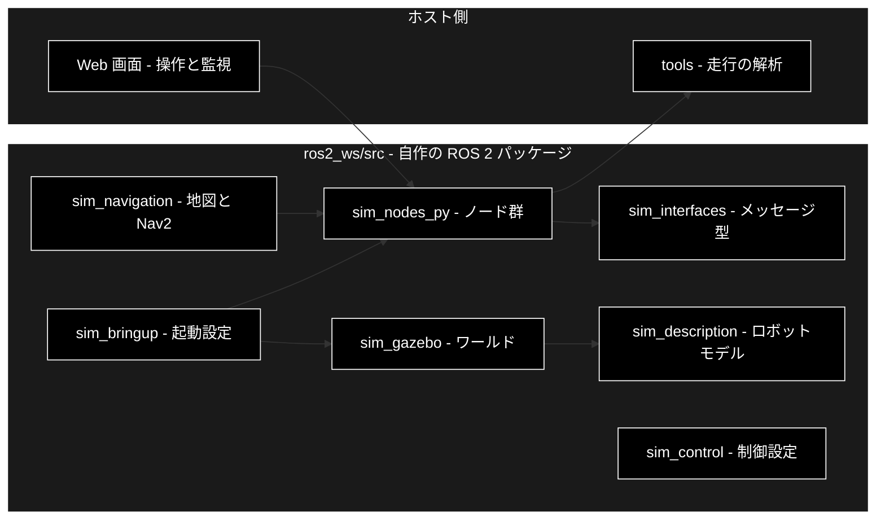
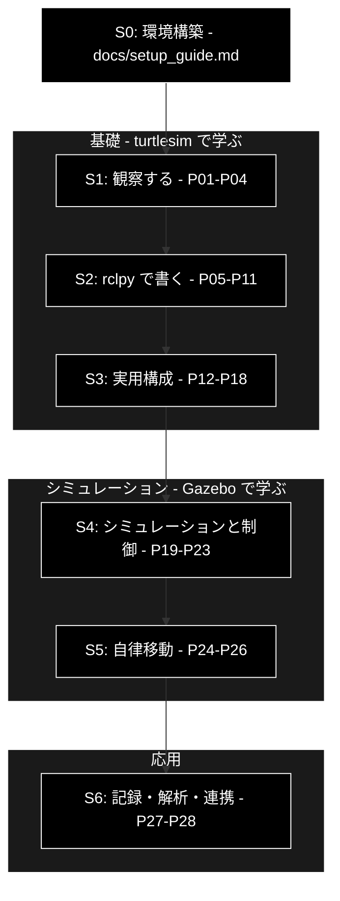
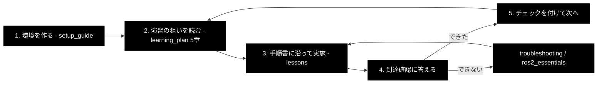
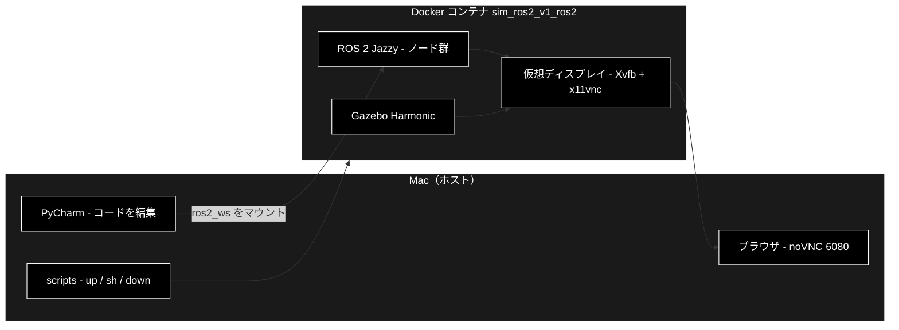

# sim_ros2_v1 — シミュレーションで学ぶ ROS 2

**実機を使わず、Mac 1 台と Docker のシミュレーションだけで、ROS 2 を基礎から自律移動まで習得する学習プロジェクト。**
公式チュートリアルに沿って基礎を固め、公式が扱わない Gazebo・SLAM・Nav2・解析・Web 連携までを、
28 本の演習プログラムを自分で書きながら一本の道筋で学ぶ。

| 項目 | 内容 |
|---|---|
| ROS 2 | **Jazzy Jalisco**（LTS / 2029 年 5 月まで） |
| シミュレータ | turtlesim（前半）→ **Gazebo Harmonic**（後半） |
| 実装言語 | **Python（rclpy）**のみ |
| 実行環境 | Docker Compose（macOS Apple Silicon で動作確認） |
| 開発 IDE | PyCharm Professional |
| 学習量 | 6 ステージ・**演習 28 本**＋発展課題 4 本・目安 約 120 時間 |

---

## 📚 ドキュメント案内

**すぐに開く（リンク）**

1. [README.md](README.md) — プロジェクトの全体像（本書）
2. [docs/setup_guide.md](docs/setup_guide.md) — **環境構築の手順**（セットアップガイド）
3. [docs/learning_plan.md](docs/learning_plan.md) — **学習計画**（技術の評価・演習の一覧と詳細）
4. [lessons/README.md](lessons/README.md) — **演習の手順書**（[P01](lessons/P01_observe_nodes.md)）
5. [docs/ros2_tutorial_index.md](docs/ros2_tutorial_index.md) — 公式チュートリアルの索引
6. [docs/ros2_essentials.md](docs/ros2_essentials.md) — ROS 2 の要点
7. [docs/dev_workflow.md](docs/dev_workflow.md) — 日常の開発ワークフロー
8. [docs/troubleshooting.md](docs/troubleshooting.md) — トラブルシューティング
9. [docs/humble_jazzy_diff.md](docs/humble_jazzy_diff.md) — Humble ↔ Jazzy 差分早見表

**各ドキュメントの役割**

| 順 | ドキュメント | 書いてあること | いつ読むか |
|:-:|---|---|---|
| 1 | [README.md](README.md) | 目的・目標・学習の目次・進め方・環境の要点・現在の状況 | 最初に |
| 2 | [docs/setup_guide.md](docs/setup_guide.md) | 環境構築の詳細。Docker → 動作確認 → GUI → PyCharm → ワークスペース（STEP 1〜5） | 環境を作るとき・壊れたとき |
| 3 | [docs/learning_plan.md](docs/learning_plan.md) | 技術の評価（重要度・頻度・難易度）、**演習 28 本の目的・作るもの・到達確認・つまずきどころ** | 演習に入る前に、その演習の狙いを確かめるとき |
| 4 | [lessons/](lessons/README.md) | **演習ごとの手順書**。実行するコマンドと**期待される結果**、到達確認の答え、対処 | 演習を実際に進めるとき |
| 5 | [docs/ros2_tutorial_index.md](docs/ros2_tutorial_index.md) | 公式チュートリアルの全目次と、各演習との対応 | 公式の該当箇所を読むとき |
| 6 | [docs/ros2_essentials.md](docs/ros2_essentials.md) | 通信 4 方式・QoS・TF・実行モデル、Web 開発者向け用語対応表 | 概念で迷ったとき |
| 7 | [docs/dev_workflow.md](docs/dev_workflow.md) | 編集 → ビルド → 実行 → 観察の流れ、CLI チートシート | 毎日の作業で |
| 8 | [docs/troubleshooting.md](docs/troubleshooting.md) | 症状から原因と対処を引ける | 動かないとき |
| 9 | [docs/humble_jazzy_diff.md](docs/humble_jazzy_diff.md) | Humble 向けの記事を Jazzy で読み替える表 | ネット記事・書籍を参考にするとき |

---

## 目次

1. [このプロジェクトについて](#1-このプロジェクトについて)
2. [学習の目標と成果](#2-学習の目標と成果)
3. [学習の目次](#3-学習の目次)
4. [学習の進め方（実施手順）](#4-学習の進め方実施手順)
5. [学習環境](#5-学習環境)
6. [リポジトリ構成](#6-リポジトリ構成)
7. [現在の状況](#7-現在の状況)
8. [参考リンク](#8-参考リンク)
9. [変更履歴](#9-変更履歴)

---

## 1. このプロジェクトについて

### 1.1 目的

ROS 2 で**実際の開発に使われている技術を、一通り自分の手で書ける**ようになること。
ロボット本体・センサ・実験スペースは一切用意しない。すべてをシミュレーションで行う。

### 1.2 学習の方針

| 方針 | 内容 | 理由 |
|---|---|---|
| **実機を使わない** | turtlesim と Gazebo のシミュレーションだけで学ぶ | 機材と場所が要らず、壊しても戻せる。同じ条件を何度でも再現できる |
| **観察してから書く** | 最初のステージはコードを書かず、CLI で ROS 2 の動きを観察する | 書いたものが動かないとき、コードの誤りか概念の誤解かを切り分けられるようにする |
| **公式チュートリアルに沿う** | 基礎（S1〜S3）は公式チュートリアルの順序をなぞる | 情報が多く、正確。Jazzy でも Humble でも構成はほぼ同じ |
| **公式が扱わない部分を補う** | Gazebo との統合・SLAM・Nav2・解析・Web 連携（S4〜S6）は独自に用意する | 公式チュートリアルはここで途切れる。実務ではここからが本番 |
| **重要技術を独立させる** | QoS・名前空間・Executor・ライフサイクル・シミュレーション時間などを、1 本ずつの演習にする | 公式の順序だけでは抜け落ち、後で必ず詰まる技術だから（[学習計画 2.3](docs/learning_plan.md#23-評価で分かったこと)） |
| **Python に絞る** | rclpy だけを使い、C++ は扱わない | 概念の習得に集中する。概念は C++ と共通なので、後から移りやすい |
| **段階的にシミュレータを使う** | S3 までは軽い turtlesim、S4 から Gazebo | 概念を学ぶ段階で、重いシミュレータの環境トラブルに足を取られない |

### 1.3 対象者と前提知識

| 分野 | 必要な水準 |
|---|---|
| Python | クラス・デコレータ・仮想環境が分かる |
| Docker | `docker compose up` / `exec` の意味が分かる |
| ターミナル | 複数のターミナルを並べて作業できる |
| ロボティクス | **不要**（本プロジェクトで学ぶ） |
| C++ | **不要** |

---

## 2. 学習の目標と成果

### 2.1 最終目標

28 本の演習を終えたとき、次の 3 つができる状態を目指す。

| # | 目標 | 達成するステージ |
|:-:|---|:-:|
| **G1** | 通信 4 方式（トピック / サービス / アクション / パラメータ）と QoS を使い分けて、ROS 2 のノードを自分で書ける | S1〜S3 |
| **G2** | URDF・TF・Gazebo・ros2_control で仮想ロボットを組み立て、センサを読んで動かせる | S3〜S4 |
| **G3** | SLAM で地図を作り、Nav2 で自律移動させ、その走行を記録・解析・外部から操作できる | S5〜S6 |

### 2.2 ステージごとの到達目標と成果物

| S | ステージ | できるようになること（到達目標） | 手元に残るもの（成果物） | 確かめ方 |
|:-:|---|---|---|---|
| **S1** | 観察する | ノード・トピック・サービス・アクションの違いを、CLI と図で説明できる | （コードなし）観察の記録 | `rqt_graph` の図を見て、どのノードがどう繋がっているか説明できる |
| **S2** | rclpy で書く | 通信 4 方式・QoS・名前空間を使ったノードを自分で書ける | `sim_nodes_py`（自作ノード群）、`sim_interfaces`（自作のメッセージ型） | 自作ノードで亀を動かし、QoS の不一致をわざと起こして直せる |
| **S3** | 実用構成 | 複数ノードを launch で起動し、座標変換とロボットモデルを扱い、テストを書ける | launch 一式、差動二輪ロボットのモデル（URDF）、テスト | RViz2 にロボットが表示され、`colcon test` が通る |
| **S4** | シミュレーションと制御 | 仮想ロボットを Gazebo で動かし、センサ（LiDAR・カメラ）を読んで制御できる | Gazebo ワールド、障害物回避ノード、画像処理ノード、ros2_control の設定 | 迷路で壁にぶつからずに走り続ける |
| **S5** | 自律移動 | 地図を作り、ゴールを指定して自律移動させ、Python から巡回を指示できる | 迷路の地図、Nav2 の設定、巡回ノード | 起動するだけで 4 地点を巡回して戻ってくる |
| **S6** | 記録・解析・連携 | 走行を記録して解析し、ブラウザから操作・監視できる | 解析レポート（軌跡・速度のグラフ）、Web 画面 | ブラウザのボタンで巡回が始まり、現在位置が表示される |

### 2.3 完成時の姿

全ステージを終えると、次のものが手元に揃う。


```mermaid
flowchart LR
    subgraph Ws["ros2_ws/src - 自作の ROS 2 パッケージ"]
        N["sim_nodes_py - ノード群"]
        I["sim_interfaces - メッセージ型"]
        D["sim_description - ロボットモデル"]
        G["sim_gazebo - ワールド"]
        C["sim_control - 制御設定"]
        V["sim_navigation - 地図と Nav2"]
        B["sim_bringup - 起動設定"]
    end
    subgraph Host["ホスト側"]
        T["tools - 走行の解析"]
        W["Web 画面 - 操作と監視"]
    end
    B --> N
    B --> G
    G --> D
    N --> I
    V --> N
    N --> T
    W --> N
classDef default fill:#000,stroke:#fff,color:#fff
classDef subgraphStyle fill:#1a1a1a,stroke:#fff,color:#fff
class N,I,D,G,C,V,B,T,W default
style Ws fill:#1a1a1a,stroke:#fff,color:#fff
style Host fill:#1a1a1a,stroke:#fff,color:#fff
```

---

## 3. 学習の目次

### 3.1 ステージ構成


```mermaid
flowchart TB
    S0["S0: 環境構築 - docs/setup_guide.md"]
    subgraph Base["基礎 - turtlesim で学ぶ"]
        S1["S1: 観察する - P01-P04"]
        S2["S2: rclpy で書く - P05-P11"]
        S3["S3: 実用構成 - P12-P18"]
    end
    subgraph Sim["シミュレーション - Gazebo で学ぶ"]
        S4["S4: シミュレーションと制御 - P19-P23"]
        S5["S5: 自律移動 - P24-P26"]
    end
    subgraph App["応用"]
        S6["S6: 記録・解析・連携 - P27-P28"]
    end
    S0 --> S1 --> S2 --> S3 --> S4 --> S5 --> S6
classDef default fill:#000,stroke:#fff,color:#fff
classDef subgraphStyle fill:#1a1a1a,stroke:#fff,color:#fff
class S0,S1,S2,S3,S4,S5,S6 default
style Base fill:#1a1a1a,stroke:#fff,color:#fff
style Sim fill:#1a1a1a,stroke:#fff,color:#fff
style App fill:#1a1a1a,stroke:#fff,color:#fff
```

| S | ステージ | 演習 | 環境 | 難易度 | 目安 |
|:-:|---|:-:|---|:-:|:-:|
| S0 | 環境構築 | — | Docker | — | 1〜2 h |
| S1 | 観察する | P01〜P04 | turtlesim | ★1 | 9 h |
| S2 | rclpy で書く | P05〜P11 | turtlesim | ★2〜★3 | 19 h |
| S3 | 実用構成 | P12〜P18 | turtlesim / RViz2 | ★3〜★4 | 32 h |
| S4 | シミュレーションと制御 | P19〜P23 | Gazebo | ★2〜★5 | 26 h |
| S5 | 自律移動 | P24〜P26 | Gazebo | ★3〜★5 | 18 h |
| S6 | 記録・解析・連携 | P27〜P28 | Gazebo / ホスト | ★3〜★4 | 13 h |

難易度は ★1（コマンドを打って観察するだけ）〜 ★5（数百行の設定とデバッグが中心）の 5 段階。
定義は [学習計画 2.1](docs/learning_plan.md#21-評価軸) にある。

### 3.2 演習一覧（全 28 本）

**上から順に進める。** 各演習の目的・作るもの・到達確認は [学習計画 5 章](docs/learning_plan.md#5-各演習の説明)、
実行手順と期待される結果は「手順書」の列にある。

| 順 | ID | 演習 | ★ | 目安 | 作るもの | 手順書 |
|:-:|:-:|---|:-:|:-:|---|:-:|
| 1 | P01 | 環境確認とノードの観察 | 1 | 2h | （コードなし）turtlesim を起動し、ノード構成を観察する | [✅](lessons/P01_observe_nodes.md) |
| 2 | P02 | トピックとメッセージ型の操作 | 1 | 2h | （コードなし）CLI でトピックを送受信し、型を調べる | 🔲 |
| 3 | P03 | サービス・パラメータ・アクションの操作 | 1 | 3h | （コードなし）3 方式を CLI で呼び分ける | 🔲 |
| 4 | P04 | launch・ログ・bag の操作 | 1 | 2h | （コードなし）記録した動きを再生する | 🔲 |
| 5 | P05 | パッケージの作成とビルド | 2 | 2h | `sim_nodes_py` パッケージ（空のノード） | 🔲 |
| 6 | P06 | パブリッシャ・サブスクライバ・タイマ | 2 | 3h | 亀を円運動させるノード ＋ 位置を読むノード | 🔲 |
| 7 | P07 | QoS の実験 | 2 | 3h | QoS の不一致をわざと起こして直すノード一式 | 🔲 |
| 8 | P08 | サービスのサーバとクライアント | 2 | 3h | 亀を出現させるクライアント ＋ 自作サービス | 🔲 |
| 9 | P09 | パラメータ | 2 | 2h | 実行中に速度を変えられるノード | 🔲 |
| 10 | P10 | カスタムインターフェース | 3 | 4h | `sim_interfaces` パッケージ（msg / srv / action） | 🔲 |
| 11 | P11 | 名前空間・リマップ | 2 | 2h | 2 匹の亀を同じノードで別々に動かす | 🔲 |
| 12 | P12 | アクションのサーバとクライアント | 3 | 4h | 指定座標へ亀を移動させるアクション | 🔲 |
| 13 | P13 | Executor とコールバックグループ | 4 | 5h | デッドロックを再現して解消するノード | 🔲 |
| 14 | P14 | launch ファイル | 3 | 4h | S2 の全ノードを引数つきで一括起動する launch | 🔲 |
| 15 | P15 | tf2 による座標変換 | 4 | 6h | 亀が亀を追いかけるノード | 🔲 |
| 16 | P16 | URDF・xacro・RViz2 | 3 | 6h | 差動二輪ロボット（LiDAR・カメラ付き）のモデル | 🔲 |
| 17 | P17 | ライフサイクルノード | 3 | 3h | configure → activate で配信を始めるノード | 🔲 |
| 18 | P18 | テスト | 3 | 4h | S2〜S3 のノードの単体テスト ＋ launch テスト | 🔲 |
| 19 | P19 | Gazebo とブリッジ | 4 | 6h | P16 のロボットを Gazebo に出現させ、ROS から操作する | 🔲 |
| 20 | P20 | シミュレーション時間 | 2 | 2h | `use_sim_time` の有無で挙動を比較する | 🔲 |
| 21 | P21 | センサ処理と制御ループ | 3 | 5h | LiDAR で障害物を避けて走るノード | 🔲 |
| 22 | P22 | カメラ画像処理 | 3 | 5h | 色付きの物体を検出して追うノード | 🔲 |
| 23 | P23 | ros2_control | 5 | 8h | 差動二輪を `diff_drive_controller` で制御する構成 | 🔲 |
| 24 | P24 | SLAM | 3 | 4h | 迷路ワールドの地図 | 🔲 |
| 25 | P25 | Nav2 の起動と設定 | 5 | 10h | 地図上でゴールを指定して自律移動させる構成 | 🔲 |
| 26 | P26 | Nav2 を Python から操作 | 3 | 4h | 複数地点を巡回するノード | 🔲 |
| 27 | P27 | rosbag2 の記録と解析 | 3 | 5h | 走行を記録し、軌跡と速度をグラフ化するツール | 🔲 |
| 28 | P28 | Web 連携 | 4 | 8h | ブラウザからロボットを操作・監視する画面 | 🔲 |

手順書の列: ✅ 作成済み / 🔲 未作成（取り組む演習の少し先まで、順に作っていく）

### 3.3 発展課題（任意）

| ID | 課題 | ★ | 内容 |
|:-:|---|:-:|---|
| X1 | Behavior Tree | 4 | Nav2 の振る舞いを定義する BT（XML）を改造する |
| X2 | 複数ロボット | 5 | 名前空間（P11）× Nav2（P25）で 2 台を同じ地図で動かす |
| X3 | MoveIt 2 | 5 | アームロボットの軌道計画と把持を体験する |
| X4 | DDS の調整 | 4 | 通信ミドルウェアの切り替えなどで、通信の仕組みを深掘りする |

---

## 4. 学習の進め方（実施手順）

### 4.1 全体の流れ


```mermaid
flowchart LR
    A["1. 環境を作る - setup_guide"] --> B["2. 演習の狙いを読む - learning_plan 5章"]
    B --> C["3. 手順書に沿って実施 - lessons"]
    C --> D["4. 到達確認に答える"]
    D -->|"できた"| E["5. チェックを付けて次へ"]
    D -->|"できない"| F["troubleshooting / ros2_essentials"]
    F --> C
    E --> B
classDef default fill:#000,stroke:#fff,color:#fff
class A,B,C,D,E,F default
```

| 段階 | すること | 使うドキュメント |
|:-:|---|---|
| 1 | **環境を作る**（最初の 1 回だけ） | [docs/setup_guide.md](docs/setup_guide.md) |
| 2 | **演習の狙いを読む**。何を作り、何ができたら完了かを先に知る | [docs/learning_plan.md 5 章](docs/learning_plan.md#5-各演習の説明) |
| 3 | **手順書に沿って実施する**。コマンドを打つたびに「期待される結果」と見比べる | [lessons/](lessons/README.md) |
| 4 | **到達確認に答える**。答えは手順書の最後にある | 手順書の「到達確認」 |
| 5 | **チェックを付けて次へ** | [学習計画 9.3 の進捗チェックリスト](docs/learning_plan.md#93-進捗チェックリスト) |

### 4.2 1 本の演習の時間配分

| 段階 | 内容 | 配分 |
|---|---|:-:|
| 読む | 学習計画の該当演習と、対応する公式チュートリアルを読む | 20% |
| 書く | `ros2_ws/src/` に実装する。**写経ではなく、見ないで書く** | 40% |
| 観察する | `ros2 topic echo` / `rqt_graph` / `ros2 topic info -v` で、期待どおりに繋がっているかを見る | 30% |
| 確かめる | 到達確認に答える。できなければ「読む」に戻る | 10% |

**「観察する」が最も大事である。** ROS 2 は複数のプログラムが通信しあう仕組みなので、動かないときに
原因がノード・トピック名・QoS・型・時刻のどこにあるのかを切り分ける力が要る。

### 4.3 1 日の作業の流れ

```bash
# --- 始める（Mac のターミナル・リポジトリのフォルダで） ---
git pull origin master       # 最新の手順書を取り込む
./scripts/up.sh              # コンテナを起動する
./scripts/sh.sh              # コンテナに入る（必要な枚数だけ、別ターミナルで繰り返す）

# --- 作業する（プロンプトが root@ros2: のターミナルで） ---
#     手順書に沿って ros2 / colcon コマンドを実行する
#     GUI はブラウザで http://localhost:6080/vnc.html →「接続」

# --- 終える（Mac のターミナルで） ---
./scripts/down.sh            # コンテナを停止する（ビルド成果物は残る）
```

**いまどこにいるかは、プロンプトで見分ける。**

| プロンプト | いる場所 | 使えるもの |
|---|---|---|
| `nakashima_toshio@Mac sim_ros2_v1 %` | **Mac** | `./scripts/*.sh`、`git` |
| `root@ros2:/workspace/ros2_ws#` | **コンテナ** | `ros2`、`colcon`、`gz` |

### 4.4 手順書の読み方

手順書（`lessons/Pxx_*.md`）は、**コマンドと、その直後に期待される結果**を組にして書いている。

````
### 4.1 起動しているノードの一覧

```bash
ros2 node list          ← 実行するコマンド
```

**期待される結果:**     ← こう表示されれば正しい

```
/teleop_turtle
/turtlesim
```
````

**期待される結果と違ったら、そこで止まる。** 先に進まず、手順書の「うまくいかないとき」と
[docs/troubleshooting.md](docs/troubleshooting.md) を見る。期待される結果は推測ではなく、
実機またはソースで確かめた値を書いている（どちらで確かめたかは各手順書の変更履歴にある）。

---

## 5. 学習環境

詳細は [docs/setup_guide.md](docs/setup_guide.md) にある。ここでは全体像と最初の起動だけを示す。

### 5.1 構成


```mermaid
flowchart LR
    subgraph Mac["Mac（ホスト）"]
        Br["ブラウザ - noVNC 6080"]
        Py["PyCharm - コードを編集"]
        Sc["scripts - up / sh / down"]
    end
    subgraph Ctr["Docker コンテナ sim_ros2_v1_ros2"]
        Ros["ROS 2 Jazzy - ノード群"]
        Gz["Gazebo Harmonic"]
        Gui["仮想ディスプレイ - Xvfb + x11vnc"]
    end
    Sc --> Ctr
    Py -->|"ros2_ws をマウント"| Ros
    Ros --> Gui
    Gz --> Gui
    Gui --> Br
classDef default fill:#000,stroke:#fff,color:#fff
classDef subgraphStyle fill:#1a1a1a,stroke:#fff,color:#fff
class Br,Py,Sc,Ros,Gz,Gui default
style Mac fill:#1a1a1a,stroke:#fff,color:#fff
style Ctr fill:#1a1a1a,stroke:#fff,color:#fff
```

| 要素 | 内容 |
|---|---|
| なぜ Docker か | macOS には ROS 2 の実用的な配布が無い。コンテナの中に Ubuntu 24.04 ＋ ROS 2 Jazzy を用意する |
| GUI の見え方 | コンテナ内の画面（RViz2・Gazebo・turtlesim）を、ブラウザ（noVNC）で見る |
| コードの置き場所 | Mac の `ros2_ws/src/` をコンテナにマウントする。PyCharm で編集し、コンテナでビルドする |
| ポート | 6080（noVNC）・8765（Foxglove）・5678（デバッガ）。**この Mac からのみ**接続できる |

### 5.2 前提ソフト

| ソフト | 要件 |
|---|---|
| Docker Desktop | 4.30 以降。メモリ 8 GB 以上・ディスク 32 GB 以上を割り当てる |
| ブラウザ | noVNC が動くもの（Chrome / Safari など） |
| PyCharm | Professional（Docker インタプリタを使うため） |
| 空きディスク | 20 GB 以上 |

### 5.3 クイックスタート

Mac のターミナルで実行する。

```bash
git clone https://github.com/nakashima2toshio/sim_ros2_v1.git
cd sim_ros2_v1
./scripts/up.sh        # 初回はイメージのビルドに 20〜40 分かかる
```

**期待される結果:** 最後に次の 2 行が出る。

```
GUI (noVNC): http://localhost:6080/vnc.html
コンテナに入る: ./scripts/sh.sh
```

```bash
./scripts/sh.sh        # プロンプトが root@ros2:/workspace/ros2_ws# に変わる
ros2 doctor
```

**期待される結果:** `All 5 checks passed` と出る（大量の `UserWarning` は無視してよい）。

ここまで来たら、[P01 の手順書](lessons/P01_observe_nodes.md) から学習を始める。

### 5.4 動作確認の基準

学習を始めてよい状態の基準（詳細は [セットアップガイド 2.1](docs/setup_guide.md#21-完成状態の定義)）。

| # | 条件 | 状況 |
|:-:|---|:-:|
| C1 | コンテナが起動し、`ros2 doctor` が通る | ✅ 実機で確認済み |
| C2 | turtlesim が画面に表示され、キー操作で動く | 🔲 確認中（P01） |
| C3 | ノード間でメッセージが流れる | 🔲 |
| C4 | RViz2 と rqt が開く | 🔲 |
| C5 | Gazebo が起動し、ROS 側からトピックが見える | 🔲 |
| C6 | PyCharm から `rclpy` の補完が効く | 🔲 |

---

## 6. リポジトリ構成

```
sim_ros2_v1/
├── README.md                # プロジェクトの全体像（本書）
├── docs/                    # 計画・環境・リファレンス
│   ├── setup_guide.md       #   環境構築の手順（STEP 1〜5）
│   ├── learning_plan.md     #   学習計画（技術の評価・演習 28 本の詳細）
│   ├── ros2_tutorial_index.md  # 公式チュートリアルの索引
│   ├── ros2_essentials.md   #   ROS 2 の要点
│   ├── dev_workflow.md      #   日常の開発ワークフロー
│   ├── troubleshooting.md   #   トラブルシューティング
│   └── humble_jazzy_diff.md #   Humble ↔ Jazzy 差分
├── lessons/                 # 演習の手順書（コマンドと期待される結果）
├── docker-compose/          # 実行環境（Dockerfile / compose / entrypoint）
├── scripts/                 # Mac 側で使う定型操作（up / sh / build / down / verify_env）
├── ros2_ws/src/             # 自作の ROS 2 パッケージ（演習で増えていく。現在は空）
├── tools/                   # ROS に依存しない解析ツール（P27 で作成）※未作成
├── tests/                   # tools/ のテスト ※未作成
├── .env.example             # ポート番号などの設定のひな形
└── pyproject.toml           # ホスト側 Python ツールの依存定義
```

---

## 7. 現在の状況

| 項目 | 状況 |
|---|---|
| 環境構築（STEP 1〜5） | 手順とファイルは完成。実機（macOS Apple Silicon）でビルド・起動・`ros2 doctor` まで確認済み |
| GUI 表示 | 画面を出す仕組み（Xvfb・x11vnc・noVNC）の起動は実機で確認済み。turtlesim の表示は確認中 |
| 学習計画 | 全 28 演習の一覧と詳細が完成（[docs/learning_plan.md](docs/learning_plan.md)） |
| 手順書 | P01 のみ作成済み（[lessons/](lessons/README.md)） |
| 自作パッケージ | 未着手（P05 から作り始める） |
| 環境への追加が必要なもの | P22 の `cv_bridge`、P23 の ros2_control 一式（[学習計画 7 章](docs/learning_plan.md#7-学習環境への追加が必要なもの)） |

---

## 8. 参考リンク

| リンク | 内容 |
|---|---|
| [ROS 2 Jazzy Documentation](https://docs.ros.org/en/jazzy/) | 公式ドキュメント（本プロジェクトの対象バージョン） |
| [ROS 2 Tutorials](https://docs.ros.org/en/jazzy/Tutorials.html) | 公式チュートリアル |
| [Gazebo Harmonic](https://gazebosim.org/docs/harmonic) | シミュレータ |
| [ros_gz](https://github.com/gazebosim/ros_gz) | ROS 2 と Gazebo の橋渡し |
| [Nav2](https://docs.nav2.org/) | 自律移動のフレームワーク |
| [ros2_control](https://control.ros.org/jazzy/) | 制御のフレームワーク |
| [REP-2000](https://ros.org/reps/rep-2000.html) | ROS 2 の版ごとの対応バージョン |

---

## 9. 変更履歴

| 日付 | 内容 |
|---|---|
| 2026-08-04 | 初版（学習準備のセットアップガイドとして作成） |
| 2026-10-04 | 学習計画を全面改訂（演習 28 本の構成） |
| 2026-10-05 〜 06 | 起動時の不具合修正（ポート衝突・`up.sh`）、`.idea/` の管理対象外化、実機確認結果の反映 |
| 2026-10-08 | 演習の手順書 `lessons/` を新設（P01） |
| 2026-10-08 | **README をプロジェクト全体の入口として一から作り直した。** 目的・学習方針・目標と成果（ステージごとの到達目標と成果物）・学習の目次（全 28 演習）・実施手順・環境の要点・現在の状況をまとめた。それまでの環境構築の詳細（STEP 1〜5）は [docs/setup_guide.md](docs/setup_guide.md) に移した。変更の経緯の詳細は同書の変更履歴にある |
