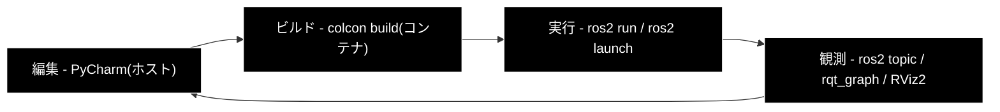

# 日常の開発ワークフロー

学習準備（[README](../README.md) STEP 1〜5）完了後の、**毎日の作業手順とコマンド集**。

---

## 目次

1. [基本ループ](#1-基本ループ)
2. [ターミナル構成](#2-ターミナル構成)
3. [CLI チートシート](#3-cli-チートシート)
4. [記録と再現（rosbag2）](#4-記録と再現rosbag2)
5. [テストの実行](#5-テストの実行)

---

## 1. 基本ループ



### 1.1 一日の始め方

```bash
# ホスト側
cd ~/sim_ros2_v1
./scripts/up.sh                    # コンテナ起動
./scripts/sh.sh                    # コンテナ内 bash

# コンテナ内
cd /workspace/ros2_ws
colcon build --symlink-install
source install/setup.bash
```

### 1.2 編集からの反映

| 変更した内容 | 必要な操作 |
|---|---|
| Python ノードのコード | **不要**（`--symlink-install` により即反映）。再実行するだけ |
| `setup.py` の `entry_points` | `colcon build --packages-select <pkg>` |
| `.msg` / `.srv` / `.action` | `colcon build --packages-up-to <使う側のpkg>` |
| launch ファイル | `colcon build --packages-select <pkg>`（`share/` へコピーされるため） |
| `package.xml` の依存 | `rosdep install` → `colcon build` |

> **`--symlink-install` の効果は Python パッケージのソースに限る。**
> launch ファイルや YAML は `install/` にコピーされるため、ビルドが必要になる。

### 1.3 一日の終わり方

```bash
# コンテナ内での作業を抜けて、ホスト側で
./scripts/down.sh          # コンテナ停止（イメージとボリュームは残る）
```

`git commit` はホスト側で行う。`ros2_ws/build/` `install/` `log/` は
`.gitignore` 済みのため対象に入らない。

---

## 2. ターミナル構成

ROS 2 の作業では**ターミナルを 3〜4 枚開く**のが標準。推奨の役割分担は次のとおり。

| 枚目 | 役割 | 典型的なコマンド |
|---|---|---|
| 1 | シミュレータ / 主要ノード | `ros2 launch sim_bringup sim_world.launch.py` |
| 2 | 自作ノードの実行 | `ros2 run sim_nodes_py my_node` |
| 3 | 観測 | `ros2 topic echo /scan`、`ros2 topic hz /odom` |
| 4 | 可視化 / 調査 | `rviz2`、`rqt_graph`、`ros2 node info` |

すべて同じコマンドで同一コンテナに入る。

```bash
docker compose -f docker-compose/docker-compose.yml exec ros2 bash
# または
./scripts/sh.sh
```

> **すべてのターミナルで `source install/setup.bash` が必要。**
> `entrypoint.sh` / `.bashrc` で自動化しておくこと（README 3.6）。

> **⚠️ `./scripts/sh.sh` はホスト（Mac）側で実行する。**
> コンテナ内で叩くと `No such file or directory` になる。
> スクリプトの実体は `/workspace/scripts/` にあるが、中身は `docker compose`
> コマンドなので、パスを直してもコンテナ内では動かない。

---

## 3. CLI チートシート

### 3.1 ノード

```bash
ros2 node list                       # 起動中のノード一覧
ros2 node info /turtlesim            # そのノードの topic/service/action/param
ros2 run <package> <executable>      # ノードを起動
ros2 run <pkg> <exe> --ros-args -r __node:=new_name   # ノード名を変更して起動
```

### 3.2 トピック

```bash
ros2 topic list                      # トピック一覧
ros2 topic list -t                   # 型つきで表示
ros2 topic info /scan --verbose      # ★ QoS を含む詳細（不具合調査の起点）
ros2 topic echo /scan                # 中身を表示
ros2 topic echo /scan --once         # 1件だけ
ros2 topic hz /scan                  # 配信周期を測る
ros2 topic bw /scan                  # 帯域を測る
ros2 topic pub /cmd_vel geometry_msgs/msg/Twist \
  "{linear: {x: 0.2}, angular: {z: 0.5}}" -r 10       # 手動で配信
```

### 3.3 サービス

```bash
ros2 service list
ros2 service list -t
ros2 service type /reset_robot
ros2 service call /reset_robot std_srvs/srv/Trigger "{}"
```

### 3.4 アクション

```bash
ros2 action list
ros2 action info /navigate_to_pose
ros2 action send_goal /countdown sim_interfaces/action/Countdown \
  "{start: 10}" --feedback              # --feedback で進捗を表示
```

### 3.5 パラメータ

```bash
ros2 param list
ros2 param list /my_node
ros2 param get /my_node max_linear_vel
ros2 param set /my_node max_linear_vel 0.8      # 実行中に変更できる
ros2 param dump /my_node > params.yaml          # 現在値を YAML 出力
ros2 run <pkg> <exe> --ros-args --params-file params.yaml
```

### 3.6 インターフェース定義

```bash
ros2 interface list                                    # 全型の一覧
ros2 interface show sensor_msgs/msg/LaserScan          # ★ 型の中身を確認
ros2 interface show sim_interfaces/action/Countdown
ros2 interface proto geometry_msgs/msg/Twist           # 空のテンプレートを出力
```

> `ros2 interface show` は**最も使用頻度の高いコマンドの 1 つ**。
> メッセージのフィールド名を調べるたびにブラウザを開く必要がなくなる。

### 3.7 launch

```bash
ros2 launch <package> <launch_file>
ros2 launch <package> <launch_file> world:=maze gui:=false    # 引数を渡す
ros2 launch <package> <launch_file> --show-args               # 受け付ける引数の確認
ros2 launch <package> <launch_file> --debug                   # 詳細ログ
```

### 3.8 TF

```bash
ros2 run tf2_tools view_frames               # TF ツリーを PDF 出力
ros2 run tf2_ros tf2_echo map base_link      # 2フレーム間の変換を表示
ros2 topic echo /tf_static --once            # 静的 TF の確認
```

### 3.9 診断

```bash
ros2 doctor                # 環境の自己診断
ros2 doctor --report       # 詳細レポート
rqt_graph                  # ノード接続図
ros2 run rqt_console rqt_console     # ログビューア
ros2 wtf                   # ros2 doctor のエイリアス
```

### 3.10 ビルド

```bash
colcon build --symlink-install                    # 通常のビルド
colcon build --packages-select <pkg>              # 指定パッケージのみ
colcon build --packages-up-to <pkg>               # 依存を辿ってビルド
colcon build --parallel-workers 2                 # メモリ不足時
colcon build --event-handlers console_direct+     # ビルド出力を全表示
rm -rf build install log && colcon build          # フルビルド（型の不整合時）
```

---

## 4. 記録と再現（rosbag2）

### 4.1 記録

```bash
# 特定トピックを記録
ros2 bag record -o bags/run01 /odom /scan /cmd_vel /tf /tf_static

# すべて記録（容量に注意。画像を含むと急激に肥大する）
ros2 bag record -a -o bags/run_all

# 圧縮しながら記録
ros2 bag record -o bags/run02 --compression-mode file --compression-format zstd /scan /odom
```

> **`/tf` と `/tf_static` は必ず含める。** これが無いと、再生しても RViz2 で
> 何も正しい位置に描画できない。

### 4.2 確認と再生

```bash
ros2 bag info bags/run01           # 記録内容・時間・メッセージ数
ros2 bag play bags/run01           # 再生
ros2 bag play bags/run01 -r 0.5    # 0.5倍速
ros2 bag play bags/run01 -l        # ループ再生
```

再生中に別ターミナルで `rviz2` を開けば、走行を何度でも見直せる。

### 4.3 ホスト側での解析

記録した bag は、**ROS を使わずホスト側の Python で解析する**（`tools/`）。

```bash
# ホスト側
uv run python -m tools.report --bag bags/run01 --out reports/run01
```

この分離の理由は [README 8.3](../README.md#83-ros-依存--非依存の分離方針) を参照。

---

## 5. テストの実行

### 5.1 ホスト側（ROS 非依存・高速）

```bash
uv run pytest tests -q
uv run ruff check .
```

`tools/` のロジックはここでテストする。**コンテナ起動が不要**なため数秒で終わる。

### 5.2 コンテナ内（ROS 依存）

```bash
cd /workspace/ros2_ws
colcon test --packages-select sim_nodes_py
colcon test-result --verbose            # ★ 結果の詳細（これを見ないと失敗理由が分からない）
```

> `colcon test` は**失敗してもコマンド自体は成功扱いで終わる**ことがある。
> 必ず `colcon test-result --verbose` で確認する。

### 5.3 テストの種類

| 種類 | ツール | 対象 |
|---|---|---|
| 単体 | `pytest` | ノード内のロジック関数（判定・変換） |
| 結合 | `launch_testing` | launch でノードを起動し、トピックが流れることを確認 |
| Lint | `ament_flake8` / `ament_copyright` / `ruff` | コードスタイル |

---

## 変更履歴

| 日付 | 内容 |
|---|---|
| 2026-08-04 | 初版。README から開発ワークフローを分離して作成 |
