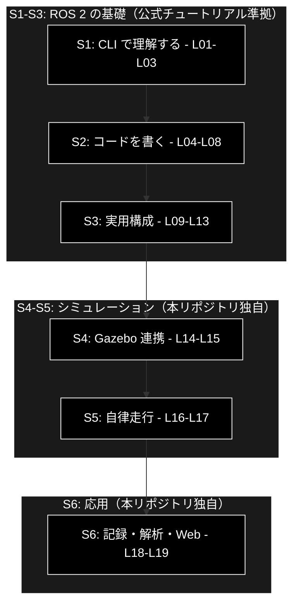
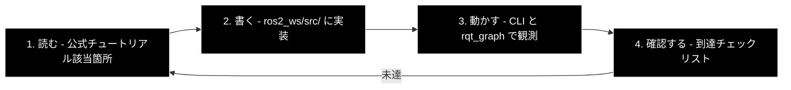

# ROS 2 学習計画 — ステージ構成と公式チュートリアル対応表

本ドキュメントは、[README](../README.md) の学習準備（STEP 1〜5）が完了した後に進む
**学習フェーズの道筋**を定義する。

| 項目 | 内容 |
|---|---|
| 対象 | ROS 2 Jazzy Jalisco |
| 実装言語 | **Python（rclpy）のみ** |
| シミュレータ | turtlesim（S1〜S3）→ Gazebo Harmonic（S4〜） |
| 全体量 | 6 ステージ / 全 19 章 |
| 想定期間 | 週 5〜8 時間で約 3 か月 |

---

## 目次

1. [設計方針](#1-設計方針)
2. [ステージ構成](#2-ステージ構成)
3. [章一覧](#3-章一覧)
4. [公式チュートリアル対応表](#4-公式チュートリアル対応表)
5. [公式が扱わない範囲](#5-公式が扱わない範囲)
6. [1 章の進め方](#6-1-章の進め方)
7. [進捗チェックリスト](#7-進捗チェックリスト)

---

## 1. 設計方針

### 1.1 公式チュートリアルの順序に従う

ROS 2 公式チュートリアルは **「CLI で概念を理解する」→「コードを書く」** の二段構えで
設計されている。この順序には合理性がある。

- ROS 2 の中心概念（ノード・トピック・サービス・アクション）は、**コードを書く前に
  CLI で観測できる**。`ros2 topic echo` でメッセージが流れる様子を先に見ておくと、
  publisher を書いたときに「何が起きているか」が分かる
- 逆順（先にコードを書く）だと、動かないときに「コードの誤り」なのか
  「概念の誤解」なのかを切り分けられない

本計画は S1（CLI）→ S2（実装）という公式の順序をそのまま採用する。

### 1.2 Python のみを追う

公式チュートリアルには Python 版と C++ 版が併記されている章が多いが、
**本プロジェクトは Python 版のみを追う。**

これにより、C++ 専用の章（Pluginlib、Composition、Node Interfaces Template Class、
Monitoring for parameter changes）は対象外となる。
これらは実務や OSS 解読で必要になった時点で個別に参照すればよい。

### 1.3 シミュレータは段階的に導入する

S1〜S3 は **turtlesim と RViz2 のみ**で進める。Gazebo は S4 まで起動しない。

理由は、序盤の学習内容（通信・パラメータ・launch）に Gazebo が不要である一方、
Gazebo は起動が重く、環境依存のトラブルも起きやすいためである。
**概念を学ぶ段階で重いシミュレータの問題に足を取られない**ことを優先する。

### 1.4 公式が途切れる場所から独自の内容になる

公式チュートリアルは Gazebo を Advanced に 1 章置くのみで、SLAM・Nav2 は範囲外である。
**S4 以降が本リポジトリの独自価値**にあたる（詳細は 5 章）。

---

## 2. ステージ構成

| S | 名称 | 章 | 環境 | 目安時間 | このステージの狙い |
|---|---|---|---|---|---|
| S1 | CLI で理解する | L01〜L03 | turtlesim | 6〜9h | ROS 2 の全体像を、コードを書かずに掴む |
| S2 | コードを書く | L04〜L08 | turtlesim | 12〜18h | `rclpy` でノードを書けるようになる |
| S3 | 実用構成 | L09〜L13 | RViz2 | 20〜30h | launch・TF・URDF・テストで「まともなプロジェクト」を組む |
| S4 | Gazebo 連携 | L14〜L15 | Gazebo | 12〜18h | 仮想ロボットを物理シミュレーション上で動かす |
| S5 | 自律走行 | L16〜L17 | Gazebo | 15〜25h | SLAM で地図を作り、Nav2 で自律移動させる |
| S6 | 記録・解析・Web | L18〜L19 | Gazebo | 12〜20h | 実行を記録・解析し、ブラウザから操作する |

---

## 3. 章一覧

### S1: CLI で理解する（turtlesim）

| 章 | テーマ | 学ぶこと | 到達確認 |
|---|---|---|---|
| **L01** | ノードとトピック | 環境設定、turtlesim、rqt、ノードの概念、トピックの概念 | `rqt_graph` で `/turtle1/cmd_vel` の接続が読める |
| **L02** | サービス・パラメータ・アクション | 3 方式の違いを CLI で体験する | `ros2 service call` で亀をワープさせられる |
| **L03** | ログ・launch・記録 | `rqt_console`、`ros2 launch`、`ros2 bag` | 記録した動きを再生できる |

> **L02 が S1 の山場。** トピック・サービス・アクションの使い分けは ROS 2 の設計思想の中核であり、
> ここを CLI で体感しておくと S2 以降が楽になる。
> 概念の整理は [`ros2_essentials.md`](ros2_essentials.md) を併読すること。

### S2: コードを書く（rclpy）

| 章 | テーマ | 学ぶこと | 成果物 |
|---|---|---|---|
| **L04** | ワークスペースとパッケージ | `colcon`、ワークスペース構造、`ros2 pkg create` | ビルドが通る空パッケージ |
| **L05** | パブリッシャとサブスクライバ | `rclpy.node.Node`、タイマ、コールバック | `/chatter` の送受信ノード |
| **L06** | サービスとクライアント | 同期的な要求応答、非同期呼び出しの注意点 | 加算サービスとクライアント |
| **L07** | カスタムインターフェース | `.msg` / `.srv` の定義、`rosidl` によるビルド | `sim_interfaces` パッケージ |
| **L08** | パラメータと自己診断 | クラス内でのパラメータ宣言・取得、`ros2doctor` | 実行中に速度上限を変更できるノード |

> **L06 の落とし穴。** サービスのコールバック内で別のサービスを同期呼び出しすると
> デッドロックする。ROS 2 の実行モデル（Executor とコールバックグループ）に
> 最初に触れる場所であり、丁寧に進める価値がある。

### S3: 実用構成

| 章 | テーマ | 学ぶこと | 成果物 |
|---|---|---|---|
| **L09** | アクションの実装 | `.action` 定義、Goal / Feedback / Result / Cancel | カウントダウンアクション |
| **L10** | launch システム | launch ファイル、引数、substitution、event handler、大規模構成 | 複数ノードの一括起動 |
| **L11** | tf2（座標変換） | static / dynamic broadcaster、listener、frame 追加、デバッグ | 座標系を持つノード群 |
| **L12** | URDF とロボットモデル | リンク・ジョイント、物理/衝突属性、Xacro、`robot_state_publisher` | 差動二輪ロボットのモデル |
| **L13** | テストと依存管理 | `colcon test`、pytest、`launch_testing`、`rosdep` | 自作パッケージのテスト一式 |

> **L11・L12 が学習全体の最難関。** TF は「時刻付きの座標変換ツリー」という
> ROS 2 独自の概念であり、URDF は XML の記述量が多い。ここを越えると
> S4 以降のシミュレーションは一気に見通しが良くなる。

### S4: Gazebo 連携（本リポジトリ独自）

| 章 | テーマ | 学ぶこと | 成果物 |
|---|---|---|---|
| **L14** | Gazebo と ROS 2 の接続 | `gz sim`、SDF ワールド、`ros_gz_bridge`、モデルの spawn | ロボットが仮想世界に立つ |
| **L15** | センサ処理と制御 | LaserScan / Odometry / Imu の購読、制御ループ | 障害物回避ノード |

### S5: 自律走行（本リポジトリ独自）

| 章 | テーマ | 学ぶこと | 成果物 |
|---|---|---|---|
| **L16** | SLAM | `slam_toolbox`、地図生成、地図の保存 | 迷路ワールドの地図 |
| **L17** | Nav2 | コストマップ、プランナ、コントローラ、回復挙動 | ゴール指定での自律走行 |

### S6: 記録・解析・Web 連携（本リポジトリ独自）

| 章 | テーマ | 学ぶこと | 成果物 |
|---|---|---|---|
| **L18** | 記録と解析 | `rosbag2`、ノードからの記録、Python での読み出し | 軌跡・速度のレポート |
| **L19** | Web 連携 | `rosbridge`、FastAPI、React による監視・操作 UI | ブラウザからロボットを操作 |

---

## 4. 公式チュートリアル対応表

各章が公式チュートリアルのどこに対応するかを示す。
**公式ドキュメントは Jazzy 版（`https://docs.ros.org/en/jazzy/`）を参照する。**

### S1 対応表

| 章 | 対応する公式チュートリアル（Beginner: CLI tools） |
|---|---|
| L01 | Configuring environment / Using `turtlesim`, `ros2`, and `rqt` / Understanding nodes / Understanding topics |
| L02 | Understanding services / Understanding parameters / Understanding actions |
| L03 | Using `rqt_console` to view logs / Launching nodes / Recording and playing back data |

### S2 対応表

| 章 | 対応する公式チュートリアル（Beginner: Client libraries） |
|---|---|
| L04 | Using `colcon` to build packages / Creating a workspace / Creating a package |
| L05 | Writing a simple publisher and subscriber **(Python)** |
| L06 | Writing a simple service and client **(Python)** |
| L07 | Creating custom msg and srv files / Implementing custom interfaces |
| L08 | Using parameters in a class **(Python)** / Using `ros2doctor` to identify issues |

> 対象外: Creating and using plugins (C++)

### S3 対応表

| 章 | 対応する公式チュートリアル（Intermediate） |
|---|---|
| L09 | Creating an action / Writing an action server and client **(Python)** |
| L10 | **Launch**（Creating a launch file / Integrating launch files into ROS 2 packages / Using substitutions / Using event handlers / Managing large projects） |
| L11 | **tf2**（Introducing tf2 / Writing a static broadcaster **(Python)** / Writing a broadcaster **(Python)** / Writing a listener **(Python)** / Adding a frame **(Python)** / Debugging / Quaternion fundamentals） |
| L12 | **URDF**（Building a visual robot model from scratch / Building a movable robot model / Adding physical and collision properties / Using Xacro to clean up your code / Using URDF with `robot_state_publisher` **(Python)** / Generating an URDF File）＋ **RViz** の RViz User Guide |
| L13 | **Testing**（Running Tests from the Command Line / Writing Basic Tests with Python / Writing Basic Integration Tests with `launch_testing`）＋ Managing Dependencies with rosdep |

> 対象外（C++ 専用）: Writing a Composable Node / Composing multiple nodes in a single process /
> Using the Node Interfaces Template Class / Monitoring for parameter changes

### S4〜S6 対応表

| 章 | 対応する公式リソース |
|---|---|
| L14 | Advanced: **Simulators → Gazebo**（Setting up a robot simulation）＋ Intermediate: URDF → Using a URDF in Gazebo ＋ [ros_gz](https://github.com/gazebosim/ros_gz) ＋ [Gazebo 公式](https://gazebosim.org/docs/harmonic) |
| L15 | **公式チュートリアルなし**（本リポジトリ独自）。参考: Demos → Using quality-of-service settings for lossy networks |
| L16 | **公式チュートリアルなし**。[slam_toolbox](https://github.com/SteveMacenski/slam_toolbox) |
| L17 | **公式チュートリアルなし**。[Nav2 公式ドキュメント](https://docs.nav2.org/) |
| L18 | Advanced: Recording a bag from a node **(Python)** ＋ 独自（`tools/` での解析） |
| L19 | **公式チュートリアルなし**（本リポジトリ独自）。[rosbridge_suite](https://github.com/RobotWebTools/rosbridge_suite) |

公式チュートリアルの全目次は [`ros2_tutorial_index.md`](ros2_tutorial_index.md) を参照。

---

## 5. 公式が扱わない範囲

本リポジトリが独自に補う部分を明示する。**ここが本プロジェクトの存在意義**にあたる。

| 領域 | 公式の状況 | 本リポジトリの対応 |
|---|---|---|
| **Mac での実行環境** | Ubuntu 直インストール前提。macOS はソースビルド（experimental）扱い | Docker 環境一式を提供（[README](../README.md) STEP 1） |
| **GUI 表示** | 記載なし（ネイティブ環境前提） | noVNC / Foxglove の 2 方式を提供（README STEP 3） |
| **IDE 連携** | 記載なし | PyCharm Professional の設定手順（README STEP 4） |
| **Gazebo の統合的な扱い** | Advanced に 1 章。URDF 章とも分断されている | L14〜L15 で一気通貫に構成 |
| **SLAM** | 範囲外 | L16 |
| **Nav2** | 範囲外（別ドキュメント） | L17 |
| **記録データの解析** | bag の記録・再生までで、解析は範囲外 | L18（`tools/` による軌跡・速度解析） |
| **Web 連携** | 範囲外 | L19（rosbridge → FastAPI → React） |
| **日本語での要点整理** | 英語のみ | [`ros2_essentials.md`](ros2_essentials.md)、[`troubleshooting.md`](troubleshooting.md) |

---

## 6. 1 章の進め方

各章は次の 4 段階で進める。`lessons/L05_pubsub/README.md` のような形式で教材を置く。

| 段階 | 内容 | 所要の目安 |
|---|---|---|
| 1. 読む | 公式チュートリアルの該当箇所を読む。分からない用語は `ros2_essentials.md` で確認 | 20% |
| 2. 書く | `ros2_ws/src/` に自分で実装する。**写経ではなく、閉じて書く** | 40% |
| 3. 動かす | 実行し、`ros2 topic echo` / `rqt_graph` で**期待どおりに動いているかを観測**する | 30% |
| 4. 確認する | 章末の到達チェックリストで確認。未達なら 1 に戻る | 10% |

**重要なのは 3 の「観測」。** ROS 2 は分散システムであり、
「動いていない」ときに原因がノード側かトピック側か QoS かを切り分ける力が要る。
CLI ツールで中を覗く癖をつけておくと、S4 以降で詰まる時間が大きく減る。

---

## 7. 進捗チェックリスト

### S1: CLI で理解する

- [ ] L01 ノードとトピック
- [ ] L02 サービス・パラメータ・アクション
- [ ] L03 ログ・launch・記録

### S2: コードを書く

- [ ] L04 ワークスペースとパッケージ
- [ ] L05 パブリッシャとサブスクライバ
- [ ] L06 サービスとクライアント
- [ ] L07 カスタムインターフェース
- [ ] L08 パラメータと自己診断

### S3: 実用構成

- [ ] L09 アクションの実装
- [ ] L10 launch システム
- [ ] L11 tf2（座標変換）
- [ ] L12 URDF とロボットモデル
- [ ] L13 テストと依存管理

### S4: Gazebo 連携

- [ ] L14 Gazebo と ROS 2 の接続
- [ ] L15 センサ処理と制御

### S5: 自律走行

- [ ] L16 SLAM
- [ ] L17 Nav2

### S6: 記録・解析・Web 連携

- [ ] L18 記録と解析
- [ ] L19 Web 連携

---

## 変更履歴

| 日付 | 内容 |
|---|---|
| 2026-08-04 | 初版。README から学習計画部分を分離して作成 |
