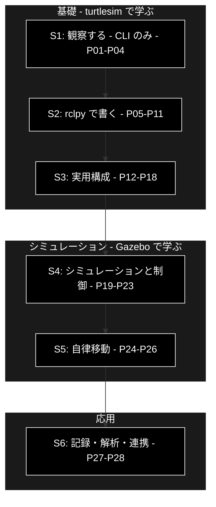
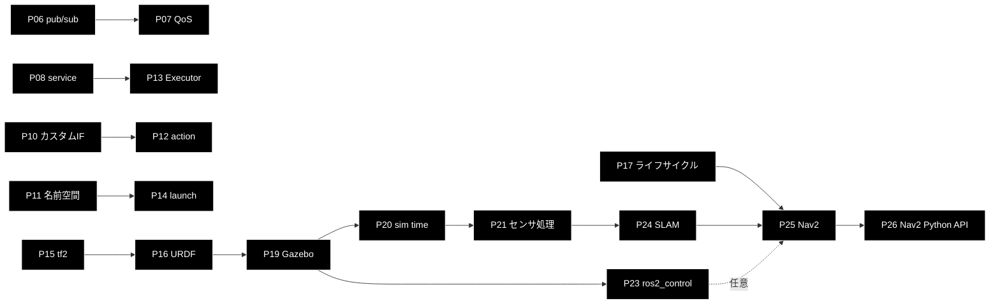

# ROS 2 学習計画 — 重要技術の評価と演習プログラム一覧

| 項目 | 内容 |
|---|---|
| Version | 2.0（2026-10-04 全面改訂） |
| 対象 | ROS 2 **Jazzy Jalisco** / Gazebo **Harmonic** |
| 実装言語 | **Python（rclpy）のみ** |
| 実行環境 | [README](../README.md) の Docker 環境（学習準備 STEP 1〜5 の完了が前提） |
| 全体量 | 6 ステージ / **演習プログラム 28 本** ＋ 発展課題 4 本 |
| 目安時間 | 合計 約 120 時間（週 6 時間で約 5 か月） |

本ドキュメントは、ROS 2 の技術を**ゼロから洗い出して評価し直し**、その結果から
「何を・どの順で・どの難しさで作るか」を決めた学習計画である。
Version 1.0（19 章構成）は公式チュートリアルの順序をなぞる形だったが、
本版は**技術の重要度と使用頻度を先に評価し、そこから演習を組み立てた**。

---

## 目次

1. [概要](#1-概要)
2. [技術の評価](#2-技術の評価)
3. [学習の全体像](#3-学習の全体像)
4. [演習プログラム一覧（項目・順番・難易度）](#4-演習プログラム一覧項目順番難易度)
5. [各演習の説明](#5-各演習の説明)
6. [発展課題（任意）](#6-発展課題任意)
7. [学習環境への追加が必要なもの](#7-学習環境への追加が必要なもの)
8. [公式チュートリアルとの対応](#8-公式チュートリアルとの対応)
9. [進め方と進捗チェックリスト](#9-進め方と進捗チェックリスト)
10. [評価の根拠](#10-評価の根拠)
11. [変更履歴](#11-変更履歴)

---

## 1. 概要

### 1.1 目的

実機を使わず、シミュレーションだけで、**ROS 2 で実際に使われる技術を一通り自分で書ける**
状態になること。到達点は次の 3 つ。

| # | 到達点 | 該当ステージ |
|---|---|---|
| G1 | 通信 4 方式（トピック / サービス / アクション / パラメータ）と QoS を使い分け、ノードを書ける | S1〜S3 |
| G2 | URDF・TF・Gazebo・ros2_control で、仮想ロボットを組み立てて動かせる | S3〜S4 |
| G3 | SLAM と Nav2 で自律移動させ、その走行を記録・解析できる | S5〜S6 |

### 1.2 主な責務

| 責務 | 本ドキュメントの該当章 |
|---|---|
| ROS 2 の技術を洗い出し、重要度・使用頻度・難易度で評価する | 2 章 |
| 評価結果から、学ぶ順番と依存関係を決める | 3 章 |
| 作る演習プログラムを、項目・順番・難易度つきで一覧にする | 4 章 |
| 各演習の作るもの・到達確認・つまずきどころを説明する | 5 章 |
| 計画の実行に必要な環境の追加を明示する | 7 章 |

### 1.3 読み方

- **一覧だけ見たい** → [4 章](#4-演習プログラム一覧項目順番難易度)
- **なぜこの順番か知りたい** → [2 章](#2-技術の評価) と [3 章](#3-学習の全体像)
- **いま取り組む演習の詳細** → [5 章](#5-各演習の説明) の該当 ID
- **公式チュートリアルのどこを読むか** → [8 章](#8-公式チュートリアルとの対応)

---

## 2. 技術の評価

### 2.1 評価軸

各技術を次の 3 軸で評価した。

**重要度**（その技術が無いと何が困るか）

| 記号 | 意味 |
|---|---|
| **S** | これが無いと ROS 2 アプリケーションを書けない。ほぼ全てのプロジェクトで使う |
| **A** | 実務でほぼ確実に出会う。知らないと既存コードが読めない |
| **B** | 用途によっては必須。移動ロボット以外では使わないこともある |
| **C** | 知っていると役立つが、学習の主線には不要 |

**使用頻度**（典型的な ROS 2 プロジェクトで、どれだけ日常的に触るか）

| 記号 | 意味 |
|---|---|
| 高 | ほぼ毎日触る |
| 中 | 構成を作るときや機能追加時に触る |
| 低 | 特定の場面でのみ触る |

**難易度**（Python 経験者が初めて取り組むときの難しさ）

| 記号 | 目安 |
|---|---|
| ★1 | コマンドを打って観察するだけ |
| ★2 | 数十行のノード 1 本で完結する |
| ★3 | 複数ファイル・複数概念を組み合わせる |
| ★4 | 非同期・時刻・座標など、**直感に反する概念**を含む |
| ★5 | 数百行規模の設定（YAML / URDF）とデバッグが作業の中心になる |

### 2.2 技術一覧と評価結果

ROS 2 Jazzy で使われる技術を分野別に洗い出し、評価した。
「採否」は本計画での扱い（**本編** = 演習で扱う / **発展** = 任意課題 / **対象外**）。

#### 通信の基礎

| 技術 | 重要度 | 頻度 | 難易度 | 採否 | 演習 |
|---|:-:|:-:|:-:|:-:|---|
| ノード（`rclpy.node.Node`） | S | 高 | ★2 | 本編 | P01, P06 |
| トピック（パブリッシャ / サブスクライバ） | S | 高 | ★2 | 本編 | P02, P06 |
| QoS（Reliability / Durability / History） | S | 高 | ★2 | 本編 | P07 |
| サービス（サーバ / 非同期クライアント） | S | 高 | ★2 | 本編 | P03, P08 |
| パラメータ（宣言・YAML・変更コールバック） | S | 高 | ★2 | 本編 | P03, P09 |
| アクション（Goal / Feedback / Result / Cancel） | S | 中 | ★3 | 本編 | P03, P12 |
| カスタムインターフェース（`.msg` / `.srv` / `.action`） | S | 中 | ★3 | 本編 | P10 |
| 名前空間・リマップ | A | 高 | ★2 | 本編 | P11 |

#### 実行モデル

| 技術 | 重要度 | 頻度 | 難易度 | 採否 | 演習 |
|---|:-:|:-:|:-:|:-:|---|
| タイマ・コールバック | S | 高 | ★2 | 本編 | P06 |
| Executor とコールバックグループ | A | 中 | ★4 | 本編 | P13 |
| ライフサイクル（managed）ノード | A | 中 | ★3 | 本編 | P17 |
| ROS 時間とシミュレーション時間（`use_sim_time`） | S | 高 | ★2 | 本編 | P20 |
| Composition（同一プロセスへの複数ノード配置） | B | 中 | ★3 | 対象外 | — |

#### 構成・ビルド

| 技術 | 重要度 | 頻度 | 難易度 | 採否 | 演習 |
|---|:-:|:-:|:-:|:-:|---|
| colcon / ament_python パッケージ | S | 高 | ★2 | 本編 | P05 |
| `package.xml` と rosdep | A | 中 | ★2 | 本編 | P05 |
| launch（Python launch・引数・include・条件） | S | 高 | ★3 | 本編 | P04, P14 |

#### 座標・ロボットモデル

| 技術 | 重要度 | 頻度 | 難易度 | 採否 | 演習 |
|---|:-:|:-:|:-:|:-:|---|
| tf2（broadcaster / listener / buffer） | S | 高 | ★4 | 本編 | P15 |
| URDF / xacro | S | 中 | ★3 | 本編 | P16 |
| `robot_state_publisher` / `joint_state_publisher` | S | 中 | ★2 | 本編 | P16 |
| RViz2（表示設定・マーカー） | S | 高 | ★2 | 本編 | P16 |

#### シミュレーションと制御

| 技術 | 重要度 | 頻度 | 難易度 | 採否 | 演習 |
|---|:-:|:-:|:-:|:-:|---|
| Gazebo Harmonic（`gz sim`・SDF ワールド） | S | 中 | ★4 | 本編 | P19 |
| `ros_gz_bridge` / `ros_gz_sim create` | S | 中 | ★3 | 本編 | P19 |
| ros2_control / `gz_ros2_control` | A | 中 | ★5 | 本編 | P23 |
| `diff_drive_controller` | A | 中 | ★4 | 本編 | P23 |

#### 知覚（センサ）

| 技術 | 重要度 | 頻度 | 難易度 | 採否 | 演習 |
|---|:-:|:-:|:-:|:-:|---|
| `sensor_msgs`（LaserScan / Imu）・`nav_msgs/Odometry` | S | 高 | ★3 | 本編 | P21 |
| `cv_bridge` + OpenCV（画像処理） | A | 中 | ★3 | 本編 | P22 |
| `message_filters`（複数トピックの時刻同期） | B | 中 | ★3 | 本編 | P22 |
| 点群（`PointCloud2`） | B | 低 | ★4 | 対象外 | — |

#### 自律移動

| 技術 | 重要度 | 頻度 | 難易度 | 採否 | 演習 |
|---|:-:|:-:|:-:|:-:|---|
| SLAM（`slam_toolbox`） | A | 中 | ★3 | 本編 | P24 |
| Nav2（AMCL・コストマップ・プランナ・コントローラ） | S | 中 | ★5 | 本編 | P25 |
| `nav2_simple_commander`（Nav2 の Python API） | A | 中 | ★3 | 本編 | P26 |
| Behavior Tree（Nav2 の BT XML） | B | 低 | ★4 | 発展 | X1 |

#### 観測・記録・品質

| 技術 | 重要度 | 頻度 | 難易度 | 採否 | 演習 |
|---|:-:|:-:|:-:|:-:|---|
| `ros2` CLI（node / topic / service / param / interface） | S | 高 | ★1 | 本編 | P01〜P04 |
| rqt（`rqt_graph` / `rqt_console`）・`ros2 doctor` | A | 高 | ★1 | 本編 | P01, P04 |
| rosbag2（記録・再生・Python からの読み出し） | A | 中 | ★3 | 本編 | P04, P27 |
| pytest / `launch_testing` / ament_lint | A | 中 | ★3 | 本編 | P18 |
| Foxglove（可視化） | B | 中 | ★1 | 本編 | README STEP 3 |

#### 連携・その他

| 技術 | 重要度 | 頻度 | 難易度 | 採否 | 演習 |
|---|:-:|:-:|:-:|:-:|---|
| rosbridge（WebSocket 経由の外部連携） | B | 低 | ★4 | 本編 | P28 |
| 複数ロボット（名前空間 × Nav2） | B | 低 | ★5 | 発展 | X2 |
| MoveIt 2（マニピュレータ） | B | 中 | ★5 | 発展 | X3 |
| DDS の調整（Discovery Server・RMW 切替） | C | 低 | ★4 | 発展 | X4 |
| rclcpp（C++） | A | 高 | ★4 | 対象外 | — |
| pluginlib（プラグイン） | B | 低 | ★4 | 対象外 | — |
| micro-ROS（マイコン） | B | 低 | ★4 | 対象外 | — |
| SROS2（セキュリティ） | C | 低 | ★4 | 対象外 | — |
| ros1_bridge | C | 低 | ★3 | 対象外 | — |

### 2.3 評価で分かったこと

洗い出しの結果、**公式チュートリアルの順序だけをなぞると抜け落ちる重要技術**が
いくつかあった。本版で新たに独立した演習にしたのは次の 8 項目。

| 技術 | 抜け落ちやすい理由 | なぜ重要か | 演習 |
|---|---|---|---|
| **QoS** | 公式では概念説明と Demos に分散している | 「トピックは見えるのにデータが来ない」障害の最大の原因 | P07 |
| **名前空間・リマップ** | 独立したチュートリアルが無い | 複数ノード・複数ロボット・Nav2 の設定で日常的に使う | P11 |
| **Executor とコールバックグループ** | 公式の該当章は C++ 中心 | サービス内でサービスを呼ぶと**デッドロックする**。Python でも必ず踏む | P13 |
| **ライフサイクルノード** | 公式は C++ のデモのみ | Nav2 の全サーバがライフサイクルノード。理解しないと Nav2 が起動しない理由を追えない | P17 |
| **シミュレーション時間** | 公式チュートリアルに独立した項目が無い | `use_sim_time` の不一致で TF が「過去すぎる／未来すぎる」エラーになる。**シミュレーション学習では必須** | P20 |
| **カメラ画像処理** | 公式チュートリアルの範囲外 | センサ処理の半分は画像。`cv_bridge` は perception 系で最頻出 | P22 |
| **ros2_control** | 公式チュートリアルの範囲外 | Gazebo でも実機でも同じ設定で動かせる、制御の標準的な枠組み | P23 |
| **Nav2 の Python API** | Nav2 の公式ドキュメント側にある | Python で自律移動を「アプリケーションとして」組むための入口 | P26 |

あわせて、Jazzy 固有の注意点として次を**原本ソースで確認**した（詳細は 10 章）。

> ⚠️ **Nav2 と ros2_control をそのまま繋ぐとロボットが動かない。**
> Jazzy の `diff_drive_controller` は `geometry_msgs/TwistStamped` **しか受けない**が、
> Nav2 は既定（`enable_stamped_cmd_vel: false`）で `geometry_msgs/Twist` を出す。
> 型が違うのでトピックは繋がらず、**エラーも出ない**。P23・P25 で必ず扱う。

### 2.4 対象外とした技術と理由

| 技術 | 対象外とした理由 |
|---|---|
| rclcpp（C++） | 本計画は Python に絞る。概念は rclpy と共通なので、必要になった時点で移行しやすい |
| Composition / pluginlib | **C++ 専用**（rclpy では使えない） |
| micro-ROS | マイコン（実機）が前提。シミュレーション完結の方針に合わない |
| SROS2 | 学習用のローカル環境では不要。公開ネットワークで運用するときに学ぶ |
| 点群（PointCloud2） | 3D LiDAR / 深度カメラ向け。移動ロボットの主線（2D LiDAR + Nav2）から外れる。M2 の CPU 実行では重い |
| ros1_bridge | ROS 1 との共存は今後の新規学習では不要 |

---

## 3. 学習の全体像

### 3.1 ステージ構成


```mermaid
flowchart TB
    subgraph Base["基礎 - turtlesim で学ぶ"]
        S1["S1: 観察する - CLI のみ - P01-P04"]
        S2["S2: rclpy で書く - P05-P11"]
        S3["S3: 実用構成 - P12-P18"]
    end
    subgraph Sim["シミュレーション - Gazebo で学ぶ"]
        S4["S4: シミュレーションと制御 - P19-P23"]
        S5["S5: 自律移動 - P24-P26"]
    end
    subgraph App["応用"]
        S6["S6: 記録・解析・連携 - P27-P28"]
    end
    S1 --> S2 --> S3 --> S4 --> S5 --> S6
classDef default fill:#000,stroke:#fff,color:#fff
classDef subgraphStyle fill:#1a1a1a,stroke:#fff,color:#fff
class S1,S2,S3,S4,S5,S6 default
style Base fill:#1a1a1a,stroke:#fff,color:#fff
style Sim fill:#1a1a1a,stroke:#fff,color:#fff
style App fill:#1a1a1a,stroke:#fff,color:#fff
```

| S | 名称 | 演習 | 環境 | 難易度帯 | 目安時間 | 狙い |
|---|---|---|---|:-:|---|---|
| S1 | 観察する | P01〜P04 | turtlesim | ★1 | 9h | コードを書く前に、ROS 2 の全体像を CLI で掴む |
| S2 | rclpy で書く | P05〜P11 | turtlesim | ★2〜★3 | 19h | 通信 4 方式・QoS・名前空間を自分のノードで書く |
| S3 | 実用構成 | P12〜P18 | turtlesim / RViz2 | ★3〜★4 | 32h | アクション・実行モデル・launch・TF・URDF・テスト |
| S4 | シミュレーションと制御 | P19〜P23 | Gazebo | ★2〜★5 | 26h | 仮想ロボットを物理シミュレーション上で動かす |
| S5 | 自律移動 | P24〜P26 | Gazebo | ★3〜★5 | 18h | 地図を作り、自律移動させ、Python から指示する |
| S6 | 記録・解析・連携 | P27〜P28 | Gazebo / ホスト | ★3〜★4 | 13h | 走行を記録・解析し、外部システムと繋ぐ |

**Gazebo は S4 まで起動しない。** S1〜S3 は turtlesim と RViz2 だけで足りる内容であり、
重いシミュレータの環境トラブルで概念学習が止まるのを避けるためである。

### 3.2 難易度の推移

```
難易度
★5 |                                                        P23        P25
★4 |                                 P13   P15         P19                          P28
★3 |                         P10  P12   P14   P16 P17 P18     P21 P22    P24  P26 P27
★2 |          P05 P06 P07 P08 P09  P11                     P20
★1 | P01 P02 P03 P04
   +----------------------------------------------------------------------------------
     S1 ----- S2 ---------------------- S3 ------------------ S4 ------------ S5 ---- S6
```

★4 以上の山は 5 つある。**P13（Executor）・P15（tf2）・P19（Gazebo）・P23（ros2_control）・
P25（Nav2）**。ここで時間がかかるのは想定どおりであり、詰まっても計画の遅れではない。

### 3.3 依存関係

各演習は直前の演習に依存するのが基本だが、とくに強い依存を下図に示す。


```mermaid
flowchart LR
    P06["P06 pub/sub"] --> P07["P07 QoS"]
    P08["P08 service"] --> P13["P13 Executor"]
    P10["P10 カスタムIF"] --> P12["P12 action"]
    P11["P11 名前空間"] --> P14["P14 launch"]
    P15["P15 tf2"] --> P16["P16 URDF"]
    P16 --> P19["P19 Gazebo"]
    P19 --> P20["P20 sim time"]
    P20 --> P21["P21 センサ処理"]
    P21 --> P24["P24 SLAM"]
    P17["P17 ライフサイクル"] --> P25["P25 Nav2"]
    P24 --> P25
    P25 --> P26["P26 Nav2 Python API"]
    P19 --> P23["P23 ros2_control"]
    P23 -.->|"任意"| P25
classDef default fill:#000,stroke:#fff,color:#fff
class P06,P07,P08,P13,P10,P12,P11,P14,P15,P16,P19,P20,P21,P24,P17,P25,P26,P23 default
```

> **P23（ros2_control）は S5 の必須前提ではない。** S5 は Gazebo の DiffDrive プラグインで
> 進められる。P23 に時間がかかる場合は先に S5 へ進み、後から戻ってよい。

---

## 4. 演習プログラム一覧（項目・順番・難易度）

**この表が本計画の中心である。** 上から順に進める。

| 順 | ID | 項目 | S | 難易度 | 重要度 | 頻度 | 目安 | 作るもの |
|:-:|:-:|---|:-:|:-:|:-:|:-:|:-:|---|
| 1 | P01 | 環境確認とノードの観察 | S1 | ★1 | S | 高 | 2h | （コードなし）turtlesim を起動し、ノード構成を観察する |
| 2 | P02 | トピックとメッセージ型の操作 | S1 | ★1 | S | 高 | 2h | （コードなし）CLI でトピックを送受信し、型を調べる |
| 3 | P03 | サービス・パラメータ・アクションの操作 | S1 | ★1 | S | 高 | 3h | （コードなし）3 方式を CLI で呼び分ける |
| 4 | P04 | launch・ログ・bag の操作 | S1 | ★1 | A | 高 | 2h | （コードなし）記録した動きを再生する |
| 5 | P05 | パッケージの作成とビルド | S2 | ★2 | S | 高 | 2h | `sim_nodes_py` パッケージ（空のノード） |
| 6 | P06 | パブリッシャ・サブスクライバ・タイマ | S2 | ★2 | S | 高 | 3h | 亀を円運動させるノード ＋ 位置を読むノード |
| 7 | P07 | QoS の実験 | S2 | ★2 | S | 高 | 3h | QoS 不一致を**わざと起こして**直すノード一式 |
| 8 | P08 | サービスのサーバとクライアント | S2 | ★2 | S | 高 | 3h | 亀を出現させるクライアント ＋ 自作サービス |
| 9 | P09 | パラメータ | S2 | ★2 | S | 高 | 2h | 実行中に速度を変えられるノード |
| 10 | P10 | カスタムインターフェース | S2 | ★3 | S | 中 | 4h | `sim_interfaces` パッケージ（msg / srv / action） |
| 11 | P11 | 名前空間・リマップ | S2 | ★2 | A | 高 | 2h | 2 匹の亀を同じノードで別々に動かす |
| 12 | P12 | アクションのサーバとクライアント | S3 | ★3 | S | 中 | 4h | 指定座標へ亀を移動させるアクション |
| 13 | P13 | Executor とコールバックグループ | S3 | ★4 | A | 中 | 5h | デッドロックを**再現して解消する**ノード |
| 14 | P14 | launch ファイル | S3 | ★3 | S | 高 | 4h | S2 の全ノードを引数つきで一括起動する launch |
| 15 | P15 | tf2 による座標変換 | S3 | ★4 | S | 高 | 6h | 亀が亀を追いかけるノード（broadcaster / listener） |
| 16 | P16 | URDF・xacro・RViz2 | S3 | ★3 | S | 中 | 6h | 差動二輪ロボット（LiDAR・カメラ付き）のモデル |
| 17 | P17 | ライフサイクルノード | S3 | ★3 | A | 中 | 3h | configure → activate で配信を始めるノード |
| 18 | P18 | テスト | S3 | ★3 | A | 中 | 4h | S2〜S3 のノードの単体テスト ＋ launch テスト |
| 19 | P19 | Gazebo とブリッジ | S4 | ★4 | S | 中 | 6h | P16 のロボットを Gazebo に出現させ、ROS から操作する |
| 20 | P20 | シミュレーション時間 | S4 | ★2 | S | 高 | 2h | `use_sim_time` の有無で挙動を比較する |
| 21 | P21 | センサ処理と制御ループ | S4 | ★3 | S | 高 | 5h | LiDAR で障害物を避けて走るノード |
| 22 | P22 | カメラ画像処理 | S4 | ★3 | A | 中 | 5h | 色付きの物体を検出して追うノード |
| 23 | P23 | ros2_control | S4 | ★5 | A | 中 | 8h | 差動二輪を `diff_drive_controller` で制御する構成 |
| 24 | P24 | SLAM | S5 | ★3 | A | 中 | 4h | 迷路ワールドの地図 |
| 25 | P25 | Nav2 の起動と設定 | S5 | ★5 | S | 中 | 10h | 地図上でゴールを指定して自律移動させる構成 |
| 26 | P26 | Nav2 を Python から操作 | S5 | ★3 | A | 中 | 4h | 複数地点を巡回するノード |
| 27 | P27 | rosbag2 の記録と解析 | S6 | ★3 | A | 中 | 5h | 走行を記録し、軌跡と速度をグラフ化するツール |
| 28 | P28 | Web 連携 | S6 | ★4 | B | 低 | 8h | ブラウザからロボットを操作・監視する画面 |

**集計**

| 難易度 | 本数 | 演習 |
|:-:|:-:|---|
| ★1 | 4 | P01〜P04 |
| ★2 | 7 | P05〜P09, P11, P20 |
| ★3 | 11 | P10, P12, P14, P16〜P18, P21, P22, P24, P26, P27 |
| ★4 | 4 | P13, P15, P19, P28 |
| ★5 | 2 | P23, P25 |

| 重要度 | 本数 |
|:-:|:-:|
| S | 17 |
| A | 10 |
| B | 1 |

---

## 5. 各演習の説明

各演習は次の形式で記述する。

- **目的** — この演習で何ができるようになるか
- **作るもの** — 実装するプログラム（実行ファイル名は `ros2_ws/src/` 配下での予定名）
- **到達確認** — これができれば完了
- **つまずきどころ** — 多くの人が詰まる点
- **参考** — 環境に同梱されているサンプル（`ros2 pkg executables <pkg>` で確認できる）

### S1: 観察する（CLI のみ）

コードは書かない。ROS 2 の部品が**どう繋がって動いているかを観察する**ステージである。
ここで CLI に慣れておくと、以降のデバッグが格段に楽になる。

#### P01 環境確認とノードの観察 ★1

| 項目 | 内容 |
|---|---|
| 目的 | ノードという単位と、ノード同士の繋がりを目で見る |
| 作るもの | なし。`turtlesim_node` と `turtle_teleop_key` を起動して観察する |
| 学ぶ技術 | `ros2 run` / `ros2 node list` / `ros2 node info` / `rqt_graph` / `ros2 doctor` |
| 到達確認 | `rqt_graph` の図を見て、どのノードがどのトピックで繋がっているか説明できる |
| つまずきどころ | GUI が出ない → README STEP 3（noVNC）。`source` 忘れ → troubleshooting 5.1 |
| 参考 | `turtlesim`, `demo_nodes_py`（`talker` / `listener`） |

#### P02 トピックとメッセージ型の操作 ★1

| 項目 | 内容 |
|---|---|
| 目的 | トピックに流れるデータの中身と型を、自分で調べられるようになる |
| 作るもの | なし。`ros2 topic pub` で亀を動かし、`echo` で位置を読む |
| 学ぶ技術 | `ros2 topic list -t` / `echo` / `pub` / `hz` / `info --verbose` / `ros2 interface show` |
| 到達確認 | `geometry_msgs/msg/Twist` のフィールドを調べ、`ros2 topic pub` だけで亀を円運動させられる |
| つまずきどころ | YAML 形式の引数の書き方（`"{linear: {x: 1.0}}"` の引用符と空白） |
| 参考 | `turtlesim` |

#### P03 サービス・パラメータ・アクションの操作 ★1

| 項目 | 内容 |
|---|---|
| 目的 | トピック以外の 3 方式を体験し、**使い分けの感覚**を掴む |
| 作るもの | なし。`/spawn`（サービス）・`background_r`（パラメータ）・`/turtle1/rotate_absolute`（アクション）を呼ぶ |
| 学ぶ技術 | `ros2 service call` / `ros2 param get/set/dump` / `ros2 action send_goal --feedback` |
| 到達確認 | 「なぜ回転はアクションで、出現はサービスなのか」を説明できる |
| つまずきどころ | パラメータを変えても背景色が変わらない → `/clear` サービスを呼ぶ必要がある |
| 参考 | `turtlesim`。判断基準は [`ros2_essentials.md` 2 章](ros2_essentials.md#2-通信-4-方式の使い分け) |

#### P04 launch・ログ・bag の操作 ★1

| 項目 | 内容 |
|---|---|
| 目的 | 複数ノードの起動・ログの絞り込み・実行の記録と再生を体験する |
| 作るもの | なし。既存の launch ファイルを起動し、操作を `ros2 bag record` で記録・再生する |
| 学ぶ技術 | `ros2 launch` / `rqt_console`（ログレベル） / `ros2 bag record/info/play` |
| 到達確認 | 亀の操作を記録し、再生すると同じ動きが再現される |
| つまずきどころ | 再生時に亀が別の位置から動き出す → 記録は「指令」なので初期位置は再現されない |
| 参考 | `turtlesim`（`multisim.launch.py`） |

### S2: rclpy で書く

自分でノードを書き始める。**1 演習 = 1 概念**に絞り、すべて turtlesim で確認できる。

#### P05 パッケージの作成とビルド ★2

| 項目 | 内容 |
|---|---|
| 目的 | ROS 2 のパッケージ構造と、ビルド → 実行の流れを身につける |
| 作るもの | `sim_nodes_py`（`ament_python`）。ログを 1 行出すだけのノード `hello_node` |
| 学ぶ技術 | `ros2 pkg create --build-type ament_python` / `setup.py` の `entry_points` / `package.xml` / `colcon build --symlink-install` / `rosdep install` |
| 到達確認 | `ros2 run sim_nodes_py hello_node` で自作ノードが動く |
| つまずきどころ | `entry_points` 未登録で `No executable found` / ビルドを `src/` の中で実行してしまう |
| 参考 | README STEP 5 |

#### P06 パブリッシャ・サブスクライバ・タイマ ★2

| 項目 | 内容 |
|---|---|
| 目的 | ROS 2 の最も基本的な通信を自分で書く |
| 作るもの | `circle_driver`（タイマで `/turtle1/cmd_vel` を配信）、`pose_logger`（`/turtle1/pose` を購読してログ出力） |
| 学ぶ技術 | `create_publisher` / `create_subscription` / `create_timer` / `get_logger()` のログレベル / `rclpy.spin` |
| 到達確認 | 亀が円を描き、もう一方のノードがその位置を出力し続ける |
| つまずきどころ | コールバック内で `time.sleep()` を使い、ノード全体が止まる |
| 参考 | `examples_rclpy_minimal_publisher` / `examples_rclpy_minimal_subscriber` |

#### P07 QoS の実験 ★2

| 項目 | 内容 |
|---|---|
| 目的 | QoS 不一致で「無言で繋がらない」状態を**自分で起こし、自分で直す** |
| 作るもの | `qos_publisher` / `qos_subscriber`（Reliability と Durability をパラメータで切り替えられる） |
| 学ぶ技術 | `QoSProfile` / `ReliabilityPolicy` / `DurabilityPolicy` / `qos_profile_sensor_data` / `ros2 topic info --verbose` |
| 到達確認 | ① BEST_EFFORT 配信 × RELIABLE 購読で繋がらないことを確認 ② TRANSIENT_LOCAL で「後から起動した購読者が最新値を受け取る」ことを確認 |
| つまずきどころ | エラーが出ないので、不一致に気づけない（それを体験するのが目的） |
| 参考 | `quality_of_service_demo_py`。理論は [`ros2_essentials.md` 3 章](ros2_essentials.md#3-qos-の考え方) |

> **なぜ独立した演習にしたか。** QoS 不一致は ROS 2 で最も原因を特定しにくい障害である。
> センサ系トピックはほぼ `BEST_EFFORT` で配信されるため、S4 で `/scan` を購読する際に
> 必ず遭遇する。**一度自分で起こしておくと、そのとき即座に原因に辿り着ける。**

#### P08 サービスのサーバとクライアント ★2

| 項目 | 内容 |
|---|---|
| 目的 | 要求 → 応答型の通信を、**ブロックしない書き方**で実装する |
| 作るもの | `spawn_client`（`/spawn` を呼んで亀を増やす）、`distance_server`（2 点間の距離を返す自作サービス。型は標準のものを使う） |
| 学ぶ技術 | `create_service` / `create_client` / `wait_for_service` / `call_async` と Future |
| 到達確認 | クライアントから亀を 3 匹出現させられる |
| つまずきどころ | コールバック内で `call()`（同期呼び出し）を使い、**応答が返らず固まる**（→ P13 で原因を学ぶ） |
| 参考 | `examples_rclpy_minimal_service` / `examples_rclpy_minimal_client` |

#### P09 パラメータ ★2

| 項目 | 内容 |
|---|---|
| 目的 | ノードの振る舞いを、コードを変えずに外から調整できるようにする |
| 作るもの | P06 の `circle_driver` に `linear_speed` / `angular_speed` パラメータを追加。実行中の変更を検証して受け入れる |
| 学ぶ技術 | `declare_parameter`（型・説明・範囲） / `add_on_set_parameters_callback` / YAML パラメータファイル / `--ros-args --params-file` |
| 到達確認 | `ros2 param set` で速度を変えると、亀の動きが即座に変わる。範囲外の値は拒否される |
| つまずきどころ | 宣言していないパラメータは `ros2 param set` で設定できない |
| 参考 | 公式「Using parameters in a class (Python)」「Monitoring for parameter changes (Python)」 |

#### P10 カスタムインターフェース ★3

| 項目 | 内容 |
|---|---|
| 目的 | 自分のメッセージ型・サービス型・アクション型を定義して使う |
| 作るもの | `sim_interfaces` パッケージ：`TurtleStatus.msg`、`SetTarget.srv`、`MoveTo.action`（P12 で使う） |
| 学ぶ技術 | `rosidl_default_generators` / `CMakeLists.txt` の `rosidl_generate_interfaces` / `package.xml` の `member_of_group` |
| 到達確認 | `ros2 interface show sim_interfaces/msg/TurtleStatus` で自作の型が表示され、P06 のノードから配信できる |
| つまずきどころ | ⚠️ **インターフェース用パッケージは `ament_python` では作れない。** Python だけで学ぶ場合でも、この 1 パッケージだけは `ament_cmake` にする必要がある。変更後に使う側を再ビルドし忘れる（troubleshooting 5.2） |
| 参考 | `action_tutorials_interfaces` |

#### P11 名前空間・リマップ ★2

| 項目 | 内容 |
|---|---|
| 目的 | 同じノードを複数起動しても衝突しない構成を作る |
| 作るもの | P06 の `circle_driver` を、コードを変えずに 2 匹の亀（`/turtle1`・`/turtle2`）それぞれに対して起動する |
| 学ぶ技術 | `--ros-args -r`（リマップ） / `__ns`（名前空間） / `__node`（ノード名） / 相対名・絶対名・`~` 名の違い |
| 到達確認 | 2 匹がそれぞれ別の速度で円を描く |
| つまずきどころ | コード内でトピック名を `/turtle1/cmd_vel` のように**絶対名で書くと、名前空間が効かない** |
| 参考 | `turtlesim`（`turtlesim_node` を 2 つ起動するか `/spawn` を使う） |

> **なぜ独立した演習にしたか。** 公式に独立したチュートリアルが無い一方、
> launch・Nav2・複数ロボットのどれでも日常的に使う。**ノード内でトピック名を相対名で
> 書く習慣**はここでつけておかないと、後で全ノードを書き直すことになる。

### S3: 実用構成

実際のプロジェクトで必要になる構成要素を揃える。難易度が上がるステージである。

#### P12 アクションのサーバとクライアント ★3

| 項目 | 内容 |
|---|---|
| 目的 | 時間がかかり、途中経過が欲しく、中断もしたい処理を実装する |
| 作るもの | `move_to_server`（P10 の `MoveTo.action`。亀を目標座標まで動かし、残り距離を Feedback で返す）、`move_to_client` |
| 学ぶ技術 | `ActionServer` / `ActionClient` / `goal_callback` / `cancel_callback` / `publish_feedback` / `succeed` / `canceled` |
| 到達確認 | 移動中に Feedback が流れ、Ctrl+C でクライアントを止めるとサーバ側でキャンセルされる |
| つまずきどころ | 実行コールバック内のループでサーバ全体がブロックし、キャンセル要求を受け取れない（→ P13） |
| 参考 | `action_tutorials_py` / `examples_rclpy_minimal_action_server` |

#### P13 Executor とコールバックグループ ★4

| 項目 | 内容 |
|---|---|
| 目的 | `rclpy.spin()` の中で何が起きているかを理解し、**固まるノードを直せる**ようになる |
| 作るもの | `deadlock_demo`：サービスのコールバック内で別サービスを同期呼び出しして固まる版と、それを直した版の 2 つ |
| 学ぶ技術 | `SingleThreadedExecutor` / `MultiThreadedExecutor` / `MutuallyExclusiveCallbackGroup` / `ReentrantCallbackGroup` |
| 到達確認 | 固まる版が固まる理由と、どちらの修正（Executor 変更・コールバックグループ分離）が何を解決するかを説明できる |
| つまずきどころ | `MultiThreadedExecutor` にするだけでは直らない（コールバックグループの指定も要る） |
| 参考 | `examples_rclpy_executors`。理論は [`ros2_essentials.md` 5 章](ros2_essentials.md#5-実行モデルexecutor-とコールバック) |

> **なぜ独立した演習にしたか。** 公式の関連章は C++ 中心だが、
> P08・P12 で踏んだ「固まる」現象の原因はすべてここにある。**Python でも必ず遭遇する**。

#### P14 launch ファイル ★3

| 項目 | 内容 |
|---|---|
| 目的 | 複数ノードの起動・設定・名前空間を 1 ファイルで管理する |
| 作るもの | `sim_bringup` パッケージの `turtles.launch.py`：turtlesim と S2 の全ノードを、引数で亀の数・速度を変えて起動する |
| 学ぶ技術 | `LaunchDescription` / `Node` / `DeclareLaunchArgument` / `LaunchConfiguration` / `IncludeLaunchDescription` / `IfCondition` / `PushRosNamespace` / YAML パラメータの読み込み |
| 到達確認 | `ros2 launch sim_bringup turtles.launch.py speed:=2.0` の引数で挙動が変わる。`--show-args` で引数一覧が出る |
| つまずきどころ | launch ファイルは `install/` にコピーされるため、編集後に再ビルドが必要（`--symlink-install` でも `setup.py` の `data_files` 登録が要る） |
| 参考 | 公式「Launch」の子章 5 つ |

#### P15 tf2 による座標変換 ★4

| 項目 | 内容 |
|---|---|
| 目的 | 「どの座標系から見た値か」を管理する仕組みを理解する |
| 作るもの | `turtle_tf_broadcaster`（各亀の位置を TF として配信）、`turtle_follower`（TF を引いて turtle2 が turtle1 を追いかける）、`static_frame`（固定フレームの配信） |
| 学ぶ技術 | `TransformBroadcaster` / `StaticTransformBroadcaster` / `Buffer` / `TransformListener` / `lookup_transform` / クォータニオン |
| 到達確認 | turtle1 を操作すると turtle2 が追従する。`view_frames` の TF ツリーを説明できる |
| つまずきどころ | `lookup_transform` の時刻指定（`Time()` = 最新）。起動直後の `LookupException`（TF がまだ届いていない） |
| 参考 | 公式「tf2」の Python 版子章。概念は [`ros2_essentials.md` 4 章](ros2_essentials.md#4-tf座標変換の考え方) |

#### P16 URDF・xacro・RViz2 ★3

| 項目 | 内容 |
|---|---|
| 目的 | ロボットの形・関節・センサ位置を記述し、RViz2 で確認する |
| 作るもの | `sim_description` パッケージ：差動二輪ロボット（車体・2 輪・キャスタ・LiDAR・カメラ）の xacro、表示用 launch、RViz2 設定 |
| 学ぶ技術 | `link` / `joint`（continuous / fixed） / `visual` / `collision` / `inertial` / xacro のマクロとプロパティ / `robot_state_publisher` / `joint_state_publisher_gui` |
| 到達確認 | RViz2 にロボットが表示され、GUI のスライダーで車輪が回る。TF ツリーが `base_footprint → base_link → {wheel, lidar_link, camera_link}` になっている |
| つまずきどころ | `inertial` を省略しても RViz2 では表示されるが、**Gazebo（P19）で倒れる・沈む**。ここで正しく書いておく |
| 参考 | 公式「URDF」の子章、「RViz User Guide」 |

#### P17 ライフサイクルノード ★3

| 項目 | 内容 |
|---|---|
| 目的 | 「起動」と「動作開始」を分けて管理する仕組みを理解する（Nav2 の前提知識） |
| 作るもの | `managed_publisher`：`configure` で準備、`activate` で配信開始、`deactivate` で停止する |
| 学ぶ技術 | `rclpy.lifecycle.LifecycleNode` / `on_configure` / `on_activate` / `on_deactivate` / `ros2 lifecycle get/set` |
| 到達確認 | `ros2 lifecycle set` で状態を遷移させると、配信の有無が切り替わる |
| つまずきどころ | 状態遷移の順序を飛ばせない（unconfigured から直接 activate はできない） |
| 参考 | `lifecycle`（C++ のデモだが CLI での挙動確認に使える） |

> **なぜ独立した演習にしたか。** Nav2 の全サーバ（planner・controller・map_server など）は
> ライフサイクルノードであり、`lifecycle_manager` がそれらを順に activate する。
> この仕組みを知らないと、P25 で「Nav2 が起動しない」ときに原因を追えない。

#### P18 テスト ★3

| 項目 | 内容 |
|---|---|
| 目的 | ノードのロジックと、ノード群としての動作をテストで保証する |
| 作るもの | P06・P09・P15 の計算ロジックの pytest、P14 の launch を起動してトピックが流れることを確かめる `launch_testing` |
| 学ぶ技術 | ロジックを関数に切り出してテストする設計 / `launch_testing` / `colcon test` / `colcon test-result --verbose` / ament_lint |
| 到達確認 | `colcon test` が成功し、意図的にロジックを壊すとテストが失敗する |
| つまずきどころ | `colcon test` は失敗しても終了コードが 0 のことがある → 必ず `test-result --verbose` を見る |
| 参考 | 公式「Testing」の Python 版子章 |

### S4: シミュレーションと制御

ここから Gazebo を使う。M2 では CPU 実行になるため、動作が遅いのは仕様である（README 5.3）。

#### P19 Gazebo とブリッジ ★4

| 項目 | 内容 |
|---|---|
| 目的 | P16 のロボットを物理シミュレーション上に置き、ROS 2 から操作する |
| 作るもの | `sim_gazebo` パッケージ：ワールド（empty / maze / room）、ブリッジ設定 YAML、P16 のモデルを `ros_gz_sim create` で出現させる launch。Gazebo の DiffDrive・LiDAR・カメラプラグインを URDF に追加 |
| 学ぶ技術 | `gz sim` / SDF ワールド / Gazebo プラグイン / `ros_gz_bridge`（`parameter_bridge` と YAML 設定） / `ros_gz_sim create` / `gz topic -l` |
| 到達確認 | `teleop_twist_keyboard` でロボットを操作でき、`/scan` と `/odom` が ROS 側で見える |
| つまずきどころ | ブリッジの型対応の記法（`@` `[` `]`）。Humble 世代の `ign` コマンドが動かない（[`humble_jazzy_diff.md`](humble_jazzy_diff.md)） |
| 参考 | 公式「Simulators → Gazebo」「Using a URDF in Gazebo」、`ros_gz_sim` の README |

#### P20 シミュレーション時間 ★2

| 項目 | 内容 |
|---|---|
| 目的 | シミュレーション内の時刻と実時間の違いを理解し、正しく揃える |
| 作るもの | `clock_check`：`self.get_clock().now()` を出力するノード。`use_sim_time` の true / false で比較する |
| 学ぶ技術 | `/clock` トピックとブリッジ / `use_sim_time` パラメータ / launch での一括設定 |
| 到達確認 | Gazebo を一時停止すると、`use_sim_time: true` のノードだけ時刻が止まる |
| つまずきどころ | ⚠️ **一部のノードだけ `use_sim_time` が false のまま**だと、TF で「extrapolation into the past / future」エラーが出る。M2 ではリアルタイムファクタが 1.0 を下回るため、ずれが顕著に出る |
| 参考 | — |

> **なぜ独立した演習にしたか。** 公式チュートリアルには独立した項目が無いが、
> シミュレーションで学ぶ限り**全演習の前提**になる。所要時間は短いが、知らないと
> S4〜S5 で原因不明のエラーに長時間悩むことになる。

#### P21 センサ処理と制御ループ ★3

| 項目 | 内容 |
|---|---|
| 目的 | センサデータを読み、判断し、指令を出す制御ループを書く |
| 作るもの | `obstacle_avoider`：`/scan` の前方の最小距離で減速・旋回を判断し、`/cmd_vel` を出す。停止距離はパラメータ |
| 学ぶ技術 | `sensor_msgs/LaserScan`（角度とインデックスの対応・`inf` / `nan` の扱い） / `nav_msgs/Odometry` / センサ用 QoS |
| 到達確認 | 迷路ワールドで壁にぶつからずに走り続ける |
| つまずきどころ | `/scan` を RELIABLE で購読して何も来ない（P07 の復習）。`ranges` に `inf` が入る |
| 参考 | — |

#### P22 カメラ画像処理 ★3

| 項目 | 内容 |
|---|---|
| 目的 | 画像トピックを OpenCV で処理し、結果を制御に使う |
| 作るもの | `color_tracker`：カメラ画像から特定の色の物体を検出し、その方向へ旋回する。検出結果を描いた画像を再配信する |
| 学ぶ技術 | `cv_bridge`（`imgmsg_to_cv2` / `cv2_to_imgmsg`） / OpenCV の色空間変換とマスク / `message_filters.ApproximateTimeSynchronizer`（画像と odom の同期） |
| 到達確認 | ワールドに置いた色付きの箱の方向へロボットが向く |
| つまずきどころ | エンコーディング（`bgr8` / `rgb8`）の取り違え。画像トピックは帯域が大きく、M2 では処理が追いつかない → 解像度とフレームレートを下げる |
| 参考 | — （**`cv_bridge` は現在の環境に未導入**。7 章参照） |

#### P23 ros2_control ★5

| 項目 | 内容 |
|---|---|
| 目的 | 実機でもシミュレーションでも同じ設定で動く、標準的な制御の枠組みを使う |
| 作るもの | `sim_control` パッケージ：URDF への `<ros2_control>` タグ追加、`gz_ros2_control` プラグイン、`diff_drive_controller` と `joint_state_broadcaster` の YAML、spawner を含む launch |
| 学ぶ技術 | `controller_manager` / ハードウェアインターフェース / `ros2 control list_controllers` / `diff_drive_controller` |
| 到達確認 | P19 の Gazebo DiffDrive プラグインを外し、`diff_drive_controller` 経由で同じように操作できる |
| つまずきどころ | ⚠️ **Jazzy の `diff_drive_controller` は `geometry_msgs/TwistStamped` しか受けない。** `teleop_twist_keyboard` や自作ノードが `Twist` を出していると、繋がらず**エラーも出ない**。`ros2 topic info -v` で型を確認する |
| 参考 | — （**ros2_control 一式は現在の環境に未導入**。7 章参照） |

> **S5 の必須前提ではない。** 時間がかかる場合は P24 へ進み、後から戻ってよい（3.3 節）。

### S5: 自律移動

#### P24 SLAM ★3

| 項目 | 内容 |
|---|---|
| 目的 | センサとオドメトリから地図を作る |
| 作るもの | `sim_navigation` パッケージ：`slam_toolbox`（online async）の設定と launch。P21 の自動走行または手動操作で迷路を走らせて地図を作り、保存する |
| 学ぶ技術 | `slam_toolbox` / `map → odom` の TF / `nav_msgs/OccupancyGrid` / `map_saver_cli` |
| 到達確認 | 保存した地図（`.pgm` / `.yaml`）が迷路の形になっている |
| つまずきどころ | `use_sim_time` の不一致（P20）。TF ツリーに `odom → base_footprint` が無いと動かない |
| 参考 | `slam_toolbox` の README |

#### P25 Nav2 の起動と設定 ★5

| 項目 | 内容 |
|---|---|
| 目的 | 地図上でゴールを指定し、経路計画と障害物回避をしながら自律移動させる |
| 作るもの | `sim_navigation` に Nav2 の パラメータ YAML と launch を追加。P24 の地図で AMCL による自己位置推定 → RViz2 の「2D Goal Pose」で移動 |
| 学ぶ技術 | `nav2_bringup` / AMCL / global・local costmap / planner・controller・behavior サーバ / `lifecycle_manager`（P17） / BT Navigator |
| 到達確認 | RViz2 でゴールを指定すると、障害物を避けて到達する |
| つまずきどころ | ⚠️ **P23 の ros2_control と組み合わせる場合、Nav2 側で `enable_stamped_cmd_vel: true` を設定する**（Jazzy の Nav2 は既定で `Twist` を出すため、`TwistStamped` を待つ `diff_drive_controller` に届かない）。パラメータ YAML が数百行あり、どこを変えるべきか分からなくなる → 既定の `nav2_params.yaml` を起点に差分だけ変える |
| 参考 | `nav2_bringup`（同梱の `nav2_params.yaml`）、[Nav2 公式](https://docs.nav2.org/) |

#### P26 Nav2 を Python から操作 ★3

| 項目 | 内容 |
|---|---|
| 目的 | 自律移動を、Python のアプリケーションから指示する |
| 作るもの | `patrol`：複数の地点を順に巡回し、各地点到着時にログを出す。途中で中断もできる |
| 学ぶ技術 | `nav2_simple_commander.robot_navigator.BasicNavigator` / `setInitialPose` / `waitUntilNav2Active` / `goToPose` / `followWaypoints` / `isTaskComplete` / `getFeedback` / `cancelTask` |
| 到達確認 | 起動するだけでロボットが 4 地点を巡回して戻ってくる |
| つまずきどころ | 初期位置を設定しないと AMCL が収束せず、Nav2 が待ち続ける |
| 参考 | `nav2_simple_commander` の examples |

### S6: 記録・解析・連携

#### P27 rosbag2 の記録と解析 ★3

| 項目 | 内容 |
|---|---|
| 目的 | 走行を記録し、ROS を起動せずに解析できるようにする |
| 作るもの | ① ノードから記録を開始・停止する `bag_recorder`（コンテナ内）② bag を読んで軌跡・速度・指令値をグラフ化する `tools/report.py`（ホスト） |
| 学ぶ技術 | `rosbag2_py`（記録・読み出し） / MCAP 形式 / ホスト側は ROS 非依存の bag 読み出しライブラリ / pandas・matplotlib |
| 到達確認 | P26 の巡回を記録し、走行軌跡のグラフと平均速度が出力される |
| つまずきどころ | `/tf` と `/tf_static` を記録し忘れて、再生時に RViz2 で何も表示されない |
| 参考 | 公式「Recording a bag from a node (Python)」。分離方針は [README 8.3](../README.md#83-ros-依存--非依存の分離方針) |

#### P28 Web 連携 ★4

| 項目 | 内容 |
|---|---|
| 目的 | ROS 2 の外側のシステムから、ロボットを操作・監視する |
| 作るもの | rosbridge → FastAPI → React の構成で、現在位置の表示・巡回開始ボタン（P26 を呼ぶ）・緊急停止ボタンを持つ画面 |
| 学ぶ技術 | `rosbridge_suite`（WebSocket） / FastAPI からの購読・アクション呼び出し / React での表示 |
| 到達確認 | ブラウザのボタンで巡回が始まり、地図上に現在位置が表示される |
| つまずきどころ | React から rosbridge を直接叩く構成にすると、認証・型・接続管理が散らばる → FastAPI に集約する |
| 参考 | [rosbridge_suite](https://github.com/RobotWebTools/rosbridge_suite) |

---

## 6. 発展課題（任意）

本編 28 本を終えた後、関心に応じて選ぶ。

| ID | 課題 | 難易度 | 重要度 | 内容 |
|:-:|---|:-:|:-:|---|
| X1 | Behavior Tree | ★4 | B | Nav2 の BT XML を改造し、「到着したら一定時間待って次へ」などの振る舞いを追加する |
| X2 | 複数ロボット | ★5 | B | 名前空間（P11）× Nav2（P25）で 2 台を同じ地図上で動かす |
| X3 | MoveIt 2 | ★5 | B | アームロボットのモデルで、軌道計画と把持の流れを体験する（移動ロボットとは別系統） |
| X4 | DDS の調整 | ★4 | C | RMW を Cyclone DDS に切り替える、Discovery Server を使う、などで通信の仕組みを深掘りする |

---

## 7. 学習環境への追加が必要なもの

現在の Docker イメージ（`docker-compose/Dockerfile`）で、本計画の **P01〜P21・P24〜P28 は実行できる**。
次の 2 演習は**追加パッケージが必要**である。

| 演習 | 必要なもの | 追加方法 | 現在の状況 |
|---|---|---|---|
| P22 | `cv_bridge`（OpenCV 連携） | `ros-jazzy-cv-bridge`（`perception` バリアントに含まれ、`desktop` には含まれない） | ❌ 未導入 |
| P23 | ros2_control 一式 | `ros-jazzy-ros2-control` / `ros-jazzy-ros2-controllers` / `ros-jazzy-gz-ros2-control` | ❌ 未導入 |
| P27（ホスト側） | ROS 非依存の bag 読み出しライブラリ | ホストの `pyproject.toml` に追加（例: MCAP の Python ライブラリ） | ❌ 未導入 |

> Dockerfile は**まだ変更していない**。追加するとイメージの再ビルド（20〜40 分）が必要になるため、
> P22 に着手する時点でまとめて追加することを推奨する。

逆に、**環境に同梱済みで演習の参考になるサンプル**は次のとおり（`ros-jazzy-desktop` の構成を確認済み）。

| パッケージ | 使う演習 |
|---|---|
| `turtlesim` / `demo_nodes_py` / `teleop_twist_keyboard` | P01〜P04, P06, P11, P19 |
| `examples_rclpy_minimal_publisher` / `_subscriber` | P06 |
| `examples_rclpy_minimal_service` / `_client` | P08 |
| `examples_rclpy_minimal_action_server` / `_client` / `action_tutorials_py` | P12 |
| `quality_of_service_demo_py` | P07 |
| `examples_rclpy_executors` | P13 |
| `lifecycle`（C++ デモ） | P17 |

---

## 8. 公式チュートリアルとの対応

公式ドキュメントは **Jazzy 版**（`https://docs.ros.org/en/jazzy/`）を参照する。
Humble 版を読む場合の読み替えは [`humble_jazzy_diff.md`](humble_jazzy_diff.md)、
全目次は [`ros2_tutorial_index.md`](ros2_tutorial_index.md) を参照。

| 演習 | 対応する公式チュートリアル | 公式の有無 |
|:-:|---|:-:|
| P01 | Beginner: CLI tools — Configuring environment / Using turtlesim, ros2, and rqt / Understanding nodes ／ Client libraries — Using ros2doctor | ◎ |
| P02 | Beginner: CLI tools — Understanding topics | ◎ |
| P03 | Beginner: CLI tools — Understanding services / parameters / actions | ◎ |
| P04 | Beginner: CLI tools — Using rqt_console / Launching nodes / Recording and playing back data ／ Demos — Logging | ◎ |
| P05 | Beginner: Client libraries — Using colcon / Creating a workspace / Creating a package ／ Intermediate — Managing Dependencies with rosdep | ◎ |
| P06 | Beginner: Client libraries — Writing a simple publisher and subscriber (Python) | ◎ |
| P07 | Demos — Using quality-of-service settings for lossy networks ／ Concepts — Quality of Service | △ 分散 |
| P08 | Beginner: Client libraries — Writing a simple service and client (Python) | ◎ |
| P09 | Beginner: Client libraries — Using parameters in a class (Python) ／ Intermediate — Monitoring for parameter changes (Python) | ◎ |
| P10 | Beginner: Client libraries — Creating custom msg and srv files / Implementing custom interfaces | ◎ |
| P11 | （独立した章なし。Concepts と launch 系の章に断片的に記載） | ✕ |
| P12 | Intermediate — Creating an action / Writing an action server and client (Python) | ◎ |
| P13 | Concepts — Executors（チュートリアルは C++ 中心） | △ |
| P14 | Intermediate — Launch（子章 5 つ） | ◎ |
| P15 | Intermediate — tf2（Python 版の子章） | ◎ |
| P16 | Intermediate — URDF（子章）／ RViz — RViz User Guide | ◎ |
| P17 | Demos — Managing node lifecycles（C++ デモ） | △ |
| P18 | Intermediate — Testing（CLI / Python / launch_testing）／ Advanced — Ament Lint CLI Utilities | ◎ |
| P19 | Advanced — Simulators → Gazebo ／ Intermediate — URDF → Using a URDF in Gazebo | △ 旧記法 |
| P20 | （独立した章なし） | ✕ |
| P21 | （なし） | ✕ |
| P22 | （なし） | ✕ |
| P23 | （なし。[ros2_control 公式](https://control.ros.org/jazzy/)） | ✕ |
| P24 | （なし。[slam_toolbox](https://github.com/SteveMacenski/slam_toolbox)） | ✕ |
| P25 | （なし。[Nav2 公式](https://docs.nav2.org/)） | ✕ |
| P26 | （なし。Nav2 公式の Simple Commander API） | ✕ |
| P27 | Advanced — Recording a bag from a node (Python) / Reading from a bag file | ○ |
| P28 | （なし。[rosbridge_suite](https://github.com/RobotWebTools/rosbridge_suite)） | ✕ |

**公式チュートリアルが無い（✕）演習が 10 本、断片的（△）が 4 本ある。**
これらが本リポジトリで独自に補う部分であり、本計画の価値の中心でもある。

---

## 9. 進め方と進捗チェックリスト

### 9.1 1 本の進め方


```mermaid
flowchart LR
    A["1. 読む - 本書5章と公式の該当箇所"] --> B["2. 書く - ros2_ws/src に実装"]
    B --> C["3. 観測する - CLI と rqt_graph"]
    C --> D["4. 到達確認 - 5章の基準"]
    D -->|"未達"| A
classDef default fill:#000,stroke:#fff,color:#fff
class A,B,C,D default
```

| 段階 | 内容 | 時間配分 |
|---|---|:-:|
| 1. 読む | 5 章の該当演習と、8 章の公式チュートリアルを読む | 20% |
| 2. 書く | `ros2_ws/src/` に実装する。**写経ではなく、閉じて書く** | 40% |
| 3. 観測する | `ros2 topic echo` / `rqt_graph` / `ros2 topic info -v` で**期待どおりに繋がっているかを見る** | 30% |
| 4. 到達確認 | 5 章の「到達確認」を満たすか確かめる。未達なら 1 に戻る | 10% |

**3 の「観測」が最も重要である。** ROS 2 は分散システムであり、
動かないときに原因がノード・トピック名・QoS・型・時刻のどれにあるかを切り分ける力が要る。
S1 で CLI に慣れておくのはこのためである。

### 9.2 パッケージ構成（予定）

演習で作るパッケージは次の 7 つに集約する。

| パッケージ | ビルド種別 | 演習 |
|---|---|---|
| `sim_nodes_py` | ament_python | P05〜P09, P11〜P13, P15, P17, P20〜P22, P26, P27 |
| `sim_interfaces` | **ament_cmake**（インターフェース定義のため） | P10, P12 |
| `sim_bringup` | ament_python | P14 以降の launch |
| `sim_description` | ament_python | P16 |
| `sim_gazebo` | ament_python | P19 |
| `sim_control` | ament_python | P23 |
| `sim_navigation` | ament_python | P24, P25 |

ホスト側（ROS 非依存）は `tools/`（P27）と、P28 の Web アプリケーションに置く。

### 9.3 進捗チェックリスト

**S1: 観察する**

- [ ] P01 環境確認とノードの観察 ★1
- [ ] P02 トピックとメッセージ型の操作 ★1
- [ ] P03 サービス・パラメータ・アクションの操作 ★1
- [ ] P04 launch・ログ・bag の操作 ★1

**S2: rclpy で書く**

- [ ] P05 パッケージの作成とビルド ★2
- [ ] P06 パブリッシャ・サブスクライバ・タイマ ★2
- [ ] P07 QoS の実験 ★2
- [ ] P08 サービスのサーバとクライアント ★2
- [ ] P09 パラメータ ★2
- [ ] P10 カスタムインターフェース ★3
- [ ] P11 名前空間・リマップ ★2

**S3: 実用構成**

- [ ] P12 アクションのサーバとクライアント ★3
- [ ] P13 Executor とコールバックグループ ★4
- [ ] P14 launch ファイル ★3
- [ ] P15 tf2 による座標変換 ★4
- [ ] P16 URDF・xacro・RViz2 ★3
- [ ] P17 ライフサイクルノード ★3
- [ ] P18 テスト ★3

**S4: シミュレーションと制御**

- [ ] P19 Gazebo とブリッジ ★4
- [ ] P20 シミュレーション時間 ★2
- [ ] P21 センサ処理と制御ループ ★3
- [ ] P22 カメラ画像処理 ★3
- [ ] P23 ros2_control ★5

**S5: 自律移動**

- [ ] P24 SLAM ★3
- [ ] P25 Nav2 の起動と設定 ★5
- [ ] P26 Nav2 を Python から操作 ★3

**S6: 記録・解析・連携**

- [ ] P27 rosbag2 の記録と解析 ★3
- [ ] P28 Web 連携 ★4

---

## 10. 評価の根拠

### 10.1 評価の方法

重要度・使用頻度・難易度は、次の材料を突き合わせた**判断**である。
利用統計などの定量データに基づく値ではない。

| 材料 | 使い方 |
|---|---|
| 公式チュートリアルの構成（`ros2/ros2_documentation` の原本） | 公式が基礎として扱う範囲 → 重要度 S の候補 |
| REP-2001 のバリアント構成（`ros_base` / `desktop` / `perception` / `simulation`） | 標準で同梱される技術ほど基本的とみなす |
| Nav2・ros2_control・slam_toolbox の依存関係 | 移動ロボットの主線で必須になる技術を特定する（例: Nav2 → ライフサイクル） |
| シミュレーション完結・Python のみという本プロジェクトの制約 | C++ 専用・実機専用の技術を対象外にする |

### 10.2 原本ソースで確認した事実

本書に書いた Jazzy 固有の挙動のうち、誤ると演習が進まなくなるものは
**GitHub の各リポジトリの `jazzy` ブランチの原本で確認した**（2026-10-04）。

| 事実 | 確認箇所 | 影響する演習 |
|---|---|---|
| `diff_drive_controller` は `TwistStamped` のみを購読する | `ros-controls/ros2_controllers` jazzy — `diff_drive_controller/src/diff_drive_controller.cpp`（`create_subscription<TwistStamped>`） | P23, P25 |
| Nav2 の `enable_stamped_cmd_vel` の既定値は `false` | `ros-navigation/navigation2` jazzy — `nav2_util/include/nav2_util/twist_publisher.hpp` | P25 |
| rclpy に `LifecycleNode` がある | `ros2/rclpy` jazzy — `rclpy/rclpy/lifecycle/__init__.py` | P17 |
| `nav2_simple_commander` に `goToPose` / `followWaypoints` / `waitUntilNav2Active` 等がある | `ros-navigation/navigation2` jazzy — `nav2_simple_commander/robot_navigator.py` | P26 |
| `ros_gz_sim` の `create` でモデルを出現させられる | `gazebosim/ros_gz` jazzy — `ros_gz_sim/README.md` | P19 |
| `ros-jazzy-desktop` に rclpy サンプル・QoS デモ・executor 例が含まれ、`cv_bridge`（vision_opencv）は含まれない | `ros2/variants` jazzy — `desktop/package.xml` / `perception/package.xml` | 7 章 |

### 10.3 未確認の事項

次の点は本書作成時点で**実行して確かめていない**。演習の実施時に確認する。

- 各演習の目安時間（経験則による見積もり）
- M2（CPU 実行）での Gazebo + Nav2 の実用的な速度（README 5.3 の目安値も未実測）
- P22・P23 で追加するパッケージが arm64 で提供されているか

---

## 11. 変更履歴

| 日付 | Version | 内容 |
|---|---|---|
| 2026-08-04 | 1.0 | 初版。公式チュートリアルの順序に沿った 6 ステージ・19 章構成 |
| 2026-10-04 | 2.0 | **全面改訂。** 技術を洗い出して重要度・使用頻度・難易度で評価し直し、演習プログラム 28 本に再構成。QoS・名前空間・Executor・ライフサイクル・シミュレーション時間・カメラ画像処理・ros2_control・Nav2 Python API を独立した演習として追加。章番号を L01〜L19 から P01〜P28 に変更。Jazzy 固有の注意点（TwistStamped）を原本ソースで確認して明記 |
