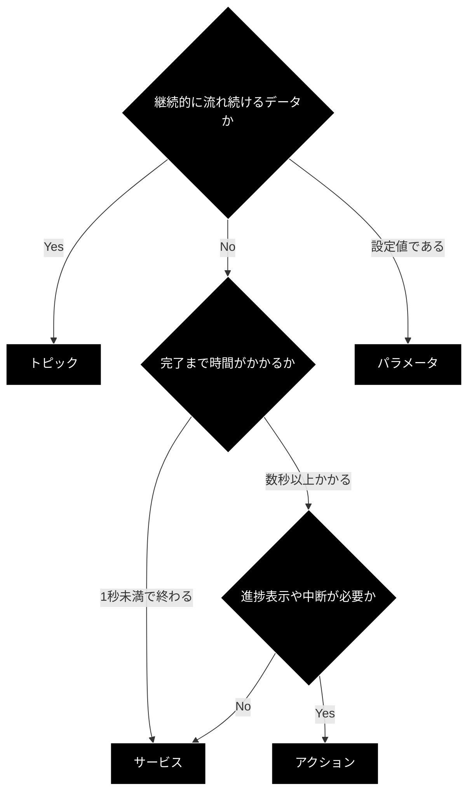

# ROS 2 の要点 — 通信方式・QoS・TF・用語対応

学習中に繰り返し戻ってくる**概念の要点**をまとめる。
網羅的な解説は[公式ドキュメント](https://docs.ros.org/en/jazzy/Concepts.html)に譲り、
ここでは**判断に必要な部分**と**Web 開発者にとっての対応関係**に絞る。

---

## 目次

1. [ノードとグラフ](#1-ノードとグラフ)
2. [通信 4 方式の使い分け](#2-通信-4-方式の使い分け)
3. [QoS の考え方](#3-qos-の考え方)
4. [TF（座標変換）の考え方](#4-tf座標変換の考え方)
5. [実行モデル（Executor とコールバック）](#5-実行モデルexecutor-とコールバック)
6. [Web 開発者のための ROS 2 用語対応表](#6-web-開発者のための-ros-2-用語対応表)

---

## 1. ノードとグラフ

ROS 2 のアプリケーションは、**ノード**（1 つの役割を持つプロセス）の集合として構成される。
ノード同士は互いのアドレスを知らず、**DDS の自動探索**で相互に発見しあう。


**設計上の含意**

- ノードは**疎結合**である。`/detector_node` を止めても他のノードは動き続ける
- 起動順序に依存しない。後から起動したノードも自動的に接続される
- その代わり、**「繋がっているつもりで繋がっていない」障害が起きやすい**。
  トピック名の typo や QoS 不一致は、エラーではなく「無言で何も起きない」形で現れる

このため、`ros2 topic list` / `ros2 node info` / `rqt_graph` による**観測が必須の習慣**になる。

---

## 2. 通信 4 方式の使い分け

ROS 2 が提供する通信は 4 種類。**どれを選ぶかが設計の中心**である。

| 方式 | 性質 | 応答 | 適する処理 | 例 |
|---|---|---|---|---|
| **トピック** | 非同期・多対多・一方向 | なし | 継続的に流れるデータ | センサ値、速度指令、画像 |
| **サービス** | 同期・1対1・要求応答 | あり（1回） | 即座に終わる問い合わせ・操作 | 設定取得、リセット、地図保存 |
| **アクション** | 非同期・1対1・進捗つき | Feedback + Result | 時間がかかり、中断もしたい処理 | 目的地への移動、アーム動作 |
| **パラメータ** | 設定値の保持・変更 | あり | ノードの振る舞いの調整 | 速度上限、閾値、フレーム名 |

### 2.1 判断フローチャート



### 2.2 よくある設計ミス

| ミス | 何が起きるか | 正しい選択 |
|---|---|---|
| 長時間処理をサービスにする | 呼び出し側がブロックし、進捗も分からず中断もできない | アクション |
| 1 回きりの操作をトピックにする | 受信の保証がなく、取りこぼす | サービス |
| 設定値をトピックで配る | 後から起動したノードが受け取れない | パラメータ（または Transient Local QoS） |
| サービスのコールバック内で別サービスを同期呼び出し | **デッドロック**する | 非同期呼び出し、またはコールバックグループを分ける |

---

## 3. QoS の考え方

**QoS（Quality of Service）の不一致は、ROS 2 で最も分かりにくい障害の原因**である。
「`ros2 topic list` に出るのに、`echo` しても何も来ない」ときは、まず QoS を疑う。

### 3.1 主要な 3 設定

| 設定 | 値 | 意味 |
|---|---|---|
| **Reliability** | `RELIABLE` | 届くまで再送する。確実だが遅延しうる |
| | `BEST_EFFORT` | 落ちても再送しない。高頻度データ向き |
| **Durability** | `VOLATILE` | 購読開始前のデータは受け取れない |
| | `TRANSIENT_LOCAL` | **後から購読しても最新値を受け取れる**（＝「latched」） |
| **History / Depth** | `KEEP_LAST` + depth | 直近 N 件だけ保持 |
| | `KEEP_ALL` | すべて保持（メモリ注意） |

### 3.2 互換性のルール

**購読側の要求が、配信側の提供より厳しいと繋がらない。**

| 配信側 | 購読側 | 結果 |
|---|---|---|
| RELIABLE | RELIABLE | ✅ 接続 |
| RELIABLE | BEST_EFFORT | ✅ 接続（購読側が緩い） |
| BEST_EFFORT | RELIABLE | ❌ **接続されない** |
| VOLATILE | TRANSIENT_LOCAL | ❌ **接続されない** |

### 3.3 本プロジェクトの既定方針

| データ種別 | Reliability | Durability | Depth |
|---|---|---|---|
| センサ（`/scan`, `/imu`, 画像） | `BEST_EFFORT` | `VOLATILE` | 5 |
| 制御指令（`/cmd_vel`） | `RELIABLE` | `VOLATILE` | 10 |
| 地図（`/map`）・静的 TF | `RELIABLE` | `TRANSIENT_LOCAL` | 1 |

### 3.4 確認コマンド

```bash
# 配信側・購読側の QoS を突き合わせる
ros2 topic info /scan --verbose
```

出力の `QoS profile` セクションで、publisher と subscriber の
`Reliability` / `Durability` が互換かを確認する。

---

## 4. TF（座標変換）の考え方

### 4.1 何を解決するものか

ロボットには複数の座標系がある。LiDAR が「前方 2m に壁」と言うとき、
それは**LiDAR から見た 2m** であって、ロボット中心でも地図上の位置でもない。

**tf2 は「どの座標系からどの座標系へ、いつの時点で、どう変換するか」を管理する仕組み**である。

```
map → odom → base_footprint → base_link → lidar_link
                                        → imu_link
                                        → camera_link
```

### 4.2 標準的な座標系（REP-105）

| フレーム | 意味 | 更新頻度 |
|---|---|---|
| `map` | 地図の原点。長期的に一貫、ただし不連続にジャンプしうる | SLAM / 自己位置推定が更新 |
| `odom` | オドメトリ原点。連続だが累積誤差でずれる | 高頻度 |
| `base_footprint` | ロボットの接地中心 | — |
| `base_link` | ロボット本体の基準 | — |
| `<sensor>_link` | 各センサの取り付け位置 | 通常は静的 |

**`map → odom` は補正量、`odom → base_link` は移動量**、という役割分担が要点。

### 4.3 静的と動的

| 種類 | 使う場面 | 配信先 |
|---|---|---|
| 静的（static） | センサの取り付け位置など、変わらない関係 | `/tf_static`（Transient Local） |
| 動的（dynamic） | ロボットの移動、関節の回転 | `/tf` |

### 4.4 時刻が重要な理由

TF は**時刻付き**で記録される。「0.1 秒前のスキャンデータを、その時点のロボット姿勢で
地図座標に変換する」といった処理が必要なため。

このため、**「変換が存在しない」エラーの多くは時刻のずれが原因**である。

```bash
# TF ツリーを PDF 出力して確認
ros2 run tf2_tools view_frames

# 2 フレーム間の変換を確認
ros2 run tf2_ros tf2_echo map base_link
```

---

## 5. 実行モデル（Executor とコールバック）

`rclpy.spin(node)` が何をしているかを理解しておくと、
「コールバックが呼ばれない」「固まる」系の問題に対処できる。

### 5.1 既定は単一スレッド

```python
rclpy.spin(node)   # SingleThreadedExecutor
```

**コールバック（タイマ、サブスクリプション、サービス）は 1 つずつ順に実行される。**
あるコールバックが 5 秒かかると、その間ほかのコールバックは一切動かない。

### 5.2 何が問題になるか

| 状況 | 結果 |
|---|---|
| サブスクリプションのコールバック内で重い処理 | 他のトピックを取りこぼす |
| サービスのコールバック内で別サービスを同期呼び出し | **デッドロック**（自分が終わらないと相手の応答を処理できない） |
| コールバック内で `time.sleep()` | 全体が止まる |

### 5.3 対処

| 方法 | 用途 |
|---|---|
| `MultiThreadedExecutor` を使う | 複数コールバックを並行実行 |
| `ReentrantCallbackGroup` を指定 | 同一コールバックの再入を許可 |
| 重い処理はアクションに切り出す | そもそも設計を変える |
| コールバックは短く保つ | 原則。フラグを立てて、タイマ側で処理する |

---

## 6. Web 開発者のための ROS 2 用語対応表

FastAPI / React の経験がある場合、次の対応で理解が早くなる。
**厳密には異なるが、初期の足場としては有効**である。

### 6.1 通信

| ROS 2 | Web 開発での近い概念 | 相違点 |
|---|---|---|
| トピック（pub/sub） | WebSocket / SSE のブロードキャスト | 送信側は受信者を知らない。多対多 |
| サービス | 同期 REST エンドポイント | URL ではなく名前で解決される |
| アクション | 非同期ジョブ（Goal＝投入、Feedback＝進捗 SSE、Cancel＝中断） | ROS が状態機械を規定している |
| パラメータ | 実行時に変更可能な設定（環境変数＋動的リロード） | 型と範囲を宣言できる |
| メッセージ型（`.msg`） | Pydantic モデル / TypeScript の型定義 | ビルド時にコード生成される |

### 6.2 構成・運用

| ROS 2 | Web 開発での近い概念 | 相違点 |
|---|---|---|
| ノード | マイクロサービスの 1 プロセス | 起動順・アドレス設定が不要 |
| launch ファイル | `docker compose` の ROS 版 | Python で書け、条件分岐もできる |
| DDS の自動探索 | サービスディスカバリ（Consul / K8s の Service） | 設定なしで動く反面、範囲の制御が難しい |
| `ROS_DOMAIN_ID` | ネットワークの名前空間 | 同一 ID 同士だけが見える |
| QoS | 配信保証・バッファ設定（at-most-once / at-least-once） | **不一致だと無言で繋がらない** |
| ワークスペース / `colcon` | モノレポ / ビルドツール（turborepo 等） | ビルド後の `source` が必須 |
| `package.xml` | `package.json` の dependencies | システムパッケージも記述する |
| `rosdep` | パッケージマネージャの依存解決 | apt と連携する |

### 6.3 観測

| ROS 2 | Web 開発での近い概念 |
|---|---|
| `ros2 topic echo` | `curl` でエンドポイントを叩く / WebSocket のログ |
| `rqt_graph` | サービス依存関係図 / トレーシングのサービスマップ |
| `ros2 bag` | リクエストログの記録と再生 |
| `rqt_console` | 構造化ログビューア |
| `ros2 doctor` | ヘルスチェックエンドポイント |

### 6.4 対応させると誤解する点

| 誤解しやすい点 | 実際 |
|---|---|
| 「トピックは REST の GET のようなもの」 | 違う。**購読していない間のデータは存在しない**（Transient Local を除く） |
| 「サービスは軽いから何にでも使える」 | 同期のため、**呼び出し側がブロックする**。長い処理には使えない |
| 「ノードを分ければスケールする」 | ローカル通信ではノード分割にコストがある。**学習用途では 1 コンテナに集約**する |
| 「トピック名が合っていれば繋がる」 | **QoS も一致する必要がある**（3.2 参照） |

---

## 変更履歴

| 日付 | 内容 |
|---|---|
| 2026-08-04 | 初版。README から ROS 2 の要点を分離して作成 |
