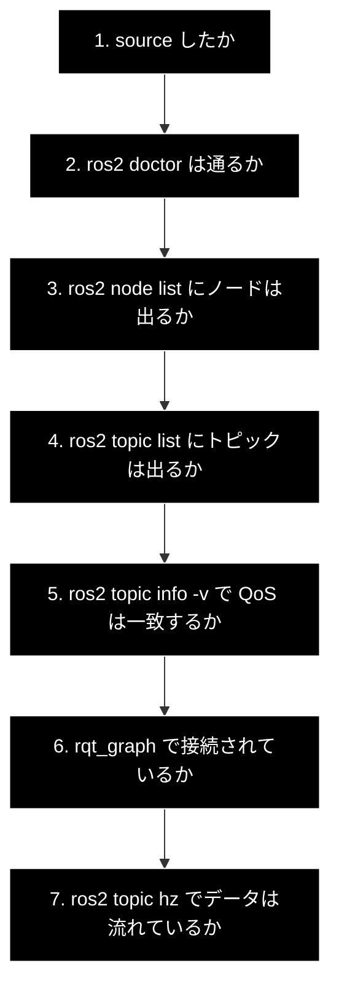

# トラブルシューティング

ROS 2 学習中に高頻度で遭遇する問題と、その切り分け手順。
**症状から引ける形**で構成している。

---

## 目次

1. [症状別インデックス](#1-症状別インデックス)
2. [切り分けの基本手順](#2-切り分けの基本手順)
3. [Mac / Apple Silicon 固有](#3-mac--apple-silicon-固有)
4. [DDS・ネットワーク](#4-ddsネットワーク)
5. [ビルド・インターフェース](#5-ビルドインターフェース)
6. [Gazebo](#6-gazebo)
7. [GUI 表示](#7-gui-表示)

---

## 1. 症状別インデックス

| 症状 | 最も可能性が高い原因 | 参照 |
|---|---|---|
| `Package 'xxx' not found` / ノードが見つからない | `source install/setup.bash` を忘れている | [5.1](#51-source-忘れ) |
| トピックは `list` に出るのに `echo` で何も来ない | **QoS 不一致** | [4.1](#41-qos-不一致) |
| `talker` は動くが `listener` が受け取らない | DDS / ネットワーク設定 | [4.2](#42-ノード同士が見えない) |
| `.msg` を変更したのに古い型が使われる | ビルドキャッシュ | [5.2](#52-インターフェース変更が反映されない) |
| `colcon build` が途中で固まる / OOM | 並列数過多 | [5.3](#53-ビルドが固まるメモリ不足) |
| Gazebo が真っ黒 / 起動しない | GPU 非対応 / GUI 設定 | [6.1](#61-gazebo-が真っ黒起動しない) |
| `ign gazebo: command not found` | Humble 世代の記事を見ている | [6.2](#62-ign-gazebo-が見つからない) |
| RViz2 / rqt のウィンドウが出ない | GUI 表示方式の設定 | [7.1](#71-gui-ウィンドウが表示されない) |
| 動きがカクつく / 反応が遅い | **仕様**（CPU 実行） | [3.2](#32-リアルタイムファクタが-10-に届かない) |
| `Lookup would require extrapolation into the past` | TF の時刻ずれ | [4.4](#44-tf-の変換が見つからない) |
| PyCharm で `rclpy` が赤線になる | インタプリタパス未設定 | [3.3](#33-pycharm-で-rclpy-が解決されない) |

---

## 2. 切り分けの基本手順

問題が起きたら、**上から順に**確認する。原因の 8 割はここで判明する。



```bash
source /opt/ros/jazzy/setup.bash
source /workspace/ros2_ws/install/setup.bash
ros2 doctor
ros2 node list
ros2 topic list
ros2 topic info <topic> --verbose
ros2 topic hz <topic>
```

> **エラーメッセージを読まずに設定を変えない。** ROS 2 は「無言で繋がらない」ことが多い分、
> エラーが出ているときはその内容がほぼ正しい手がかりになる。

---

## 3. Mac / Apple Silicon 固有

### 3.1 ホストに ROS 2 を入れようとして失敗する

**macOS 向けの ROS 2 バイナリは実質提供されていない。**
公式のインストール手順にある macOS 版はソースビルド（experimental）であり、
Apple Silicon では依存解決が非常に困難。

**対処:** ホストへのインストールは試みない。すべて Docker コンテナ内で行う
（[README STEP 1](../README.md#3-step-1-docker-環境の構築)）。

### 3.2 リアルタイムファクタが 1.0 に届かない

**これは不具合ではない。** Docker コンテナから Mac の GPU は利用できないため、
Gazebo の物理演算・描画は CPU 実行になる。

| 状況 | 目安 |
|---|---|
| turtlesim・基本ノード | 1.0 |
| Gazebo 単純ワールド | 0.7〜1.0 |
| Gazebo + SLAM | 0.4〜0.7 |
| Gazebo + Nav2 + SLAM | 0.2〜0.5 |

**対処（改善は可能）**

1. Gazebo をヘッドレス起動する（`gui:=false`）
2. 可視化を Foxglove に寄せる
3. Docker Desktop の割り当て CPU / メモリを増やす
4. ワールドを単純化する（不要なモデル・光源を減らす）

### 3.3 PyCharm で rclpy が解決されない

Docker インタプリタを設定しても、ROS 2 の Python パッケージは
標準の site-packages に無いため補完が効かない。

**対処:** `Show Interpreter Paths` に次を追加する。

```
/opt/ros/jazzy/lib/python3.12/site-packages
/opt/ros/jazzy/local/lib/python3.12/dist-packages
/workspace/ros2_ws/install/<パッケージ名>/lib/python3.12/site-packages
```

詳細は [README STEP 4](../README.md#6-step-4-開発環境の整備pycharm-professional)。

### 3.4 コンテナのビルドが極端に遅い

Docker Desktop のファイル共有方式が原因のことがある。

**対処**

- `build/` `install/` `log/` を**名前付きボリューム**に置く（ホスト共有しない）
- Docker Desktop の `VirtioFS` を有効にする
- 割り当てメモリを 8GB 以上にする

---

## 4. DDS・ネットワーク

### 4.1 QoS 不一致

**症状:** `ros2 topic list` にトピックは出るが、`ros2 topic echo` で何も表示されない。
エラーも出ない。

**原因:** 配信側と購読側の QoS が非互換。特に次の 2 パターン。

| 配信側 | 購読側 | 結果 |
|---|---|---|
| `BEST_EFFORT` | `RELIABLE` | ❌ 繋がらない |
| `VOLATILE` | `TRANSIENT_LOCAL` | ❌ 繋がらない |

**確認**

```bash
ros2 topic info /scan --verbose
```

出力の publisher / subscriber それぞれの `QoS profile` を突き合わせる。

**対処:** 購読側の QoS を配信側に合わせる。センサ系は `BEST_EFFORT` が標準。

```python
from rclpy.qos import QoSProfile, ReliabilityPolicy, HistoryPolicy

qos = QoSProfile(
    reliability=ReliabilityPolicy.BEST_EFFORT,
    history=HistoryPolicy.KEEP_LAST,
    depth=5,
)
self.create_subscription(LaserScan, '/scan', self.cb, qos)
```

詳細は [`ros2_essentials.md` 3章](ros2_essentials.md#3-qos-の考え方)。

### 4.2 ノード同士が見えない

**症状:** `talker` は動くが `listener` が何も受け取らない。`ros2 node list` に片方しか出ない。

**確認**

```bash
echo $ROS_DOMAIN_ID          # 全ターミナルで同じ値か
echo $ROS_AUTOMATIC_DISCOVERY_RANGE   # Jazzy ではこちら（ROS_LOCALHOST_ONLY は非推奨）
echo $RMW_IMPLEMENTATION     # 全ノードで同じ実装か
```

**原因と対処**

| 原因 | 対処 |
|---|---|
| ターミナルごとに `ROS_DOMAIN_ID` が違う | `entrypoint.sh` / `.bashrc` で統一 |
| RMW 実装が混在している | 全ノードで同じ `RMW_IMPLEMENTATION` を使う |
| コンテナを分けている | **ROS ノードは 1 コンテナに集約する**（README 3.4 方針1） |
| Docker のブリッジネットワークでマルチキャストが通らない | `ROS_AUTOMATIC_DISCOVERY_RANGE=LOCALHOST` を設定 |

### 4.3 他人の ROS 2 とノードが混線する

**症状:** 身に覚えのないノードやトピックが `list` に出る。

**原因:** 同一 LAN 上の別マシンの ROS 2 と、同じ `ROS_DOMAIN_ID` で繋がっている。

**対処**

```bash
# Jazzy 推奨（学習用途では常時これでよい）
export ROS_AUTOMATIC_DISCOVERY_RANGE=LOCALHOST
export ROS_DOMAIN_ID=42            # 他と重複しない値に変更

# ⚠️ Humble 向けの記事にある ROS_LOCALHOST_ONLY=1 は Jazzy では非推奨。
#    設定しても動くが警告が出る。上の変数に読み替えること。
```

### 4.4 TF の変換が見つからない

**症状**

```
Lookup would require extrapolation into the past
Could not find a connection between 'map' and 'base_link'
```

**原因と対処**

| 原因 | 確認 | 対処 |
|---|---|---|
| そのフレームを配信するノードが起動していない | `ros2 run tf2_tools view_frames` | 該当ノードを起動 |
| フレーム名の typo | `ros2 topic echo /tf --once` | 名前を修正 |
| 時刻がずれている（未来 / 過去すぎる） | — | `lookup_transform` に `Time()`（＝最新）を渡す |
| 静的 TF を後から購読した | `ros2 topic info /tf_static -v` | `/tf_static` は `TRANSIENT_LOCAL` で購読する |

```bash
ros2 run tf2_tools view_frames               # ツリー全体を PDF 出力
ros2 run tf2_ros tf2_echo map base_link      # 個別の変換を確認
```

---

## 5. ビルド・インターフェース

### 5.1 source 忘れ

**症状**

```
Package 'sim_nodes_py' not found
No executable found
```

**これが ROS 2 で最も多いトラブル。** ビルド後・新しいターミナルを開くたびに
`source` が必要になる。

**対処**

```bash
source /opt/ros/jazzy/setup.bash
source /workspace/ros2_ws/install/setup.bash
```

恒久対処として `entrypoint.sh` / `~/.bashrc` に書いておく（README 3.6）。

### 5.2 インターフェース変更が反映されない

**症状:** `.msg` / `.srv` を変更したのに、古いフィールド構成のまま動く、
または型の不整合エラーが出る。

**対処**

```bash
# 1) 使う側のパッケージまで含めて再ビルド
colcon build --packages-up-to <使う側のパッケージ>

# 2) それでも直らない場合はフルビルド
rm -rf build install log
colcon build --symlink-install
source install/setup.bash
```

生成された Python 型は `install/<pkg>/lib/python3.12/site-packages/` に置かれる。
PyCharm の補完も、ここを Interpreter Paths に追加しないと更新されない。

### 5.3 ビルドが固まる / メモリ不足

**症状:** `colcon build` が応答しなくなる、コンテナが落ちる。

**対処**

```bash
colcon build --parallel-workers 2      # 並列数を下げる
colcon build --packages-select <pkg>   # 対象を絞る
```

Docker Desktop の割り当てメモリを 8GB 以上にする。

### 5.4 ビルドは通るが実行時に `No module named`

**原因:** `setup.py` の `packages` / `entry_points` の記述漏れ。

**確認:** `setup.py` の `entry_points` に、実行したい関数が登録されているか。

```python
entry_points={
    'console_scripts': [
        'my_node = sim_nodes_py.my_node:main',
    ],
},
```

登録名を変更した場合は `colcon build --packages-select <pkg>` が必要。

---

## 6. Gazebo

### 6.1 Gazebo が真っ黒 / 起動しない

**原因:** GPU アクセラレーションが使えないこと、または GUI 転送の問題。

**対処（順に試す）**

```bash
# 1) ソフトウェアレンダリングを明示
export LIBGL_ALWAYS_SOFTWARE=1
gz sim -v 4 shapes.sdf

# 2) ヘッドレスで起動し、可視化は Foxglove / RViz2 に任せる
gz sim -v 4 -r -s shapes.sdf
```

### 6.2 ign gazebo が見つからない

**症状**

```
ign: command not found
gazebo: command not found
```

**原因:** Humble 世代（Gazebo Fortress）や Gazebo Classic 向けの記事を見ている。

**対処:** Jazzy が対応する Gazebo は **Harmonic** であり、コマンドは `gz sim`。

| 世代 | コマンド | 対応 ROS 2 |
|---|---|---|
| Gazebo Classic | `gazebo` | 〜Humble（EOL） |
| Ignition / Fortress | `ign gazebo` | Humble（2026年9月 EOL） |
| **Gazebo Harmonic** | **`gz sim`** | **Jazzy（本プロジェクト）** |

詳細は [`humble_jazzy_diff.md`](humble_jazzy_diff.md)。

### 6.3 Gazebo のトピックが ROS 側に見えない

**原因:** `ros_gz_bridge` が起動していない、またはブリッジ設定にそのトピックが無い。

```bash
# Gazebo 側のトピックを確認
gz topic -l

# ROS 側を確認
ros2 topic list

# 手動でブリッジする例
ros2 run ros_gz_bridge parameter_bridge \
  /scan@sensor_msgs/msg/LaserScan[gz.msgs.LaserScan
```

型のマッピング記法（`@` `[` `]`）は [ros_gz のドキュメント](https://github.com/gazebosim/ros_gz)を参照。

### 6.4 モデルが見つからない

**症状:** `Unable to find model` / ロボットが表示されない。

**対処:** `GZ_SIM_RESOURCE_PATH` にモデルディレクトリが含まれているか確認する。

```bash
echo $GZ_SIM_RESOURCE_PATH
export GZ_SIM_RESOURCE_PATH=/workspace/ros2_ws/src/sim_gazebo/models:$GZ_SIM_RESOURCE_PATH
```

---

## 7. GUI 表示

### 7.1 GUI ウィンドウが表示されない

**確認**

```bash
echo $DISPLAY          # コンテナ内で :1 などが設定されているか
xeyes                  # X が生きているかの最小確認
```

**対処**

| 使用方式 | 確認事項 |
|---|---|
| noVNC | `http://localhost:6080` が開くか。ポートが公開されているか |
| Foxglove | `foxglove_bridge` が起動しているか。`ws://localhost:8765` に接続できるか |
| X11（XQuartz） | XQuartz の「ネットワーククライアントからの接続を許可」が有効か |

**推奨:** Apple Silicon では X11 転送は使わず、noVNC を主・Foxglove を副とする
（[README STEP 3](../README.md#5-step-3-gui-をどう見るか)）。

### 7.2 noVNC の画面が小さい / 解像度が合わない

`docker-compose.yml` の Xvfb 起動時の解像度指定を変更する。

```
Xvfb :1 -screen 0 1920x1080x24
```

### 7.3 Foxglove に何も表示されない

| 確認 | 対処 |
|---|---|
| `foxglove_bridge` が起動しているか | `ros2 launch foxglove_bridge foxglove_bridge_launch.xml` |
| ポート 8765 が公開されているか | `docker-compose.yml` の `ports` |
| トピックが実際に流れているか | `ros2 topic hz <topic>` |
| Fixed frame が正しいか | Foxglove の 3D パネル設定で `map` や `base_link` を指定 |

---

## 変更履歴

| 日付 | 内容 |
|---|---|
| 2026-08-04 | 初版。README からトラブルシューティングを分離して作成 |
